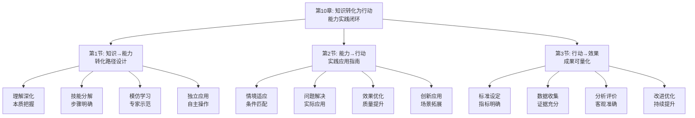

# 第10章：知识转化为行动 - 总览

> "知道做不到，等于不知道。" ——中国古谚

## 引言：当马斯克遇上"行动哲学"

### 企业家的"实践智慧"

埃隆·马斯克不仅是梦想家，更是行动派。他将物理学的第一性原理应用到实践中，从电动汽车到太空探索，每一个想法都转化为具体的产品和服务。

马斯克的"行动转化原则"：
- **快速验证**：通过快速原型验证想法
- **迭代优化**：在实践中不断优化改进
- **风险承担**：勇于承担失败的风险
- **执行力强**：强大的执行能力推动想法实现

**马斯克的名言**："当某件事足够重要时，即使机会渺茫，你也要去做。"他明白，再好的想法如果不付诸行动，也只是空想。

### 现代人的"行动困境"

如果马斯克生活在今天的学习环境中，他可能会对现代人的学习方式感到困惑：

**企业家的"行动导向"**：
- 学习以解决问题为目标
- 知识通过实践来验证和应用
- 注重实际效果和价值创造

**现代学习者的"理论偏好"**：
- 学习停留在理论层面
- 知识缺乏实际应用验证
- 缺乏行动力和执行力

**马斯克会怎么说？**他可能会感慨："你们这个时代，想法如繁星般众多，但真正能转化为行动的却如恒星般稀少。学会行动，比学会思考更重要。"

### 认知科学的"行动转化理论"

现代认知科学为知识转化为行动提供了科学依据：

**行动转化理论**（Bandura）：
> "自我效能感是影响行为转化的关键因素，相信自己能够成功的人更可能将知识转化为行动。"**通过提升自我效能感能显著提高知识的行动转化率**。

**计划行为理论**（Ajzen）：
行为意向由态度、主观规范和感知行为控制共同决定，**通过改变这些因素能促进知识向行动的转化**。

**实践智慧理论**（Sternberg）：
实践智慧是将理论知识转化为实际应用的能力，**通过培养实践智慧能提高知识的应用效果**。

## 知识转化的"三维行动系统"

### 维度1：能力转化——从"知道"到"会做"

**核心问题**：如何将理论知识转化为实际操作能力？

**转化过程**：
- **理解深化**：深入理解知识的本质和应用场景
- **技能分解**：将复杂技能分解为可操作的步骤
- **模仿学习**：通过模仿专家行为学习技能
- **独立应用**：独立应用技能解决实际问题

**转化方法**：
1. **示范教学**：通过专家示范学习正确方法
2. **分步练习**：分步骤练习复杂技能
3. **反馈调整**：通过反馈调整操作方法
4. **熟练掌握**：通过反复练习熟练掌握技能

### 维度2：行动实践——从"会做"到"做好"

**核心问题**：如何将操作能力转化为实际应用效果？

**实践过程**：
- **情境适应**：适应具体的应用情境和条件
- **问题解决**：运用能力解决实际问题
- **效果优化**：优化应用效果和质量
- **创新应用**：在新情境中创新性地应用能力

**实践方法**：
1. **真实应用**：在真实情境中应用所学能力
2. **问题导向**：以解决实际问题为导向
3. **持续改进**：持续优化应用方法和效果
4. **创新探索**：探索新的应用场景和方法

### 维度3：效果评估——从"做好"到"优化"

**核心问题**：如何评估和优化行动应用的效果？

**评估过程**：
- **标准设定**：设定明确的评估标准和指标
- **数据收集**：收集应用效果的相关数据
- **分析评价**：分析数据评价应用效果
- **改进优化**：根据评估结果改进优化

**评估方法**：
1. **定量评估**：通过量化指标评估应用效果
2. **定性评估**：通过质性分析评估应用质量
3. **对比分析**：通过对比分析评估改进效果
4. **反馈循环**：建立反馈循环持续优化

## 本章的"行动转化工具箱"

### 第1节：知识→能力——"转化路径设计"

#### 核心问题：如何设计从知识到能力的转化路径？

**科学基础**：基于**技能学习理论**和**能力发展理论**，设计知识到能力的转化体系。

**实战工具**：
- **转化路径图**：设计清晰的知识到能力转化路径
- **技能分解法**：将复杂技能分解为可操作步骤
- **学习地图**：制定系统的学习和练习计划

**预期收获**：
- 掌握知识到能力转化的具体方法
- 提高技能学习的效率和效果
- 建立系统的能力发展路径

### 第2节：能力→行动——"实践应用指南"

#### 核心问题：如何将能力应用于实际情境？

**科学基础**：基于**情境学习理论**和**应用转化理论**，设计能力到行动的应用体系。

**实战工具**：
- **应用情境分析**：分析能力应用的具体情境
- **问题解决框架**：建立解决问题的框架和方法
- **实践指导手册**：提供实践应用的具体指导

**预期收获**：
- 掌握能力在实际中应用的方法
- 提高解决实际问题的能力
- 建立能力应用的实践体系

### 第3节：行动→效果——"成果可量化"

#### 核心问题：如何评估和优化行动应用的效果？

**科学基础**：基于**效果评估理论**和**持续改进理论**，建立行动效果的评估体系。

**实战工具**：
- **评估指标体系**：建立量化的效果评估指标
- **数据收集方法**：设计有效的数据收集方法
- **优化改进机制**：建立持续优化改进机制

**预期收获**：
- 掌握行动效果评估的具体方法
- 提高应用效果的优化能力
- 建立持续改进的反馈体系

## 知识转化的"生态系统"

### 为什么叫"生态系统"？

就像自然生态系统一样，高效的知识转化需要多个要素的协同工作：
- **知识输入**（输入端）：获取有价值的知识和信息
- **能力转化**（处理端）：将知识转化为实际能力
- **行动实践**（应用端）：将能力应用于实际情境
- **效果评估**（反馈端）：评估应用效果并提供反馈
- **持续优化**（调节端）：根据反馈持续优化改进

**缺一不可**：就像生态系统中的每个环节都至关重要，知识转化的每个要素都需要精心设计。

## 与前几章的"无缝衔接"

### 从理解到应用：能力发展的自然延伸

| 前几章解决的问题 | 本章解决的问题 | 连接逻辑 |
|----------------|--------------|---------|
| 知识获取和理解 | 如何将理解的知识转化为实际能力 | 理解是基础，转化是目标 |
| 笔记整理和工具应用 | 如何将整理的知识应用于实际 | 整理是手段，应用是目的 |
| 方法论和技巧 | 如何通过实践验证和深化方法 | 理论指导实践，实践深化理论 |

### 从学习到实践：方法论的完整闭环

**前三部分**：认识问题、解决问题、获取知识
**本章**：应用知识、创造价值、持续优化

这就像创新价值链：
- 前面章节是关于知识的获取和整理
- 本章是关于知识的应用和创造

## 学习成果：从"理论家"到"实践者"

> "临渊羡鱼，不如退而结网。" ——《汉书·董仲舒传》

完成这一章的学习后，你将实现从"理论家"到"实践者"的转变：

### 🎯 能力转化：成为知识的"转化专家"

你将拥有：
- **转化路径设计**：设计知识到能力的转化路径
- **技能分解能力**：将复杂技能分解为可操作步骤
- **学习地图制定**：制定系统的学习和练习计划

就像工程师能将理论知识转化为实际产品，你也能将学到的知识转化为实际能力。

### 🚀 行动实践：成为能力的"应用大师"

你将掌握：
- **情境适应能力**：适应具体的应用情境和条件
- **问题解决技巧**：运用能力解决实际问题
- **效果优化方法**：优化应用效果和质量

这就像项目经理能将计划转化为实际成果，你也能将学习成果转化为实际能力。

### 📊 效果评估：成为实践的"优化专家"

你将具备：
- **标准设定技能**：设定明确的评估标准和指标
- **数据分析能力**：收集和分析应用效果数据
- **持续优化技术**：根据评估结果改进优化

这就像质量管理者能优化产品和服务质量，你也能优化知识应用的效果。

## 知识转化攻略：如何让知识产生实际价值

> "实践是检验真理的唯一标准。" ——毛泽东

### 🎯 三步转化法：像实干家一样行动

**第一步：转化模式**（知识→能力）
像实干家学习技能一样，将学到的知识转化为实际能力。问自己："我如何将这个知识转化为可操作的技能？"

**第二步：实践模式**（能力→行动）
像实干家解决问题一样，将能力应用于实际情境。问自己："我如何在实际中应用这个技能？"

**第三步：优化模式**（行动→改进）
像实干家总结经验一样，通过评估优化应用效果。问自己："我如何改进这个应用方法？"

### 💡 元认知提醒：成为自己的"行动教练"

在知识转化过程中，经常问自己三个问题：
1. **我如何将这个知识转化为实际能力？**（转化设计）
2. **我如何在实际中应用这个能力？**（实践应用）
3. **我如何通过评估优化应用效果？**（持续改进）

认知心理学家约翰·弗拉维尔（John Flavell）把这种"思考自己的思考"称为元认知，它是高效学习的核心技能。

### 🚀 开启探索：从理论到实践的价值升级

准备好了吗？我们即将踏上一场从"纸上谈兵"到"实战应用"的价值升级之旅。这不仅是关于知识应用的提升，更是关于如何将知识转化为实际价值的人生智慧。

**下一站：第1节《知识→能力：转化路径设计》——让我们学会设计从知识到能力的转化路径。**