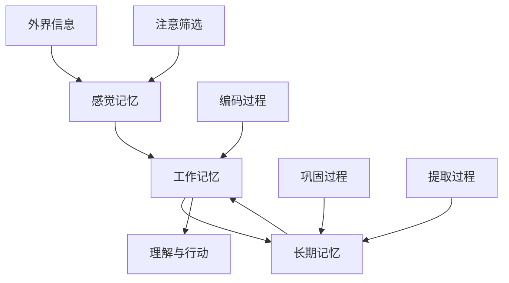

# 短期记忆与长期记忆

> "记忆是一座宫殿，但它不是静态的建筑，而是不断重建的活体结构。" ——奥利弗·萨克斯

## 引言：当H.M.改变了我们对大脑的理解

### 一个改变神经科学的病人

1953年9月1日，27岁的亨利·莫莱森（Henry Molaison，简称H.M.）走进了哈特福德医院的手术室。他患有严重的癫痫，医生威廉·斯科维尔决定切除他的海马体和部分颞叶，希望能控制癫痫发作。

手术成功了——癫痫得到了控制。

但代价是惊人的：**H.M.从此无法形成新的记忆**。

- 他能记住手术前的大部分事情
- 他的智商、语言能力、基本技能都正常
- 但他无法记住任何新认识的人、新学的信息、新发生的事件

**更神奇的是**：他仍然能学习新的运动技能，比如描绘镜像图案，而且技能会一天天进步——尽管他每次都觉得这是第一次做这个任务。

### H.M.给我们的启示

H.M.的案例像一道闪电，照亮了记忆科学的黑暗角落。

**它证明了三个革命性的发现**：

1. **大脑中存在不同的记忆系统**——不是一个记忆，而是多个记忆
2. **海马体是新记忆形成的关键枢纽**——但不是记忆的最终存储地
3. **技能学习和事实学习使用不同的神经回路**——身体记得，但意识不知道

诺贝尔奖得主埃里克·坎德尔说："**H.M.教会了我们比任何实验动物都要多的关于记忆的知识**。"

### 从病理到日常：记忆系统在阅读中的作用

当你阅读这篇文章时，你的大脑正在上演一场精密的协作：

**此时此刻**：
- 你的**工作记忆**在处理这句话的语法结构
- 你的**长期记忆**在提供"H.M."、"海马体"等概念的含义
- 两个系统在无缝协作，让理解成为可能

但这个看似简单的过程，实际上比最先进的人工智能还要复杂。

## 记忆科学的里程碑发现

### 乔治·米勒的"神奇数字"

1956年，哈佛大学心理学家乔治·米勒发表了一篇改变认知科学的论文《神奇数字7±2》。

他发现：**人类的短期记忆容量惊人地一致——大约7个单位，上下浮动2个**。

**这个发现的深刻含义**：

**限制即是特征**：
- 不是设计缺陷，而是进化智慧
- 迫使大脑进行选择和组织
- 推动了更高级的认知策略发展

**普遍性法则**：
- 跨文化、跨年龄的一致性
- 从数字到词汇到概念都适用
- 成为认知科学的第一个"常数"

**实践启示**：
- 为什么电话号码通常是7-8位？
- 为什么好的演讲通常有3-7个要点？
- 为什么阅读长句时容易"断片"？

### 阿特金森-希夫林的双存储革命

1968年，理查德·阿特金森和理查德·希夫林提出了影响至今的记忆模型：

```
环境信息 → 感觉记忆 → 短期记忆 → 长期记忆
         (0.5-2秒)   (15-30秒)   (终生)
            ↓           ↓           ↓
           大部分       部分       少部分
           丢失        丢失        保存
```

**这个模型的革命性在于**：

1. **序列加工观念**：信息按照固定流程处理
2. **容量递减规律**：每个阶段都有信息损失
3. **注意力筛选机制**：不是所有信息都能进入下一阶段

### 巴德利工作记忆模型的突破

1974年，艾伦·巴德利彻底颠覆了短期记忆的概念，提出了"工作记忆"模型：

```
           中央执行系统
               ↓
    ┌──────────┼──────────┐
语音环路      视空画板     情节缓冲器
(处理声音)   (处理图像)   (整合信息)
```

**这不仅是概念升级，更是认知革命**：

**从被动存储到主动处理**：
- 旧观念：短期记忆像录音机
- 新观念：工作记忆像乐队指挥

**从单一系统到多重协作**：
- 可以同时处理不同类型的信息
- 各子系统相对独立但协调工作

**从容量限制到策略优化**：
- 重点不是容量有多大
- 而是如何更有效地使用

## 短期记忆/工作记忆：大脑的临时工作台

### 四个子系统的精密分工

#### 中央执行系统：认知的CEO

想象一下，你的大脑是一家复杂的公司，中央执行系统就是CEO：

**主要职责**：
- **注意力分配**：决定关注什么、忽略什么
- **任务切换**：在不同认知活动间切换
- **冲突解决**：当信息冲突时做出决策
- **策略选择**：选择最适合的认知策略

**能力限制**：
- 像CEO一样，容量极其有限
- 容易疲劳，需要休息
- 受情绪和压力影响很大

**阅读中的作用**：
- 决定是精读还是略读
- 协调理解和记忆活动
- 监控理解程度

#### 语音环路：大脑的"录音师"

**工作机制**：
语音环路就像一个不断循环播放的录音带：
- **语音存储**：保存2-3秒的声音信息
- **复述过程**：通过内部复述延长保持时间
- **自动刷新**：不断更新循环的内容

**有趣的现象**：
- **词长效应**：短词比长词更容易记住
- **语音相似效应**：发音相似的词容易混淆
- **不相关语音效应**：背景音乐会干扰语音处理

**阅读应用**：
- 默读时的"内心声音"
- 理解句子语法结构
- 记住刚读过的关键词

#### 视空画板：大脑的"设计师"

**功能特点**：
- **空间信息**：位置、方向、距离
- **视觉信息**：颜色、形状、运动
- **心理旋转**：在脑中操作图像
- **视觉想象**：构建心理图像

**容量特征**：
- 约3-4个视觉对象
- 精度有限，细节容易丢失
- 与语音环路相对独立

**阅读应用**：
- 理解图表和图像
- 构建文本的空间关系
- 形成概念的视觉表征

#### 情节缓冲器：整合的艺术家

**核心功能**：
- 整合来自不同系统的信息
- 连接工作记忆与长期记忆
- 形成连贯的意识体验
- 支持复杂的认知活动

**工作原理**：
像一个熟练的编辑，将分散的信息片段编织成连贯的故事。

**阅读中的作用**：
- 将词汇组合成句子意义
- 连接前后文形成理解
- 整合文本与背景知识

### 工作记忆的优化策略

#### 策略1：认知负荷管理

**认知负荷理论**告诉我们，工作记忆有三种负荷：

**内在负荷（Intrinsic Load）**：
- 材料本身的复杂度
- 无法直接减少
- 可以通过分解任务降低

**外在负荷（Extraneous Load）**：
- 不良设计造成的额外负担
- 可以通过优化减少
- 是提升效率的重点

**相关负荷（Germane Load）**：
- 有助于理解的认知加工
- 应该被鼓励和促进
- 是学习的核心

**阅读应用**：
```
阅读策略 = 管理内在负荷 + 减少外在负荷 + 增加相关负荷
```

#### 策略2：组块化技术

**什么是组块？**
诺贝尔奖得主赫伯特·西蒙说："组块是记忆中的一个单位，它将一些元素按照某种关系组合在一起。"

**组块的魔力**：
- 专家的象棋大师能"看到"棋局模式
- 熟练的阅读者能识别词汇和短语模式
- 有经验的程序员能理解代码结构模式

**阅读中的组块策略**：
1. **词汇组块**：将常见搭配作为整体识别
2. **语法组块**：识别句型模式
3. **概念组块**：将相关概念打包处理
4. **结构组块**：把握文章的逻辑框架

#### 策略3：多通道协同

**双重编码理论**的启示：
心理学家阿兰·帕伊维奥发现，同时使用语言和图像系统能显著提升记忆效果。

**实践方法**：
- **视觉化思考**：将抽象概念转化为图像
- **语音化处理**：利用内部语音加深理解
- **动作化学习**：通过手势和动作强化记忆
- **多感官参与**：调动更多感官通道

## 长期记忆：大脑的图书馆与技能中心

### 长期记忆的壮观容量

**数量级的震撼**：
神经科学家估计，人脑的信息存储容量约为**2.5 PB**（2500万亿字节）——相当于300万小时的高清视频！

**但更重要的不是容量，而是组织**：
- 不是简单的堆积，而是复杂的网络
- 不是被动的存储，而是主动的重构
- 不是固定的档案，而是动态的系统

### 两大记忆王国

#### 陈述性记忆：可以言说的知识

**语义记忆：概念的王国**
- **内容**：事实、概念、规律、原理
- **特点**：抽象、去情境化、可复述
- **例子**：π≈3.14159、巴黎是法国首都、光速=3×10⁸m/s

**神经基础**：主要存储在大脑皮层的各个区域
**提取特点**：快速、准确、不依赖具体情境

**情节记忆：经历的宝库**
- **内容**：个人经历、具体事件、时空情境
- **特点**：具体、情境化、带有情感色彩
- **例子**：第一次读《哈利·波特》的兴奋、毕业典礼的感动

**神经基础**：高度依赖海马体和前额叶
**提取特点**：重构性、易受干扰、富含细节

#### 程序性记忆：身体的智慧

**技能记忆：自动化的艺术**
- **内容**：运动技能、认知技能、社交技能
- **特点**：难以言喻、高度自动化、需要练习
- **例子**：骑自行车、打字、阅读

**习惯记忆：无意识的模式**
- **内容**：行为模式、反应倾向、情绪反应
- **特点**：无意识触发、难以控制、具有惯性
- **例子**：看到书就想翻阅、遇到困难就查手机

**神经基础**：基底神经节、小脑、运动皮层
**形成机制**：通过大量重复练习实现自动化

### 记忆巩固：从脆弱到稳固的旅程

#### 突触巩固：分子层面的记忆

**时间尺度**：几小时到几天
**主要过程**：
1. **蛋白质合成**：合成新的突触蛋白
2. **结构改变**：突触连接的物理强化
3. **网络优化**：无效连接的剪除

**关键发现**：
神经科学家发现，记忆形成需要新蛋白质的合成。如果在学习后立即阻止蛋白质合成，记忆就无法形成。

#### 系统巩固：记忆的"搬家"

**时间尺度**：数周到数年
**核心过程**：记忆从海马体逐渐转移到新皮层

**为什么要"搬家"？**
- **海马体容量有限**：需要为新记忆让出空间
- **新皮层更稳定**：不容易受到干扰和损伤
- **抽象化提取**：从具体转向一般规律

**重要机制：系统重激活理论**
睡眠期间，海马体会"重播"白天的经历，帮助新皮层学习和整合这些信息。这就是为什么充足睡眠对学习如此重要。

## 双系统协作：记忆的交响曲

### 信息流动的动态循环



**正向流动：新信息的旅程**
1. **感知阶段**：信息通过感官进入感觉记忆
2. **注意阶段**：重要信息被选择进入工作记忆
3. **加工阶段**：在工作记忆中与长期记忆互动
4. **编码阶段**：重要信息转入长期记忆存储

**反向流动：旧知识的激活**
1. **激活阶段**：当前信息触发相关记忆
2. **提取阶段**：相关知识进入工作记忆
3. **整合阶段**：新旧信息在工作记忆中融合
4. **理解阶段**：形成连贯的理解

### 专业技能的记忆基础

#### 阅读专家的记忆特征

**自动化识别**：
- 优秀读者的词汇识别高度自动化
- 不需要占用工作记忆资源
- 为高级理解留出认知空间

**丰富的背景知识**：
- 长期记忆中存储大量相关知识
- 能够快速激活相关信息
- 为新信息提供理解框架

**高效的组织策略**：
- 知识按照有意义的方式组织
- 具有良好的提取路径
- 能够灵活调用和整合

#### 从新手到专家的记忆发展

**新手阶段**：
- 依赖工作记忆进行逐词阅读
- 背景知识有限且零散
- 理解速度慢、容易疲劳

**中级阶段**：
- 部分技能开始自动化
- 背景知识逐渐丰富
- 开始使用策略性方法

**专家阶段**：
- 基础技能高度自动化
- 拥有结构化的专业知识
- 能够进行深度和批判性思考

## 阅读优化的记忆科学应用

### 基于工作记忆的阅读策略

#### 策略1：认知负荷的精细管理

**诊断你的认知负荷**：
- 阅读时是否经常需要重读？（内在负荷过高）
- 是否被无关信息干扰？（外在负荷过高）
- 是否有深度思考的空间？（相关负荷不足）

**优化方法**：
```
内在负荷管理：
- 选择适合难度的材料
- 分段消化复杂内容
- 建立必要的预备知识

外在负荷减少：
- 创造安静的阅读环境
- 使用简洁的笔记工具
- 避免多任务干扰

相关负荷增加：
- 主动提问和思考
- 寻找知识间的联系
- 应用所学解决问题
```

#### 策略2：多通道协同阅读

**理论基础**：巴德利的工作记忆模型显示，不同子系统可以并行工作。

**实践方法**：
- **视听结合**：看文字的同时听相关音频
- **图文并茂**：结合文字和图表理解
- **动手实践**：边读边做笔记或思维导图
- **口语表达**：大声朗读或复述要点

### 基于长期记忆的深度策略

#### 策略1：语义网络的建构

**什么是语义网络？**
心理学家阿兰·柯林斯提出，我们的知识以网络形式存储，概念通过各种关系连接。

**网络建构方法**：
1. **分层组织**：从一般到具体的层次结构
2. **关联映射**：建立概念间的多种关系
3. **交叉引用**：在不同知识域间建立链接
4. **定期维护**：更新和整理知识网络

#### 策略2：情节记忆的巧妙利用

**为什么情节记忆重要？**
- 提供丰富的提取线索
- 增强记忆的生动性
- 促进知识的个性化

**利用方法**：
- **情境化学习**：在特定环境中阅读
- **故事化记忆**：将抽象概念编成故事
- **个人关联**：与自己的经历建立联系
- **感官参与**：调动多种感官体验

### 记忆系统的协同优化

#### 个人记忆档案的建立

**工作记忆特征分析**：
```
数字广度测试：____个数字
词汇广度测试：____个词汇
空间广度测试：____个位置
注意分配能力：____分（1-10）
```

**长期记忆特征分析**：
```
保持时间：学习后____天开始大量遗忘
提取能力：____％的学过内容能准确回忆
知识关联：新知识与旧知识的连接____（强/中/弱）
应用转化：学过内容的实际应用率____％
```

#### 个性化策略设计

**如果工作记忆容量小**：
- 使用更多外部辅助工具
- 采用分步骤的处理方法
- 重点培养基础技能的自动化

**如果长期记忆提取困难**：
- 建立更多样化的线索系统
- 增加主动回忆的练习
- 在多种情境中应用知识

**如果知识整合能力弱**：
- 重点练习寻找关联的技巧
- 使用概念图等可视化工具
- 定期进行知识的跨域思考

## 小结：双系统记忆的阅读启示

### 三个核心洞察

**洞察1：限制即是智慧**
工作记忆的容量限制不是缺陷，而是进化的智慧：
- 迫使我们进行选择和优先排序
- 推动我们发展更高效的策略
- 促使我们建构结构化的知识

**洞察2：自动化释放潜能**
长期记忆的自动化能力是专业技能的关键：
- 基础技能的自动化释放认知资源
- 专业知识的结构化支持深度理解
- 经验模式的积累加速问题解决

**洞察3：协作创造奇迹**
两个记忆系统的协作产生了智慧：
- 工作记忆提供灵活性和创造性
- 长期记忆提供稳定性和专业性
- 协作产生了超越单个系统的能力

### 阅读优化的三个方向

**方向1：工作记忆优化**
- 减少不必要的认知负荷
- 提高信息处理的效率
- 发展更好的注意力管理

**方向2：长期记忆建构**
- 建立丰富的知识网络
- 培养快速的提取能力
- 形成结构化的专业知识

**方向3：系统协作提升**
- 促进新旧知识的整合
- 加速从理解到应用的转化
- 实现认知技能的自动化

在下一节中，我们将探索遗忘的奥秘和间隔复习的科学原理，进一步完善我们的记忆科学武器库。

---

> "记忆不是心灵的仓库，而是心灵的重建。每次回忆都是一次创造。" ——弗雷德里克·巴特莱特

**理解记忆系统的工作原理，就是掌握了学习的密钥。在这个信息爆炸的时代，不是比谁记得更多，而是比谁记得更好。**