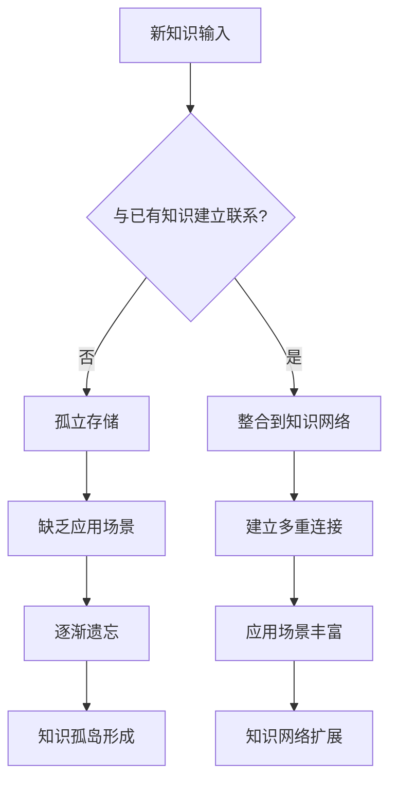

# 知识孤岛：缺乏关联与应用

## 引言：一个充满知识却无法解决问题的困境

**小张的困扰：**

小张是个学习狂热者，5年来读了200多本书，参加了十几个线上课程，笔记做了厚厚几本。朋友们都说他"知识渊博"，他自己也很有成就感。

但最近他遇到了工作上的挑战：需要制定一个新产品的营销策略。虽然他读过《定位》、《营销管理》、《增长黑客》等经典书籍，学过用户分析、数据驱动等方法，但面对具体问题时，却不知道从何下手。

这些知识就像散落在各个角落的孤岛，彼此之间没有桥梁相连，无法形成解决问题的合力。

这就是典型的**知识孤岛现象**。

## 什么是知识孤岛？

### 定义和特征

知识孤岛是指**学到的知识缺乏有机联系，无法形成系统性的认知结构，难以在实际情境中有效应用的现象**。

#### 主要特征

**结构特征：**
- **分散存储**：知识点各自独立，没有建立连接
- **缺乏层次**：没有形成清晰的知识层次结构
- **孤立存在**：新知识无法与已有知识整合

**功能特征：**
- **提取困难**：知道某个知识点，但想不起来在哪里适用
- **应用障碍**：理论和实践之间存在巨大鸿沟
- **迁移受限**：无法将知识应用到新的情境中

**表现特征：**
- **"知道但不会用"**：能说出概念，但不知道如何应用
- **"学了很多，解决不了问题"**：知识丰富但解决问题能力差
- **"重复学习"**：同样的问题需要重新学习

### 知识孤岛的形成过程

## 知识孤岛的类型

### 1. 领域孤岛

#### 特征
不同学科或领域的知识相互隔离，无法跨界整合。

#### 表现
- **学科界限分明**：心理学是心理学，管理学是管理学
- **跨界思维缺乏**：不会用心理学原理解决管理问题
- **视野局限**：只在单一领域内思考问题

#### 案例分析
**营销人员的困境：**
- 学过营销4P理论，知道产品、价格、渠道、推广
- 学过心理学，了解认知偏差、社会影响
- 学过数据分析，掌握用户画像、A/B测试
- 但无法将这些知识整合起来制定营销策略

**整合思维：**
- 用心理学原理理解用户决策过程
- 用数据分析验证营销假设
- 用4P框架设计营销组合策略
- 形成心理学+数据+营销的综合解决方案

### 2. 理论-实践孤岛

#### 特征
理论知识与实际应用严重脱节，无法指导实践。

#### 表现
- **理论空中楼阁**：理论很完美，现实很复杂
- **实践缺乏指导**：做事凭经验，不知道背后原理
- **知行分离**：知道正确做法，但行动时还是按老套路

#### 案例分析
**项目管理的脱节：**

**理论层面知道：**
- 项目管理五大过程组：启动、规划、执行、监控、收尾
- WBS工作分解结构
- 关键路径法
- 风险管理矩阵

**实践中的问题：**
- 面对突发状况不知道如何应用理论
- 理论模型过于理想化，现实情况复杂多变
- 团队成员不配合，理论方法难以实施

**整合方案：**
- 在实际项目中逐步应用理论工具
- 根据具体情况调整理论模型
- 结合组织文化和人员特点定制方法

### 3. 新旧知识孤岛

#### 特征
新学的知识无法与原有知识体系建立有效连接。

#### 表现
- **新知识游离**：新概念无法融入已有认知框架
- **认知冲突**：新旧观念相互矛盾，无法协调
- **知识更新困难**：固守旧观念，拒绝新知识

#### 案例分析
**传统管理者学习敏捷管理：**

**原有知识体系：**
- 层级管理、计划控制、标准化流程
- 强调稳定性、可预测性、风险控制

**新学习内容：**
- 敏捷管理、快速迭代、拥抱变化
- 强调灵活性、快速响应、试错学习

**整合挑战：**
- 两种管理理念看似冲突
- 不知道在什么情况下用哪种方法
- 担心新方法的风险和不确定性

**整合思路：**
- 理解两种方法的适用情境
- 在不同项目阶段采用不同方法
- 建立混合管理模式

### 4. 概念-应用孤岛

#### 特征
能够记住概念定义，但不知道在什么情况下使用。

#### 表现
- **概念记忆清楚**：能准确说出定义和特点
- **应用场景模糊**：不知道什么时候用
- **实际操作困难**：知道是什么，不知道怎么做

#### 案例分析
**学习思维模型的困境：**

**记住的概念：**
- 二八定律：80%的结果来自20%的原因
- 马斯洛需求层次：生理、安全、社交、尊重、自我实现
- SWOT分析：优势、劣势、机会、威胁

**应用困难：**
- 知道二八定律，但不知道如何识别关键的20%
- 知道需求层次，但不知道如何在产品设计中应用
- 知道SWOT，但分析结果不知道如何转化为行动

**应用策略：**
- 为每个概念准备3-5个具体应用场景
- 建立"概念-情境-行动"的应用模板
- 在实际工作中刻意练习应用

## 知识孤岛形成的原因

### 1. 学习方式问题

#### 孤立学习
- **单点学习**：每次只学一个知识点
- **缺乏关联**：不主动寻找知识间的联系
- **被动接受**：接受作者的组织方式，不主动重构

#### 表面学习
- **记忆导向**：满足于记住概念和定义
- **缺乏理解**：不深入思考知识的本质
- **应用缺失**：不考虑实际应用场景

#### 线性学习
- **顺序处理**：按照书籍或课程的顺序学习
- **缺乏跳跃**：不在不同知识点间跳跃思考
- **结构固化**：接受现有的知识结构，不主动重构

### 2. 认知结构问题

#### 缺乏元认知
- **不知道自己不知道**：对自己的知识结构缺乏了解
- **学习策略单一**：不知道如何有效组织知识
- **反思不足**：不经常反思知识间的关系

#### 认知图式僵化
- **固定思维模式**：习惯用固定方式理解新信息
- **分类僵化**：严格按照学科分类整理知识
- **抗拒整合**：不愿意打破原有的认知结构

### 3. 应用环境问题

#### 缺乏实践机会
- **纸上谈兵**：学习停留在理论层面
- **应用场景单一**：只在学习情境中接触知识
- **缺乏反馈**：没有机会验证知识的有效性

#### 环境约束
- **组织文化限制**：工作环境不鼓励创新应用
- **资源限制**：缺乏应用知识的资源和支持
- **时间压力**：没有时间深入思考和应用

## 知识孤岛的危害

### 1. 学习效率低下

#### 重复学习成本
- **记忆负担重**：需要记住大量孤立的知识点
- **遗忘率高**：孤立的知识容易被遗忘
- **重复投入**：需要反复学习相同的内容

#### 学习迁移困难
- **新情境适应差**：无法将知识应用到新环境
- **举一反三困难**：学会A无法帮助理解B
- **创新能力弱**：无法组合已有知识创造新解决方案

### 2. 问题解决能力差

#### 思维局限
- **单一视角**：只能从一个角度分析问题
- **工具选择困难**：面对问题不知道用什么方法
- **综合分析能力弱**：无法进行多维度分析

#### 决策质量低
- **信息整合困难**：无法有效整合多源信息
- **方案设计能力差**：无法设计综合性解决方案
- **预测能力弱**：无法预判方案的效果

### 3. 职业发展受限

#### 专业能力瓶颈
- **深度有限**：知识广度有余，深度不足
- **创新能力差**：无法产生原创性见解
- **适应性弱**：难以适应快速变化的环境

#### 领导力限制
- **系统思维缺乏**：无法进行系统性思考
- **跨界能力差**：无法整合不同领域资源
- **变革能力弱**：无法推动组织变革

## 打破知识孤岛的策略

### 1. 建立知识连接

#### 主动关联策略
**类比连接：**
- 寻找新知识与已知事物的相似性
- 用熟悉的概念理解陌生的概念
- 建立概念间的类比关系

**因果连接：**
- 分析知识点间的因果关系
- 理解事物发展的逻辑链条
- 建立原因-结果的知识网络

**层次连接：**
- 建立概念的上下位关系
- 理解知识的层次结构
- 从抽象到具体的连接

#### 跨领域整合
**寻找共同原理：**
- 识别不同领域的共同规律
- 抽象出通用的思维模型
- 建立跨学科的理论框架

**交叉应用：**
- 将A领域的方法应用到B领域
- 寻找知识的交叉应用点
- 创造新的解决方案

### 2. 构建应用场景

#### 情境化学习
**真实场景模拟：**
- 在真实或模拟场景中应用知识
- 体验知识在具体情境中的作用
- 建立知识-情境的关联

**案例分析：**
- 分析知识在具体案例中的应用
- 理解知识的应用条件和效果
- 积累应用经验

#### 项目化应用
**知识集成项目：**
- 设计需要多种知识的综合项目
- 在项目中练习知识整合
- 通过实践加深理解

**问题解决练习：**
- 选择复杂的现实问题
- 用多种知识分析和解决
- 验证知识的有效性

### 3. 重构知识体系

#### 主题式整理
**按问题主题组织：**
- 围绕核心问题整理相关知识
- 打破学科界限，按主题分类
- 建立问题导向的知识结构

**按应用场景组织：**
- 根据应用场景整理知识
- 建立场景-知识的映射关系
- 提高知识的可用性

#### 知识地图构建
**概念地图：**
- 绘制概念间的关系图
- 可视化知识结构
- 发现知识的空白点

**思维导图：**
- 用思维导图整理知识
- 建立放射状的知识结构
- 促进知识的关联思考

## 知识整合的具体方法

### 1. 概念桥接法

#### 方法步骤
1. **识别核心概念**：找出不同知识领域的核心概念
2. **寻找共同点**：分析概念间的相似性和关联性
3. **建立桥接**：用中介概念连接不同领域的知识
4. **验证连接**：通过应用验证连接的有效性

#### 实践案例
**连接心理学和管理学：**
- **核心概念**：心理学的"认知偏差" + 管理学的"决策制定"
- **共同点**：都涉及人的判断和选择
- **桥接概念**："理性决策"作为桥梁
- **应用验证**：分析管理决策中的认知偏差，设计改进方案

### 2. 情境映射法

#### 方法步骤
1. **情境分析**：分析具体的应用情境
2. **知识匹配**：找出适用于该情境的知识
3. **整合应用**：将多个知识整合应用于情境
4. **效果评估**：评估整合应用的效果

#### 实践案例
**产品设计情境：**
- **情境**：设计一款面向老年人的APP
- **相关知识**：
  - 用户体验设计：简洁、易用
  - 老年心理学：认知特点、需求特征
  - 技术实现：无障碍设计、语音交互
- **整合应用**：结合三个领域知识设计产品方案

### 3. 问题导向整合法

#### 方法步骤
1. **问题界定**：明确要解决的核心问题
2. **知识搜索**：寻找所有相关的知识资源
3. **知识筛选**：选择最相关和有用的知识
4. **整合方案**：将知识整合成解决方案
5. **实施验证**：实施方案并验证效果

#### 实践案例
**提升团队创新能力问题：**
- **问题**：如何提升团队的创新能力？
- **相关知识**：
  - 创新理论：创新过程、创新方法
  - 团队管理：团队建设、激励机制
  - 心理学：创造性思维、群体动力
  - 组织行为：组织文化、变革管理
- **整合方案**：设计包含文化建设、流程优化、激励机制的综合方案

### 4. 模型构建法

#### 方法步骤
1. **要素提取**：从不同知识中提取关键要素
2. **关系分析**：分析要素间的相互关系
3. **模型构建**：构建整合性的理论模型
4. **模型验证**：在实践中验证模型的有效性
5. **模型优化**：根据反馈优化模型

#### 实践案例
**个人学习效能模型：**
- **知识来源**：
  - 认知科学：记忆、注意力、学习原理
  - 时间管理：效率提升、习惯养成
  - 动机理论：内在动机、目标设定
- **整合模型**：认知能力 × 时间投入 × 动机水平 = 学习效能
- **应用指导**：从三个维度提升学习效能

## 建立个人知识管理系统

### 1. 知识收集系统

#### 多渠道收集
- **正式学习**：书籍、课程、培训
- **非正式学习**：经验、交流、观察
- **数字化工具**：收藏、标签、分类

#### 质量控制
- **来源可靠性**：选择权威和可信的知识来源
- **内容相关性**：与个人目标和需求相关
- **时效性**：保持知识的更新和时效

### 2. 知识组织系统

#### 多维度分类
- **学科维度**：按传统学科分类
- **应用维度**：按应用场景分类
- **问题维度**：按解决的问题分类
- **时间维度**：按学习和应用时间分类

#### 关联标记
- **标签系统**：用标签标记知识特征
- **链接系统**：建立知识间的链接关系
- **索引系统**：建立快速检索的索引

### 3. 知识应用系统

#### 应用记录
- **应用日志**：记录知识的具体应用
- **效果评估**：评估应用的效果和问题
- **改进建议**：提出应用的改进方案

#### 反思机制
- **定期回顾**：定期回顾知识的学习和应用
- **差距分析**：分析知识和能力的差距
- **学习规划**：制定下一步的学习计划

## 评估知识整合效果

### 评估指标

#### 连接度指标
- **知识关联数量**：每个知识点连接的其他知识数量
- **跨领域连接**：不同领域间的知识连接程度
- **连接质量**：连接的逻辑性和有效性

#### 应用度指标
- **应用频率**：知识在实际中的应用频次
- **应用效果**：知识应用的实际效果
- **迁移能力**：知识在新情境中的应用能力

#### 创新度指标
- **组合创新**：通过知识组合产生的创新数量
- **解决方案质量**：综合性解决方案的质量
- **问题解决能力**：解决复杂问题的能力提升

### 评估方法

#### 自我评估
- **知识地图绘制**：绘制个人知识网络图
- **应用案例收集**：收集知识应用的具体案例
- **能力对比分析**：对比学习前后的能力变化

#### 外部评估
- **同事反馈**：收集同事对能力变化的反馈
- **项目成果**：通过项目成果评估知识整合效果
- **专家评价**：请专家评价知识整合的质量

## 小结

知识孤岛是现代学习中的普遍问题，它阻碍了知识的有效应用和个人能力的提升：

**知识孤岛的特征：**
- 知识分散孤立，缺乏有机联系
- 理论与实践脱节，应用困难
- 新旧知识无法整合，形成认知冲突

**形成原因：**
- 学习方式问题：孤立学习、表面学习
- 认知结构问题：缺乏元认知、图式僵化
- 应用环境问题：缺乏实践机会和环境支持

**解决策略：**
- 建立知识连接：主动关联、跨领域整合
- 构建应用场景：情境化学习、项目化应用
- 重构知识体系：主题式整理、知识地图构建

**关键方法：**
- 概念桥接法：用中介概念连接不同知识
- 情境映射法：在具体情境中整合多种知识
- 问题导向整合法：围绕问题整合相关知识
- 模型构建法：构建整合性的理论模型

打破知识孤岛需要：
1. **转变学习观念**：从收集知识转向建构知识网络
2. **改进学习方法**：注重知识间的关联和整合
3. **增加应用实践**：在真实情境中验证和完善知识
4. **建立管理系统**：用系统化方法管理和应用知识

在下一节中，我们将探讨注意力与认知负荷的限制，分析现代信息环境对学习效果的影响。

---

记住：知识的价值不在于数量，而在于连接。只有建立了丰富连接的知识才能真正发挥作用。