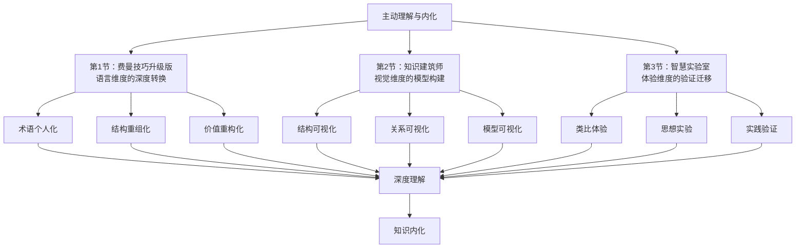

# 第5章：主动理解与内化 - 总览

> "理解是灵魂的炼金术，它能把信息的铅块变成智慧的黄金。" ——蒙田

## 引言：当费曼遇到现代"伪理解"流行病

### 物理学天才的"愚蠢问题"

1965年，理查德·费曼获得诺贝尔物理学奖。但在颁奖典礼上，这位天才物理学家做了一件"奇怪"的事：**他承认自己经常问"愚蠢"的问题**。

费曼的经典问题：
- "你真的理解你在说什么吗？"
- "你能用简单的话向一个6岁孩子解释这个概念吗？"
- "如果你不能简化一个概念，说明你并没有真正理解它。"

**费曼的发现**：大多数人以为自己理解了，实际上只是记住了一堆术语。**真正的理解和表面的记忆之间，有着天壤之别**。

### 现代学习者的"伪理解"综合症

如果费曼生活在今天，他会震惊地发现现代人普遍患上了"伪理解"综合症：

**症状一：术语堆砌病**
- 能够流利地使用各种专业术语
- 可以完整复述书中的观点
- 但问到"为什么"就说不清楚

**症状二：概念收集癖**
- 笔记本里记满了各种概念和方法
- 朋友圈经常分享"深度思考"
- 但在实际问题面前一筹莫展

**症状三：理解幻觉症**
- 读完一本书觉得"很有道理"
- 感觉自己"懂了很多东西"
- 但过两天就忘得一干二净

**费曼会说什么？**他可能会苦笑："你们这样学习，就像只会背诵菜谱却从来不下厨的人——知道所有步骤，但做不出一道菜。"

### 认知科学的"理解工程学"

现代认知科学证实了费曼的洞察：

**建构主义学习理论**（让·皮亚杰）：
> "知识不是被动接受的，而是学习者主动建构的。真正的理解是新信息与已有认知结构的创造性整合。"

**意义学习理论**（大卫·奥苏贝尔）：
> "影响学习最重要的因素是学习者已经知道什么。如果没有与已有知识建立有意义的联系，新信息很快就会被遗忘。"

**双重编码理论**（艾伦·佩维奥）：
大脑同时使用语言系统和视觉系统处理信息。**最有效的理解是多感官通道的协同加工**。

## 理解与内化的"生物化学"

### 理解的三重转化过程

#### 转化1：从"外来物"到"自体物"——同化过程

就像身体消化食物一样，大脑也要"消化"信息：

**信息消化的四个阶段**：
```
外来信息 → 分解识别 → 吸收整合 → 重新合成 → 自体知识

具体过程：
原始信息 → 个人语言 → 个人经验 → 个人理解 → 个人智慧
```

**消化不良的症状**：
- 只能用书上的原话解释概念
- 无法与个人经验建立连接
- 在新情境中无法灵活应用

#### 转化2：从"零散分子"到"系统结构"——整合过程

**认知化学反应**：
```
孤立概念 + 关联思考 → 概念网络
个别方法 + 系统思维 → 方法体系  
零散经验 + 理论框架 → 智慧结构
```

**整合成功的标志**：
- 能够看到知识间的内在联系
- 可以构建个人的理论框架
- 具备系统性解决问题的能力

#### 转化3：从"被动存储"到"主动调用"——内化过程

**知识的三种存在状态**：
```
惰性知识：存在但不活跃，难以调用
活性知识：可以调用但需要刻意努力
自动化知识：成为思维的一部分，自然调用
```

**内化完成的标志**：
- 知识成为直觉判断的基础
- 在思考中自然使用新概念
- 能够创造性地组合和应用

## 主动理解与内化的"三维建模"系统

### 第一维：语言维度——费曼技巧的升级版

#### 费曼技巧的神经科学基础

**布罗卡区和韦尼克区的协同工作**：
- 理解激活韦尼克区（语言理解中枢）
- 表达激活布罗卡区（语言产生中枢）
- **用自己的话表达=强制激活两个脑区的深度协作**

#### 语言转换的四个层次

**L1层：术语转换**
```
原文："认知负荷理论认为工作记忆容量有限"
费曼版："大脑一次只能处理少量信息，就像杂技演员只能同时抛几个球"
```

**L2层：结构重组**
```
原文逻辑：理论→证据→应用
费曼逻辑：问题→解释→例子→应用
```

**L3层：情境嵌入**
```
抽象概念 → 具体情境中的应用
一般原理 → 个人经验中的体现
```

**L4层：价值重构**
```
作者的价值判断 → 个人的价值判断
书本的意义 → 对个人的意义
```

### 第二维：视觉维度——知识的"建筑设计"

#### 大脑的视觉优势

**视觉皮层占大脑皮层30%**：人类是高度视觉化的物种。
**图像记忆效应**：图像信息的记忆效果是文字的6倍。
**空间认知理论**：大脑用空间关系理解抽象概念。

#### 知识可视化的三种模式

**模式1：结构可视化**
```
思维导图：展现概念的层次关系
概念图：显示概念间的语义关系  
流程图：呈现过程的时间关系
系统图：表达系统的因果关系
```

**模式2：关系可视化**
```
对比表：突出差异和相似性
矩阵图：展现多维度关系
网络图：显示复杂关联
地图化：空间化抽象知识
```

**模式3：模型可视化**
```
隐喻模型：用熟悉事物解释陌生概念
机制模型：展现内在工作原理
系统模型：整体功能和结构
过程模型：动态发展变化
```

### 第三维：体验维度——知识的"实验室测试"

#### 体验式学习理论

**大卫·科尔布的体验学习循环**：
```
具体体验 → 反思观察 → 抽象概念化 → 主动实验 → 具体体验
```

**体验的三种形式**：

**形式1：类比体验**
```
寻找相似体验：新概念与已有经验的相似点
构建类比桥梁：抽象概念的具体化表达
验证类比边界：类比的适用范围和局限性
```

**形式2：思想实验**
```
假设情境：如果条件改变会怎样？
极端测试：在极端情况下理论还成立吗？
反例搜索：什么情况下这个理论会失效？
```

**形式3：实践验证**
```
小规模试验：在安全环境中测试理论
观察结果：理论预测与实际结果的差异
修正理解：基于实践经验调整理解
```

## 理解与内化的"质量保证"体系

### 理解深度的五级评估

基于**布鲁姆认知层次理论**的现代化升级：

**Level 1：记忆层（Remembering）**
```
质量标准：能准确回忆关键信息
测试方法：关键词复述、定义回忆
通过标准：准确率>90%
```

**Level 2：理解层（Understanding）**
```
质量标准：能用自己的话解释概念
测试方法：费曼技巧、概念改写
通过标准：6岁孩子能听懂
```

**Level 3：应用层（Applying）**
```
质量标准：能在新情境中运用知识
测试方法：案例分析、问题解决
通过标准：成功率>70%
```

**Level 4：分析层（Analyzing）**
```
质量标准：能分解复杂概念和关系
测试方法：结构分析、关系梳理
通过标准：识别出主要组成部分和关系
```

**Level 5：创造层（Creating）**
```
质量标准：能创新性地组合和应用
测试方法：创新方案、跨域迁移
通过标准：产生有价值的新见解
```

### 内化程度的动态监测

#### 内化的三个阶段

**阶段1：表面内化（Surface Internalization）**
```
特征：
□ 能记住主要观点
□ 可以复述基本内容
□ 理解停留在字面意思
□ 难以在新情境中应用

持续时间：学习后1-7天
巩固策略：重复阅读、要点梳理
```

**阶段2：深度内化（Deep Internalization）**
```
特征：
□ 理解概念的本质含义
□ 能与已有知识建立联系
□ 可以进行批判性思考
□ 开始在实际中尝试应用

持续时间：学习后1-4周
巩固策略：主动解释、实践验证
```

**阶段3：自动化内化（Automatic Internalization）**
```
特征：
□ 知识成为思维的自然部分
□ 直觉性地调用相关概念
□ 能够灵活迁移和创新应用
□ 形成个人化的理解风格

持续时间：学习后1个月以上
巩固策略：持续应用、创新组合
```

#### 内化监测工具

**自我评估量表**：
```
内化程度检测（5分制）：

1. 自然使用度
□ 在思考中自然想到这些概念？(1-5分)
□ 在交流中自然使用这些概念？(1-5分)

2. 灵活应用度  
□ 能在不同情境中灵活运用？(1-5分)
□ 能与其他知识创新组合？(1-5分)

3. 直觉判断度
□ 对相关问题有直觉性判断？(1-5分)
□ 能快速识别相关模式？(1-5分)

总分解读：
25-30分：高度内化
20-24分：中度内化  
15-19分：浅度内化
<15分：未真正内化
```

## 本章的"工程蓝图"

### 三节课的协同设计



### 学习路径的个性化设计

#### 基于认知风格的策略选择

**语言优势型学习者**：
- 重点发展费曼技巧
- 强化语言转换训练
- 通过写作和讲解深化理解

**视觉优势型学习者**：
- 重点发展可视化建模
- 强化图表制作技能
- 通过绘图和图像深化理解

**体验优势型学习者**：
- 重点发展实践验证
- 强化类比和实验思维
- 通过动手和体验深化理解

#### 基于学习目标的方法组合

**理论掌握目标**：
```
主要方法：费曼技巧 + 概念图
辅助方法：类比思考 + 批判反思
评估标准：能清晰解释 + 能指出局限
```

**实践应用目标**：
```
主要方法：实践验证 + 案例分析
辅助方法：流程图 + 情境模拟
评估标准：能成功应用 + 能改进优化
```

**创新发展目标**：
```
主要方法：跨域类比 + 思想实验
辅助方法：系统建模 + 价值重构
评估标准：能创新组合 + 能启发他人
```

## 预期收获：从"知道"到"智慧"

### 认知能力的三重跃升

**第一重：理解力跃升**
- 从表面理解转向深层理解
- 从孤立理解转向关联理解
- 从被动理解转向主动建构

**第二重：应用力跃升**
- 从僵化应用转向灵活应用
- 从单一应用转向组合应用
- 从模仿应用转向创新应用

**第三重：创造力跃升**
- 从知识消费转向知识生产
- 从简单组合转向创造性综合
- 从个人智慧转向集体智慧贡献

### 元认知能力的根本提升

**学会学习的学习**：
- 掌握理解的本质机制
- 形成个人的理解风格
- 建立理解质量的监控体系

**学会思考的思考**：
- 理解思维的基本过程
- 掌握思维工具的使用
- 培养反思和改进的习惯

**学会创新的创新**：
- 理解创新的认知基础
- 掌握创新思维的方法
- 建立持续创新的机制

## 成功学习的"三个关键变量"

### 变量1：主动性（Agency）

**被动学习 vs 主动学习**：
```
被动学习：等待理解自然发生
主动学习：主动建构理解过程

被动学习：接受作者的观点
主动学习：与作者进行对话

被动学习：依赖外部解释
主动学习：创造个人意义
```

### 变量2：深度性（Depth）

**浅层加工 vs 深层加工**：
```
浅层：满足于表面信息
深层：追求本质理解

浅层：孤立处理概念
深层：系统整合知识

浅层：机械记忆为主
深层：意义建构为主
```

### 变量3：持续性（Persistence）

**一次性学习 vs 持续性学习**：
```
一次性：学完即止
持续性：螺旋式深化

一次性：追求完美理解
持续性：接受理解的渐进性

一次性：静态知识观
持续性：动态知识观
```

---

> "理解是通往智慧的桥梁，而内化是智慧在心中生根的过程。" ——孔子

**费曼教会了我们：真正的理解不是占有，而是转化。不要做知识的囤积者，要做智慧的创造者。因为只有当知识成为你思维的一部分时，它才真正属于你。**