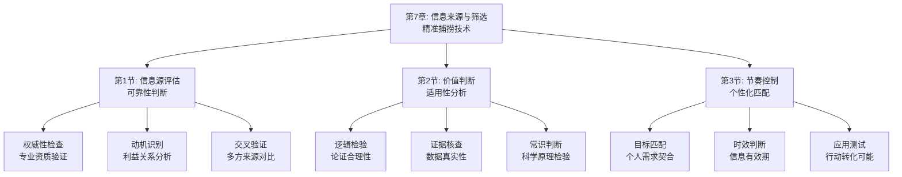

# 第7章：信息来源与筛选 - 总览

> "在信息的洪流中，判断力比知识更重要。" ——亚里士多德

## 引言：当司马迁遇上"假新闻"

### 史学家的"信息甄别术"

公元前1世纪，太史令司马迁在撰写《史记》时面临一个巨大挑战：如何从海量且相互矛盾的史料中筛选出真实可靠的信息？

司马迁的解决方案令人惊叹：
- **多方验证**：同一事件必须有多个独立来源的记录
- **逻辑检验**：不符合常理的记录需要特别谨慎
- **动机分析**：分析记录者的立场和可能的偏见

**司马迁的原则**："究天人之际，通古今之变，成一家之言。"这不仅是写作原则，更是信息筛选的最高标准。

### 现代人的"信息迷雾"

如果司马迁生活在今天，他可能会被现代的信息环境震惊：

**古代史官的"稀缺时代"**：
- 信息珍贵，每条记录都经过严格筛选
- 史官职责就是辨别真伪，确保记录准确
- 错误信息的传播成本极高

**现代网民的"泛滥时代"**：
- 信息爆炸，每天面对海量信息流
- 每个人都是信息发布者，真假难辨
- 错误信息传播速度比真相更快

**司马迁会怎么说？**他可能会感慨："你们这个时代，信息如江河泛滥，但真正有价值的却如珍珠般稀少。学会筛选，比学会记录更重要。"

### 认知科学的"信息过滤器"

现代认知科学为信息筛选提供了科学依据：

**信号检测理论**（Green & Swets）：
> "在噪音中识别信号的能力，是信息筛选的核心技能。"**优秀的筛选者能更好地区分有用信息和干扰信息**。

**启发式决策理论**（Gerd Gigerenzer）：
人类大脑进化出简单的"经验法则"来处理复杂决策，**学会使用正确的启发式能显著提高筛选效率**。

**确认偏见理论**（Peter Wason）：
人们倾向于寻找证实自己观点的信息，**优秀的筛选者会主动寻找反面证据**。

## 信息筛选的"三重过滤器"

### 过滤器1：来源评估——信息的"出生证明"

**核心问题**：这条信息来自哪里？发布者是否可靠？

**认知科学基础**：
- **权威性评估**：发布者的专业背景和声誉
- **动机分析**：发布者的目的和可能的偏见
- **一致性检验**：与其他可靠来源是否一致

**实践方法**：
1. **权威性检查**：确认发布者的专业资质和声誉
2. **动机识别**：分析发布者可能的利益关系
3. **交叉验证**：与其他独立来源进行对比

### 过滤器2：内容评估——信息的"健康检查"

**核心问题**：这条信息本身是否合理？证据是否充分？

**认知科学基础**：
- **逻辑一致性**：信息内部是否逻辑自洽
- **证据支撑**：观点是否有充分的证据支持
- **常识检验**：是否符合基本的常识和科学原理

**实践方法**：
1. **逻辑检验**：检查论证过程是否合理
2. **证据核查**：验证引用数据和案例的真实性
3. **常识判断**：用基本常识检验信息的合理性

### 过滤器3：适用性评估——信息的"个人匹配度"

**核心问题**：这条信息对我个人有什么价值？是否适用？

**认知科学基础**：
- **相关性判断**：信息与个人目标的相关程度
- **时效性评估**：信息的有效期和更新频率
- **可操作性分析**：信息是否能转化为实际行动

**实践方法**：
1. **目标匹配**：评估信息与个人目标的契合度
2. **时效判断**：确认信息的时效性和更新情况
3. **应用测试**：思考如何将信息转化为实际行动

## 本章的"信息筛选工具箱"

### 第1节：信息源评估——"可靠性鉴定师"

#### 核心问题：如何判断信息来源是否可靠？

**科学基础**：基于**权威性评估**和**动机分析**，建立信息源可靠性评估体系。

**实战工具**：
- **权威性检查表**：评估发布者的专业背景和声誉
- **动机识别器**：分析发布者的目的和可能的偏见
- **交叉验证法**：与其他独立来源进行对比验证

**预期收获**：
- 建立个人化的高质量信息源清单
- 掌握信息源可靠性评估的科学方法
- 避免被不可靠信息误导

### 第2节：价值判断——"个人价值评估师"

#### 核心问题：如何判断信息对个人的价值？

**科学基础**：基于**相关性判断**和**可操作性分析**，建立个人化的价值评估体系。

**实战工具**：
- **目标匹配矩阵**：评估信息与个人目标的契合度
- **时效性评估器**：确认信息的时效性和更新情况
- **应用测试法**：思考如何将信息转化为实际行动

**预期收获**：
- 建立个人化的信息价值评估标准
- 提高信息筛选的效率和准确性
- 确保获取的信息都能产生实际价值

### 第3节：节奏控制——"个性化信息管理师"

#### 核心问题：如何根据个人情况控制信息摄入节奏？

**科学基础**：基于**认知负荷理论**和**注意力管理理论**，建立个性化的信息摄入节奏。

**实战工具**：
- **认知能力评估**：了解个人的信息处理能力
- **注意力管理器**：合理分配注意力资源
- **节奏调节法**：根据情况调整信息摄入速度

**预期收获**：
- 建立适合自己的信息摄入节奏
- 避免信息过载导致的认知疲劳
- 提高信息处理的效率和质量

## 信息筛选的"生态系统"

### 为什么叫"生态系统"？

就像自然生态系统一样，高效的信息筛选需要多个要素的协同工作：
- **信息源**（输入端）：高质量的信息来源
- **过滤机制**（处理端）：去粗取精的筛选能力
- **评估标准**（判断端）：科学的价值判断体系
- **个人匹配**（输出端）：与个人目标的契合度
- **节奏控制**（调节端）：适应个人能力的摄入速度

**缺一不可**：就像生态系统中的每个环节都至关重要，信息筛选的每个环节都需要精心设计。

## 与前几章的"无缝衔接"

### 从理解到筛选：认知能力的自然延伸

| 前几章解决的问题 | 本章解决的问题 | 连接逻辑 |
|----------------|--------------|---------|
| 阅读的本质和记忆机制 | 如何从海量信息中筛选有价值内容 | 理解了大脑工作原理后，需要相应的筛选策略 |
| 被动阅读和知识孤岛 | 如何主动选择高质量信息 | 诊断了问题后，需要具体的解决方案 |
| 理解与内化方法 | 如何确保获取的信息质量 | 掌握了深度处理方法后，需要保证输入质量 |

### 从理论到实践：方法论的完整闭环

**前三部分**：认识问题和解决方法
**本章**：确保输入质量，从源头解决问题

这就像健康饮食：
- 前面章节是关于如何消化吸收营养
- 本章是关于如何选择健康食材

## 学习成果：从"信息被动接收者"到"主动筛选者"

> "不是所有闪光的东西都是金子。" ——威廉·莎士比亚

完成这一章的学习后，你将实现从"信息被动接收者"到"主动筛选者"的转变：

### 🔍 精准识别：成为信息的"鉴定师"

你将拥有：
- **权威性雷达**：快速识别高质量信息源
- **动机分析器**：准确判断信息发布者的意图
- **交叉验证法**：通过多方对比确保信息准确性

就像古董鉴定师能从众多物品中识别真品，你也能从海量信息中筛选出真正有价值的内容。

### 🎯 价值评估：成为信息的"价值分析师"

你将掌握：
- **目标匹配器**：准确评估信息与个人目标的契合度
- **时效性判断**：识别信息的有效期和更新情况
- **应用转化力**：思考如何将信息转化为实际行动

这就像投资分析师能评估投资项目的价值，你也能评估信息对个人的价值。

### ⚖️ 节奏控制：成为信息的"时间管理者"

你将具备：
- **认知能力评估**：了解个人的信息处理能力
- **注意力分配**：合理分配有限的注意力资源
- **节奏调节**：根据情况调整信息摄入速度

这就像优秀的项目经理能合理安排工作节奏，你也能合理安排信息摄入节奏。

## 信息筛选攻略：如何在信息洪流中保持清醒

> "知道得更多，但思考得更少，这是现代人的通病。" ——尼尔·波兹曼

### 🎯 三步筛选法：像侦探一样严谨

**第一步：背景调查**（来源评估）
像侦探调查嫌疑人背景一样，评估信息来源的可靠性。问自己："这个信息发布者可信吗？有什么动机？"

**第二步：证据检验**（内容评估）
像侦探检验证据一样，验证信息的真实性和合理性。问自己："这些信息有证据支撑吗？符合逻辑吗？"

**第三步：个人匹配**（适用性评估）
像侦探考虑案件与自己的关系一样，评估信息对个人的价值。问自己："这些信息对我有用吗？我能怎么用？"

### 💡 元认知提醒：成为自己的"信息教练"

在信息筛选过程中，经常问自己三个问题：
1. **这条信息来自哪里？发布者可靠吗？**（来源评估）
2. **这条信息合理吗？有证据支撑吗？**（内容评估）
3. **这条信息对我有价值吗？我能怎么用？**（适用性评估）

认知心理学家约翰·弗拉维尔（John Flavell）把这种"思考自己的思考"称为元认知，它是高效学习的核心技能。

### 🚀 开启探索：从信息筛选到知识建构

准备好了吗？我们即将踏上一场从"被动接收"到"主动筛选"的认知升级之旅。这不仅是关于筛选信息的技巧，更是关于如何在信息时代保持清醒和理性的生存智慧。

**下一站：第1节《信息源评估：可靠性判断》——让我们学会识别高质量信息源。**