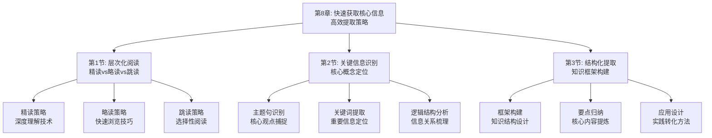

# 第8章：快速获取核心信息 - 总览

> "速度不是目标，效率才是关键。" ——中国古代兵法

## 引言：当孙子兵法遇上"信息战场"

### 军事家的"信息速战术"

公元前5世纪，孙武在《孙子兵法》中提出"兵贵神速"的战略思想。在信息时代，这一思想同样适用于知识获取——如何在最短时间内获取最有价值的信息。

孙子的"信息速战原则"：
- **知己知彼**：了解信息的特点和自己的需求
- **速战速决**：快速识别和提取核心信息
- **避实击虚**：跳过次要内容，专注关键要点
- **因敌制胜**：根据信息类型调整获取策略

**孙子的智慧**："故兵闻拙速，未睹巧之久也。"意思是军队宁可笨拙但快速，也不要精巧但拖延。在信息获取中，宁可方法简单但高效，也不要技巧复杂但低效。

### 现代人的"信息速读困境"

如果孙子生活在今天的信息时代，他可能会对现代人的阅读习惯感到困惑：

**古代将领的"精准情报"**：
- 情报珍贵，每份都经过精心分析
- 专注于关键信息，忽略无关内容
- 快速决策，立即行动

**现代读者的"全面阅读"**：
- 习惯从头读到尾，不愿跳过内容
- 追求完整性而忽视效率
- 阅读时间长但收获有限

**孙子会怎么说？**他可能会感慨："你们这个时代，信息如敌军般众多，但真正有用的情报却如将才般稀少。学会速战速决，比学会全面阅读更重要。"

### 认知科学的"快速提取理论"

现代认知科学为快速信息获取提供了科学依据：

**模式识别理论**（Walter Kintsch）：
> "专家之所以能快速处理信息，是因为他们拥有丰富的模式库。"**通过训练建立信息模式识别能力，能显著提高提取速度**。

**图式理论**（Frederic Bartlett）：
人们通过已有的认知结构（图式）来理解和记忆新信息，**建立完善的图式系统能加速信息处理**。

**预测编码理论**（Karl Friston）：
大脑通过预测来处理信息，**准确的预测能减少信息处理时间**。

## 快速获取的"三层加速系统"

### 层级1：阅读策略——信息获取的"战术选择"

**核心问题**：面对不同类型的信息，应该采用什么阅读策略？

**策略类型**：
- **精读策略**：深入理解，全面掌握
- **略读策略**：快速浏览，获取要点
- **跳读策略**：选择性阅读，直取核心

**选择原则**：
1. **价值导向**：根据信息价值选择阅读深度
2. **目标匹配**：根据处理目标选择阅读方式
3. **时间约束**：根据可用时间选择阅读策略
4. **个人能力**：根据理解能力调整阅读难度

### 层级2：关键信息识别——信息获取的"雷达系统"

**核心问题**：如何快速识别信息中的核心要点？

**识别要素**：
- **主题句**：表达核心观点的句子
- **关键词**：承载重要信息的词汇
- **逻辑结构**：信息的组织方式和关系
- **数据支撑**：支持观点的证据和案例

**识别方法**：
1. **结构分析**：分析信息的组织结构和逻辑关系
2. **标记识别**：识别表示重要性的语言标记
3. **提问引导**：通过提问引导注意力到关键信息
4. **经验积累**：通过实践积累识别经验

### 层级3：结构化提取——信息获取的"加工厂"

**核心问题**：如何将提取的信息组织成有用的知识结构？

**提取要素**：
- **核心观点**：信息的主要论点和结论
- **支撑证据**：支持观点的数据和案例
- **逻辑关系**：观点之间的连接和推理
- **应用场景**：信息的适用范围和使用方法

**提取方法**：
1. **框架构建**：建立信息处理的基本框架
2. **要点归纳**：将信息归纳为关键要点
3. **关系梳理**：梳理要点之间的逻辑关系
4. **应用设计**：设计信息的应用场景和方法

## 本章的"快速获取工具箱"

### 第1节：层次化阅读——"阅读策略大师"

#### 核心问题：如何根据信息特点选择合适的阅读策略？

**科学基础**：基于**阅读策略理论**和**认知负荷理论**，建立层次化的阅读策略体系。

**实战工具**：
- **策略选择矩阵**：根据信息价值和时间约束选择阅读策略
- **精读技术包**：深度理解的阅读方法和技巧
- **略读技巧库**：快速浏览的阅读方法和技巧

**预期收获**：
- 掌握精读、略读、跳读的科学应用场景
- 提高阅读策略选择的准确性和效率
- 在有限时间内最大化信息获取效果

### 第2节：关键信息识别——"信息雷达系统"

#### 核心问题：如何快速识别信息中的核心要点？

**科学基础**：基于**模式识别理论**和**图式理论**，训练快速识别核心信息的能力。

**实战工具**：
- **主题句识别器**：快速定位核心观点的技巧
- **关键词提取法**：识别重要信息的词汇标记
- **逻辑结构分析器**：理解信息组织方式的工具

**预期收获**：
- 培养快速识别核心信息的"雷达"能力
- 提高信息处理的准确性和效率
- 建立个人化的关键信息识别系统

### 第3节：结构化提取——"知识加工厂"

#### 核心问题：如何将提取的信息组织成有用的知识结构？

**科学基础**：基于**知识建构理论**和**结构化思维**，设计促进深度学习的提取系统。

**实战工具**：
- **框架构建器**：建立信息处理的基本框架
- **要点归纳法**：将信息归纳为关键要点
- **应用设计工具**：设计信息的应用场景和方法

**预期收获**：
- 掌握结构化知识提取的方法和技巧
- 提高信息转化为知识的效率
- 让提取的信息成为可应用的知识资产

## 快速获取的"生态系统"

### 为什么叫"生态系统"？

就像自然生态系统一样，高效的快速获取需要多个要素的协同工作：
- **策略选择**（输入端）：根据信息特点选择合适的获取策略
- **识别系统**（处理端）：快速识别核心信息的能力
- **提取工具**（加工端）：将信息转化为知识的工具
- **应用输出**（输出端）：将知识转化为行动的能力
- **反馈调节**（调节端）：根据效果调整获取策略

**缺一不可**：就像生态系统中的每个环节都至关重要，快速获取的每个环节都需要精心设计。

## 与前几章的"无缝衔接"

### 从筛选到获取：能力发展的自然延伸

| 前几章解决的问题 | 本章解决的问题 | 连接逻辑 |
|----------------|--------------|---------|
| 信息筛选和评估 | 如何高效获取筛选后的有价值信息 | 筛选是前提，获取是执行 |
| 价值判断和节奏控制 | 如何在有限时间内最大化信息获取 | 价值判断指导策略选择，节奏控制保证效率 |
| 理解与内化方法 | 如何快速提取可内化的核心信息 | 理解方法提升提取质量，内化需求指导提取重点 |

### 从理论到实践：方法论的完整闭环

**前三部分**：认识问题和解决方法
**第四部分**：确保输入质量
**本章**：提高处理效率

这就像现代化生产线：
- 前面章节是关于原料选择和质量控制
- 本章是关于生产效率和加工技术

## 学习成果：从"慢读族"到"快读侠"

> "兵贵胜，不贵久。" ——《孙子兵法》

完成这一章的学习后，你将实现从"慢读族"到"快读侠"的转变：

### ⚡ 策略选择：成为阅读的"战术家"

你将拥有：
- **策略雷达**：快速识别最适合的阅读策略
- **时间管理器**：在有限时间内最大化信息获取
- **效果评估器**：准确评估不同策略的效果

就像军事指挥官能根据不同战场选择最佳战术，你也能根据不同信息选择最佳阅读策略。

### 🔍 信息识别：成为信息的"侦察兵"

你将掌握：
- **主题句雷达**：快速定位核心观点和结论
- **关键词探测器**：准确识别重要信息词汇
- **逻辑结构分析仪**：理解信息的组织方式

这就像侦察兵能从复杂地形中识别关键目标，你也能从复杂信息中识别核心要点。

### 🧠 结构提取：成为知识的"建筑师"

你将具备：
- **框架构建能力**：将零散信息组织成系统知识
- **要点归纳技巧**：将复杂信息提炼为关键要点
- **应用设计能力**：将知识转化为实际行动

这就像建筑师能将建筑材料建成美丽房屋，你也能将信息构建为有用知识。

## 快速获取攻略：如何在信息战场上速战速决

> "善战者，致人而不致于人。" ——《孙子兵法》

### 🎯 三步获取法：像将军一样精准

**第一步：侦察模式**（策略选择）
像将军侦察敌情一样，评估信息的特点和自己的需求。问自己："这条信息我应该精读、略读还是跳读？"

**第二步：突击模式**（信息识别）
像将军发动突袭一样，快速识别信息中的核心要点。问自己："这条信息的核心观点是什么？关键证据有哪些？"

**第三步：占领模式**（结构提取）
像将军占领阵地一样，将获取的信息组织成有用的知识。问自己："如何将这些信息转化为我的知识和能力？"

### 💡 元认知提醒：成为自己的"信息将军"

在快速获取过程中，经常问自己三个问题：
1. **我应该用什么策略处理这条信息？**（策略选择）
2. **这条信息的核心要点是什么？**（信息识别）
3. **如何将这些要点组织成有用知识？**（结构提取）

军事理论家克劳塞维茨把这种"思考自己的思考"称为"元战略"，它是高效行动的核心技能。

### 🚀 开启探索：从慢读到快读的认知升级

准备好了吗？我们即将踏上一场从"慢读族"到"快读侠"的认知升级之旅。这不仅是关于阅读速度的提升，更是关于如何在信息时代保持高效和精准的人生智慧。

**下一站：第1节《层次化阅读：精读vs略读vs跳读》——让我们学会选择最合适的阅读策略。**