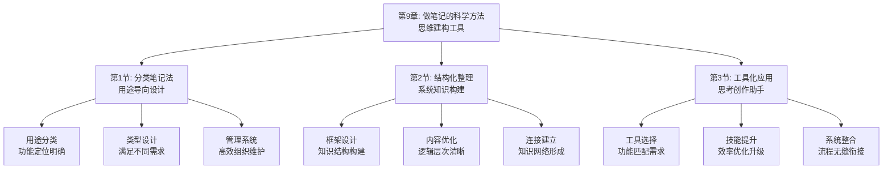

# 第9章：做笔记的科学方法 - 总览

> "好记性不如烂笔头。" ——中国古谚

## 引言：当达芬奇遇上"笔记科学"

### 文艺复兴大师的"笔记革命"

列奥纳多·达芬奇不仅是艺术大师，更是笔记科学的先驱。他的7200页笔记涵盖了从解剖学到工程学的各个领域，展现了笔记作为思维工具的巨大价值。

达芬奇的"笔记科学原则"：
- **观察记录**：详细记录观察到的现象和细节
- **思考整合**：将观察与思考相结合
- **图形表达**：用图像辅助理解和记忆
- **系统整理**：将零散记录组织成知识体系

**达芬奇的名言**："学习永无止境，笔记是最好的老师。"他明白，笔记不仅是记录工具，更是思维的延伸和知识的建构工具。

### 现代人的"笔记困境"

如果达芬奇生活在今天的信息时代，他可能会对现代人的笔记习惯感到困惑：

**文艺复兴时代的"深度笔记"**：
- 笔记珍贵，每页都经过深思熟虑
- 注重观察、思考和创造的结合
- 将笔记作为思维和创作的工具

**现代学习者的"表面记录"**：
- 笔记量大，但缺乏深度思考
- 习惯复制粘贴，忽视个人理解
- 笔记多为存储工具，少为思维工具

**达芬奇会怎么说？**他可能会感慨："你们这个时代，信息如繁星般众多，但真正能启发思考的笔记却如明月般稀少。学会思考，比学会记录更重要。"

### 认知科学的"笔记理论"

现代认知科学为科学笔记提供了科学依据：

**生成效应理论**（Slameka & Graf）：
> "自己生成的信息比被动接受的信息记忆效果更好。"**通过主动笔记能显著提高记忆和理解效果**。

**精细化理论**（Craik & Lockhart）：
记忆的持久性取决于加工的深度，**深度加工的笔记能促进长期记忆**。

**双重编码理论**（Allan Paivio）：
大脑同时使用语言和图像系统处理信息，**图文结合的笔记能提高处理效率**。

## 笔记科学的"三维体系"

### 维度1：分类系统——笔记的"功能定位"

**核心问题**：不同类型的笔记应该承担什么功能？

**笔记分类原则**：
- **目的导向**：根据使用目的设计笔记类型
- **功能明确**：每种笔记有明确的功能定位
- **系统完整**：各类笔记形成完整体系
- **便于管理**：易于分类、检索和维护

**分类方法**：
1. **按用途分类**：学习笔记、工作笔记、创意笔记等
2. **按内容分类**：概念笔记、方法笔记、案例笔记等
3. **按形式分类**：文字笔记、图表笔记、混合笔记等
4. **按时间分类**：临时笔记、整理笔记、归档笔记等

### 维度2：组织结构——笔记的"知识架构"

**核心问题**：如何组织笔记内容形成有用的知识结构？

**组织原则**：
- **逻辑清晰**：内容组织要有清晰的逻辑关系
- **层次分明**：信息要有明确的层次结构
- **关联丰富**：建立知识点之间的连接关系
- **便于检索**：建立有效的检索和导航机制

**组织方法**：
1. **框架设计**：为不同类型笔记设计合适的框架
2. **结构优化**：优化笔记的内部结构和布局
3. **连接建立**：建立笔记之间的关联关系
4. **索引完善**：完善笔记的索引和标签系统

### 维度3：工具应用——笔记的"技术支撑"

**核心问题**：如何选择和使用合适的笔记工具？

**工具选择原则**：
- **功能匹配**：工具功能要匹配笔记需求
- **易用性强**：工具要易于学习和使用
- **扩展性好**：工具要支持功能扩展
- **兼容性佳**：工具要与其他系统兼容

**应用方法**：
1. **工具评估**：评估不同工具的特点和适用性
2. **组合使用**：根据需要组合使用多种工具
3. **技能提升**：提升工具使用技能和效率
4. **系统整合**：将工具整合到工作流程中

## 本章的"笔记科学工具箱"

### 第1节：分类笔记法——"用途导向的笔记设计"

#### 核心问题：如何根据用途设计不同类型的笔记？

**科学基础**：基于**功能分化理论**和**认知负荷理论**，建立用途导向的笔记分类体系。

**实战工具**：
- **用途分类矩阵**：根据使用目的设计笔记类型
- **类型设计指南**：为不同类型笔记制定设计标准
- **管理系统方案**：建立高效的笔记组织和维护系统

**预期收获**：
- 建立个人化的笔记分类体系
- 掌握不同类型笔记的设计方法
- 提高笔记的使用效率和价值

### 第2节：结构化整理——"系统知识的建构术"

#### 核心问题：如何将零散笔记组织成系统知识？

**科学基础**：基于**知识建构理论**和**图式理论**，设计促进深度学习的整理系统。

**实战工具**：
- **框架设计工具**：为知识整理设计合适的框架
- **内容优化方法**：优化笔记内容的逻辑和层次
- **连接建立技术**：建立知识点之间的关联关系

**预期收获**：
- 掌握结构化知识整理的方法和技巧
- 提高知识体系的完整性和系统性
- 让零散笔记成为有价值的知識资产

### 第3节：工具化应用——"思维工具的集成术"

#### 核心问题：如何让笔记成为思考和创作的助手？

**科学基础**：基于**认知工具理论**和**技术增强理论**，设计促进思维的工具应用体系。

**实战工具**：
- **工具选择指南**：根据需求选择合适的笔记工具
- **技能提升方案**：提升工具使用技能和效率
- **系统整合策略**：将工具整合到工作流程中

**预期收获**：
- 掌握笔记工具的高效使用方法
- 提升笔记处理的效率和质量
- 让笔记真正成为思维的延伸工具

## 笔记科学的"生态系统"

### 为什么叫"生态系统"？

就像自然生态系统一样，科学的笔记系统需要多个要素的协同工作：
- **分类体系**（输入端）：根据用途设计的笔记类型
- **组织结构**（处理端）：系统化的知识组织方式
- **工具应用**（工具端）：支持笔记处理的技术工具
- **应用场景**（输出端）：笔记在实际中的应用价值
- **维护机制**（调节端）：笔记系统的持续优化机制

**缺一不可**：就像生态系统中的每个环节都至关重要，笔记系统的每个要素都需要精心设计。

## 与前几章的"无缝衔接"

### 从获取到整理：能力发展的自然延伸

| 前几章解决的问题 | 本章解决的问题 | 连接逻辑 |
|----------------|--------------|---------|
| 信息筛选和评估 | 如何将有价值信息转化为个人笔记 | 筛选是前提，笔记是载体 |
| 快速获取和结构化提取 | 如何系统化地组织和管理笔记 | 获取是输入，整理是加工 |
| 理解与内化方法 | 如何通过笔记促进深度理解和内化 | 理解是基础，笔记是工具 |

### 从理论到实践：方法论的完整闭环

**前三部分**：认识问题和解决方法
**第四部分**：确保输入质量
**第五、六部分**：提高处理效率和深度
**本章**：完善输出和管理系统

这就像现代化知识工厂：
- 前面章节是关于原料选择和加工技术
- 本章是关于产品存储和管理系统

## 学习成果：从"记录员"到"知识架构师"

> "笔记不是为了记录，而是为了思考。" ——现代学习理论

完成这一章的学习后，你将实现从"记录员"到"知识架构师"的转变：

### 📚 分类设计：成为笔记的"系统设计师"

你将拥有：
- **用途识别能力**：准确识别不同场景的笔记需求
- **类型设计技能**：为不同用途设计合适的笔记类型
- **管理系统构建**：建立高效的笔记组织和维护系统

就像建筑师能为不同功能设计合适的建筑，你也能为不同用途设计合适的笔记系统。

### 🧠 结构整理：成为知识的"组织专家"

你将掌握：
- **框架设计能力**：为知识整理设计合适的框架结构
- **内容优化技巧**：优化笔记内容的逻辑和层次关系
- **连接建立技术**：建立知识点之间的有机联系

这就像图书管理员能将零散书籍组织成有序的图书馆，你也能将零散笔记组织成系统的知识库。

### ⚙️ 工具应用：成为技术的"整合大师"

你将具备：
- **工具选择能力**：根据需求选择最合适的笔记工具
- **技能提升方法**：持续提升工具使用效率和质量
- **系统整合技巧**：将工具无缝整合到工作流程中

这就像技术专家能将不同工具整合成高效的工作系统，你也能将笔记工具整合成强大的思维助手。

## 笔记科学攻略：如何让笔记成为思维的延伸

> "最强大的武器不是剑，而是思想。" ——拿破仑

### 🎯 三步笔记法：像科学家一样严谨

**第一步：设计模式**（分类设计）
像科学家设计实验一样，根据用途设计合适的笔记类型。问自己："我为什么要记这个笔记？它要承担什么功能？"

**第二步：建构模式**（结构整理）
像科学家整理数据一样，将信息组织成有用的知識结构。问自己："如何将这些信息组织成系统的知識？"

**第三步：应用模式**（工具整合）
像科学家使用仪器一样，选择和使用合适的工具提高效率。问自己："什么工具能帮我更好地处理这些笔记？"

### 💡 元认知提醒：成为自己的"笔记教练"

在笔记过程中，经常问自己三个问题：
1. **我为什么要记这个笔记？它要承担什么功能？**（用途分析）
2. **如何将这些信息组织成有用的知識结构？**（结构设计）
3. **什么工具能帮我更好地处理这些笔记？**（工具选择）

认知心理学家约翰·弗拉维尔（John Flavell）把这种"思考自己的思考"称为元认知，它是高效学习的核心技能。

### 🚀 开启探索：从记录到建构的认知升级

准备好了吗？我们即将踏上一场从"被动记录"到"主动建构"的认知升级之旅。这不仅是关于笔记技巧的提升，更是关于如何将笔记变成思维工具的人生智慧。

**下一站：第1节《分类笔记法：用途导向设计》——让我们学会设计适合不同用途的笔记系统。**