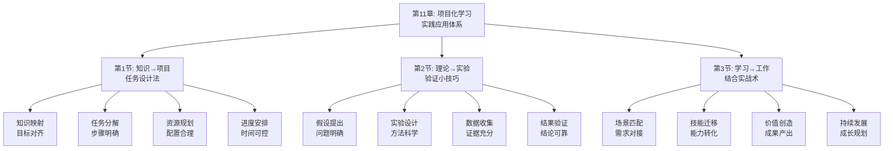

# 第11章：项目化学习 - 总览

> "纸上得来终觉浅，绝知此事要躬行。" ——陆游《冬夜读书示子聿》

## 引言：当杜威遇上"做中学"

### 教育家的"实践哲学"

美国教育家约翰·杜威提出了"做中学"（Learning by Doing）的教育理念，强调通过实践活动来获得知识和技能。他认为，真正的学习应该是在解决实际问题的过程中发生的。

杜威的"项目化学习原则"：
- **经验中心**：学习应以学生的直接经验为中心
- **问题导向**：通过解决真实问题来促进学习
- **主动参与**：学生应主动参与学习过程
- **社会互动**：学习应在社会互动中进行

**杜威的名言**："教育即生活，学校即社会。"他明白，只有将学习与生活实践相结合，才能真正实现知识的内化和应用。

### 现代人的"学习困境"

如果杜威生活在今天的学习环境中，他可能会对现代人的学习方式感到担忧：

**教育家的"体验式学习"**：
- 强调通过实践活动获得知识
- 注重学习过程中的体验和感悟
- 重视知识在实际情境中的应用

**现代学习者的"被动接受"**：
- 习惯于被动接受知识信息
- 缺乏实际操作和体验机会
- 知识与实际应用脱节

**杜威会怎么说？**他可能会感慨："你们这个时代，知识如繁星般众多，但真正能通过实践内化的却如北斗般稀少。学会在项目中学习，比学会在课堂中听讲更重要。"

### 认知科学的"项目化学习理论"

现代认知科学为项目化学习提供了科学依据：

**体验学习理论**（Kolb）：
> "学习是一个由经验、反思、概念化和实验组成的循环过程。"**通过项目化学习能促进完整的体验学习循环，显著提高学习效果**。

**建构主义学习理论**（Vygotsky）：
学习是学习者主动建构知识的过程，**在项目化学习中，学习者通过与环境和他人的互动来建构知识**。

**情境认知理论**（Lave & Wenger）：
知识是情境化的，**项目化学习提供真实情境，有助于知识的深度理解和灵活运用**。

## 项目化学习的"三维实践系统"

### 维度1：项目设计——从"知识"到"任务"

**核心问题**：如何将学到的知识转化为具体的项目任务？

**设计要素**：
- **目标明确**：项目目标要与学习目标一致
- **任务具体**：项目任务要具体可操作
- **资源匹配**：项目资源要与任务需求匹配
- **时间合理**：项目时间安排要合理可行

**设计方法**：
1. **知识映射**：将理论知识映射到实际任务
2. **任务分解**：将复杂项目分解为具体任务
3. **资源规划**：规划项目所需的各种资源
4. **进度安排**：安排合理的项目进度计划

### 维度2：实验验证——从"假设"到"实证"

**核心问题**：如何通过小实验验证理论知识的正确性？

**验证要素**：
- **假设明确**：实验假设要明确具体
- **方法科学**：实验方法要科学合理
- **数据收集**：实验数据要准确完整
- **结果分析**：实验结果要客观分析

**验证方法**：
1. **假设提出**：基于理论提出可验证的假设
2. **实验设计**：设计验证假设的实验方案
3. **数据收集**：系统收集实验相关数据
4. **结果验证**：分析数据验证理论假设

### 维度3：学用结合——从"学习"到"工作"

**核心问题**：如何将学习内容与工作实践有效结合？

**结合要素**：
- **场景匹配**：学习场景要与工作场景匹配
- **技能迁移**：学习技能要能迁移到工作中
- **价值创造**：学习要能为工作创造价值
- **持续发展**：学习要支持职业持续发展

**结合方法**：
1. **需求分析**：分析工作中的实际需求
2. **技能对接**：将学习技能与工作需求对接
3. **实践应用**：在工作中应用所学知识
4. **效果评估**：评估学用结合的效果

## 本章的"项目化学习工具箱"

### 第1节：知识→项目——"任务设计法"

#### 核心问题：如何将学到的知识转化为具体的项目任务？

**科学基础**：基于**任务分析理论**和**项目管理理论**，设计知识到项目的转化体系。

**实战工具**：
- **知识任务映射图**：将理论知识映射到具体任务
- **项目任务分解法**：将复杂项目分解为可操作任务
- **资源时间规划表**：规划项目资源和时间安排

**预期收获**：
- 掌握将知识转化为项目任务的方法
- 提高项目设计和规划的能力
- 建立系统性的项目执行体系

### 第2节：理论→实验——"验证小技巧"

#### 核心问题：如何通过小实验验证理论知识的正确性？

**科学基础**：基于**实验设计理论**和**假设检验理论**，设计理论验证体系。

**实战工具**：
- **实验假设构建法**：构建可验证的实验假设
- **小实验设计模板**：设计简单有效的验证实验
- **数据收集分析表**：系统收集和分析实验数据

**预期收获**：
- 掌握设计小实验验证理论的方法
- 提高实验设计和数据分析能力
- 建立科学的理论验证体系

### 第3节：学习→工作——"结合实战术"

#### 核心问题：如何将学习内容与工作实践有效结合？

**科学基础**：基于**迁移学习理论**和**工作学习理论**，设计学用结合体系。

**实战工具**：
- **学用对接分析法**：分析学习与工作的对接点
- **技能迁移应用图**：将学习技能迁移到工作场景
- **价值创造评估表**：评估学用结合的价值产出

**预期收获**：
- 掌握学用结合的具体方法和技巧
- 提高知识在工作中的应用能力
- 建立持续的学习与工作融合机制

## 项目化学习的"生态系统"

### 为什么叫"生态系统"？

就像自然生态系统一样，高效的项目化学习需要多个要素的协同工作：
- **知识输入**（输入端）：获取有价值的知识和信息
- **项目设计**（转化端）：将知识转化为项目任务
- **实验验证**（验证端）：通过实验验证理论假设
- **学用结合**（应用端）：将学习与工作实践结合
- **反馈优化**（调节端）：根据反馈持续优化改进

**缺一不可**：就像生态系统中的每个环节都至关重要，项目化学习的每个要素都需要精心设计。

## 与前几章的"无缝衔接"

### 从理解到应用：学习方式的自然演进

| 前几章解决的问题 | 本章解决的问题 | 连接逻辑 |
|----------------|--------------|---------|
| 知识获取和理解 | 如何将理解的知识通过项目实践 | 理解是基础，实践是深化 |
| 笔记整理和工具应用 | 如何通过项目化方式应用工具 | 工具是手段，项目是载体 |
| 能力转化和行动实践 | 如何通过项目系统化应用能力 | 能力是要素，项目是整合 |

### 从学习到创造：方法论的完整闭环

**前三部分**：认识问题、解决问题、获取知识
**本章**：应用知识、验证理论、创造价值

这就像创新价值链：
- 前面章节是关于知识的获取和整理
- 本章是关于知识的系统化应用和验证

## 学习成果：从"学习者"到"实践者"

> "知之愈明，则行之愈笃；行之愈笃，则知之益明。" ——朱熹《朱子语类》

完成这一章的学习后，你将实现从"学习者"到"实践者"的转变：

### 🎯 项目设计：成为知识的"项目转化师"

你将拥有：
- **知识任务映射**：将理论知识转化为具体项目任务
- **项目任务分解**：将复杂项目分解为可操作步骤
- **资源时间规划**：合理规划项目资源和时间安排

就像项目经理能将战略转化为具体项目，你也能将学到的知识转化为可执行的项目任务。

### 🚀 实验验证：成为理论的"实证专家"

你将掌握：
- **假设构建能力**：基于理论构建可验证的假设
- **实验设计技巧**：设计简单有效的验证实验
- **数据分析方法**：系统收集和分析实验数据

这就像科学家能通过实验验证理论，你也能通过小实验验证所学知识的正确性。

### 📊 学用结合：成为学习的"价值创造者"

你将具备：
- **学用对接能力**：准确识别学习与工作的对接点
- **技能迁移技巧**：将学习技能有效迁移到工作中
- **价值评估方法**：评估学习在工作中的价值产出

这就像企业家能将创意转化为商业价值，你也能将学习成果转化为工作价值。

## 项目化学习攻略：如何让学习产生实际价值

> "实践出真知。" ——中国古谚

### 🎯 三步项目法：像实践者一样学习

**第一步：设计模式**（知识→项目）
像项目经理一样，将学到的知识转化为具体的项目任务。问自己："我如何将这个知识设计成一个可执行的项目？"

**第二步：验证模式**（理论→实验）
像科学家一样，通过小实验验证理论知识的正确性。问自己："我如何设计一个小实验来验证这个理论？"

**第三步：结合模式**（学习→工作）
像企业家一样，将学习内容与工作实践有效结合。问自己："我如何将这个学习内容应用到我的工作中？"

### 💡 元认知提醒：成为自己的"项目教练"

在项目化学习过程中，经常问自己三个问题：
1. **我如何将这个知识设计成一个项目任务？**（项目设计）
2. **我如何通过小实验验证这个理论？**（实验验证）
3. **我如何将这个学习内容应用到工作中？**（学用结合）

认知心理学家约翰·弗拉维尔（John Flavell）把这种"思考自己的思考"称为元认知，它是高效学习的核心技能。

### 🚀 开启探索：从理论到实践的价值创造

准备好了吗？我们即将踏上一场从"被动学习"到"主动实践"的价值创造之旅。这不仅是关于学习方法的提升，更是关于如何将学习转化为实际价值的人生智慧。

**下一站：第1节《知识→项目：任务设计法》——让我们学会将知识转化为具体的项目任务。**