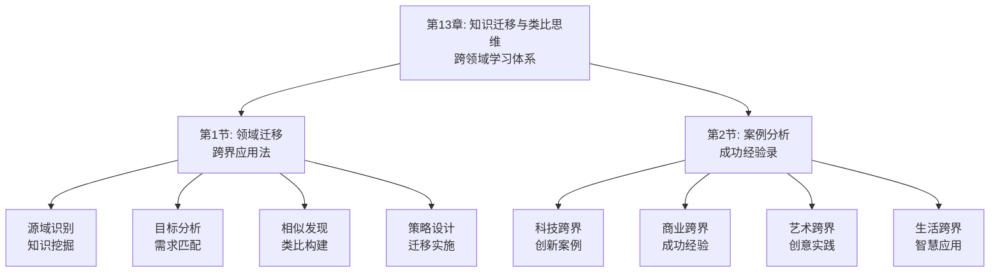

# 第13章：知识迁移与类比思维 - 总览

> "智者千虑，必有一失；愚者千虑，必有一得。" ——《晏子春秋》

## 引言：当类比大师遇上"迁移智慧"

### 类比大师的"连接艺术"

类比大师们深谙类比思维的精髓。他们能够从看似无关的事物中发现共同的本质特征，并通过类比将一个领域的知识迁移到另一个领域。从古代的哲学家到现代的科学家，从文学家到发明家，类比思维都是他们创新突破的重要工具。

类比大师的"迁移原则"：
- **本质洞察**：洞察事物背后的本质特征
- **结构映射**：映射不同领域间的结构关系
- **情境适应**：适应目标领域的情境特点
- **价值创造**：通过迁移创造新的价值

**类比大师的名言**："类比是思维的翅膀。"他们明白，只有通过类比思维，才能在不同领域间自由翱翔。

### 现代人的"迁移困境"

如果类比大师面对现代人的学习方式，他们可能会发现以下问题：

**类比大师的"迁移能力"**：
- 善于发现不同事物间的共同特征
- 能够将一个领域的知识迁移到另一个领域
- 通过类比实现创新和突破
- 不受传统思维框架的束缚

**现代学习者的"迁移障碍"**：
- 习惯于在单一领域内学习
- 缺乏跨领域连接的意识和能力
- 类比思维能力较弱
- 受学科界限的限制

**类比大师会怎么说？**他们可能会感慨："你们这个时代，知识如繁星般众多，但真正能通过类比实现迁移的却如北斗般稀少。学会类比，比学会记忆更重要。"

### 认知科学的"类比迁移理论"

现代认知科学为知识迁移与类比思维提供了科学依据：

**类比迁移理论**（Gentner）：
> "类比是跨领域知识迁移的核心机制，通过识别不同领域间的相似结构实现知识迁移。"**通过类比思维能显著提高跨领域知识迁移的效果**。

**迁移学习理论**（Singley & Anderson）：
知识的迁移是学习的重要目标，**通过多样化的情境应用能提高知识的迁移能力**。

**结构映射理论**（Gentner & Markman）：
类比的核心是结构映射，**通过映射不同领域间的结构关系能实现有效的知识迁移**。

## 知识迁移的"三维类比系统"

### 维度1：领域迁移——从"此领域"到"彼领域"

**核心问题**：如何将一个领域的知识迁移到另一个领域？

**迁移要素**：
- **源领域识别**：识别可迁移的知识来源领域
- **目标领域分析**：分析知识应用的目标领域
- **相似性发现**：发现两个领域间的相似性
- **迁移策略设计**：设计知识迁移的具体策略

**迁移方法**：
1. **特征对比**：对比两个领域的特征
2. **结构分析**：分析两个领域的结构
3. **映射建立**：建立领域间的映射关系
4. **情境适应**：适应目标领域的情境

### 维度2：类比推理——从"已知"到"未知"

**核心问题**：如何通过类比推理解决新问题？

**推理要素**：
- **基域选择**：选择合适的已知领域作为基域
- **目标域分析**：分析需要解决的目标问题
- **映射建立**：建立基域与目标域的映射
- **推理解析**：通过映射进行推理

**推理方法**：
1. **类比识别**：识别合适的类比对象
2. **映射构建**：构建类比映射关系
3. **推理解析**：通过映射进行推理
4. **结果验证**：验证推理结果的正确性

### 维度3：情境适应——从"理论"到"实践"

**核心问题**：如何将迁移的知识适应到具体情境？

**适应要素**：
- **情境分析**：分析目标情境的特点
- **差异识别**：识别源领域与目标情境的差异
- **调整策略**：制定适应调整的策略
- **效果评估**：评估适应的效果

**适应方法**：
1. **情境扫描**：全面扫描目标情境
2. **差异分析**：分析与源领域间的差异
3. **策略调整**：调整迁移策略适应情境
4. **效果监控**：监控适应的效果

## 本章的"知识迁移工具箱"

### 第1节：领域迁移——"跨界应用法"

#### 核心问题：如何将一个领域的知识迁移到另一个领域？

**科学基础**：基于**类比迁移理论**和**结构映射理论**，设计跨领域知识迁移体系。

**实战工具**：
- **领域映射图**：映射不同领域间的结构关系
- **迁移策略模板**：设计知识迁移的具体策略
- **情境适应指南**：适应目标领域的情境特点

**预期收获**：
- 掌握跨领域知识迁移的方法
- 提高类比思维和迁移能力
- 学会设计迁移策略

### 第2节：案例分析——"成功经验录"

#### 核心问题：如何通过成功案例学习跨界思维？

**科学基础**：基于**案例学习理论**和**经验学习理论**，设计案例分析体系。

**实战工具**：
- **案例分析框架**：分析跨界学习的成功案例
- **经验萃取表**：萃取有价值的经验和教训
- **应用规划模板**：规划如何应用到自己的情境

**预期收获**：
- 学习成功的跨界学习经验
- 提高案例分析和经验萃取能力
- 建立应用规划的思维模式

## 知识迁移的"创新生态系统"

### 为什么叫"创新生态系统"？

就像自然生态系统一样，高效的跨领域知识迁移需要多个要素的协同工作：
- **输入端**：获取不同领域的有价值知识
- **处理端**：通过类比实现知识迁移
- **适应端**：将迁移知识适应到具体情境
- **输出端**：产出具象的创新成果
- **反馈端**：通过实践反馈优化迁移过程

**缺一不可**：就像生态系统中的每个环节都至关重要，知识迁移的每个要素都需要精心设计。

## 与前几章的"无缝衔接"

### 从应用到迁移：学习闭环的自然延伸

| 前几章解决的问题 | 本章解决的问题 | 连接逻辑 |
|----------------|--------------|---------|
| 知识应用和实践 | 如何将知识迁移到新领域 | 应用是基础，迁移是拓展 |
| 项目化学习实践 | 如何通过类比解决新问题 | 实践是过程，类比是工具 |
| 反思迭代优化 | 如何通过迁移实现创新 | 优化是手段，创新是目标 |

### 从执行到创新：方法论的完整闭环

**前几章**：认识问题、解决问题、获取知识、应用知识
**本章**：迁移知识、类比推理、情境适应

这就像创新价值链：
- 前面章节是关于知识的获取和应用
- 本章是关于知识的迁移和创新

## 学习成果：从"迁移者"到"创新者"

> "他山之石，可以攻玉。" ——《诗经·小雅·鹤鸣》

完成这一章的学习后，你将实现从"迁移者"到"创新者"的转变：

### 🎯 领域迁移：成为知识的"搬运工"

你将拥有：
- **源域识别能力**：识别可迁移的知识来源领域
- **目标分析技巧**：分析知识应用的目标领域
- **相似性发现方法**：发现两个领域间的相似性

就像搬运工能将货物从一个地方运到另一个地方，你也能将知识从一个领域迁移到另一个领域。

### 🚀 类比推理：成为思维的"桥梁师"

你将掌握：
- **类比识别技能**：识别合适的类比对象
- **映射构建方法**：构建类比映射关系
- **推理解析能力**：通过映射进行推理

这就像桥梁师能连接两岸，你也能通过类比连接不同领域的知识。

### 📊 情境适应：成为知识的"调适师"

你将具备：
- **情境分析能力**：分析目标情境的特点
- **差异识别技巧**：识别源领域与目标情境的差异
- **策略调整方法**：制定适应调整的策略

这就像调适师能根据不同情况调整方案，你也能将迁移的知识适应到具体情境。

## 知识迁移攻略：如何让知识跨越领域边界

> "类比是思维的翅膀。" ——未知

### 🎯 三步迁移法：像类比大师一样思考

**第一步：识别模式**（领域A→领域B）
像类比大师一样，识别两个领域间的共同模式。问自己："这两个领域有什么共同的本质特征？"

**第二步：构建映射**（结构→结构）
像结构工程师一样，构建两个领域间的结构映射。问自己："这个领域的结构如何映射到另一个领域？"

**第三步：适应调整**（理论→实践）
像实践家一样，将迁移的知识适应到具体情境。问自己："如何将这个知识适应到我的具体情境？"

### 💡 元认知提醒：成为自己的"迁移教练"

在知识迁移过程中，经常问自己三个问题：
1. **这两个领域有什么共同的本质特征？**（类比识别）
2. **这个领域的结构如何映射到另一个领域？**（映射构建）
3. **如何将这个知识适应到我的具体情境？**（情境适应）

认知心理学家约翰·弗拉维尔（John Flavell）把这种"思考自己的思考"称为元认知，它是高效学习的核心技能。

### 🚀 开启探索：从迁移学习到创新突破

准备好了吗？我们即将踏上一场从"领域内学习"到"跨领域迁移"的创新之旅。这不仅是关于学习方法的提升，更是关于如何通过知识迁移实现创新突破的人生智慧。

**下一站：第1节《领域迁移：跨界应用法》——让我们学会将一个领域的知识迁移到另一个领域。**