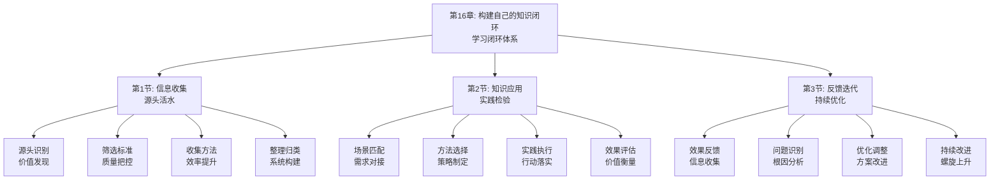

# 第16章：构建自己的知识闭环 - 总览

> "学而时习之，不亦说乎？" ——《论语·学而》

## 引言：当系统思考者遇上"闭环智慧"

### 系统思考者的"闭环哲学"

系统思考者们深谙闭环的智慧。他们明白，真正的学习不是线性的获取-存储过程，而是一个完整的闭环系统。从古代的哲学家到现代的管理大师，系统思考者们都具备将学习构建成完整闭环的能力。

系统思考者的"闭环原则"：
- **系统性**：将学习视为完整的系统
- **循环性**：强调学习的循环反馈特性
- **实践性**：注重知识的实际应用
- **持续性**：追求持续的优化改进

**系统思考者的名言**："真正的学习是一个从理论到实践，再从实践到理论的循环过程。"他们明白，只有构建完整的知识闭环，才能实现真正的学习效果。

### 现代人的"线性学习"

如果系统思考者面对现代人的学习方式，他们可能会发现以下问题：

**系统思考者的"闭环学习"**：
- 将学习视为完整的闭环系统
- 强调获取、处理、应用、反馈的循环
- 注重知识在实践中的检验和应用
- 追求持续的优化和改进

**现代学习者的"线性模式"**：
- 将学习视为线性的获取-存储过程
- 忽视知识的应用和反馈环节
- 缺乏系统性的学习规划
- 缺乏持续优化的机制

**系统思考者会怎么说？**他们可能会感慨："你们这个时代，信息如潮水般汹涌，但真正能构建知识闭环的却如珍珠般稀少。学会构建闭环，比学会获取信息更重要。"

### 认知科学的"闭环学习理论"

现代认知科学为知识闭环构建提供了科学依据：

**闭环学习理论**（Ashby）：
> "学习是一个感知-行动-反馈的闭环过程，通过反馈调节实现持续改进。"**通过构建完整的知识闭环能显著提高学习效果**。

**体验学习理论**（Kolb）：
学习是一个由具体经验、反思观察、抽象概念化和主动实验组成的循环过程，**闭环学习能促进完整的体验学习循环**。

**反馈控制理论**（Wiener）：
系统通过反馈机制实现自我调节和优化，**通过反馈能持续改进行为和学习策略**。

## 知识闭环构建的"三维闭环系统"

### 维度1：信息收集——从"杂乱"到"有序"

**核心问题**：如何建立有效的信息收集机制？

**收集要素**：
- **源头识别**：识别有价值的信息源头
- **筛选标准**：建立信息筛选的标准
- **收集方法**：掌握有效的收集方法
- **整理归类**：对收集的信息进行整理

**收集方法**：
1. **源头挖掘**：挖掘高质量的信息源头
2. **标准制定**：制定信息筛选的标准
3. **方法应用**：应用有效的收集方法
4. **系统整理**：建立系统的信息整理机制

### 维度2：知识应用——从"理论"到"实践"

**核心问题**：如何将知识有效应用于实践？

**应用要素**：
- **场景匹配**：将知识与应用场景匹配
- **方法选择**：选择合适的应用方法
- **实践执行**：在实践中执行应用
- **效果评估**：评估应用的实际效果

**应用方法**：
1. **场景分析**：分析知识的应用场景
2. **方法设计**：设计具体的应用方法
3. **执行实施**：实施知识应用过程
4. **效果监控**：监控应用的效果

### 维度3：反馈迭代——从"静态"到"动态"

**核心问题**：如何通过反馈实现持续迭代？

**迭代要素**：
- **效果反馈**：收集应用效果的反馈
- **问题识别**：识别应用中的问题
- **优化调整**：根据反馈优化调整
- **持续改进**：建立持续改进机制

**迭代方法**：
1. **反馈收集**：建立有效的反馈收集机制
2. **问题分析**：分析反馈中的问题
3. **方案优化**：优化改进应用方案
4. **循环迭代**：建立循环迭代机制

## 本章的"知识闭环路线图"

### 第1节：信息收集——"源头活水"

#### 核心问题：如何建立有效的信息收集机制？

**科学基础**：基于**信息检索理论**和**知识管理理论**，设计信息收集体系。

**关键内容**：
- **价值发现**：识别有价值的信息源头
- **质量把控**：建立信息筛选的标准
- **效率提升**：掌握有效的收集方法
- **系统构建**：建立系统的信息整理机制

**预期收获**：
- 掌握高效的信息收集方法
- 建立科学的信息筛选标准
- 提高信息收集的效率和质量
- 构建系统的信息管理体系

### 第2节：知识应用——"实践检验"

#### 核心问题：如何将知识有效应用于实践？

**科学基础**：基于**应用学习理论**和**实践理论**，设计知识应用体系。

**关键内容**：
- **需求对接**：将知识与应用场景匹配
- **策略制定**：选择合适的应用方法
- **行动落实**：在实践中执行应用
- **价值衡量**：评估应用的实际效果

**预期收获**：
- 掌握知识应用的实践方法
- 提高知识与场景的匹配度
- 增强知识应用的执行能力
- 建立效果评估的衡量体系

### 第3节：反馈迭代——"持续优化"

#### 核心问题：如何通过反馈实现持续迭代？

**科学基础**：基于**反馈控制理论**和**持续改进理论**，设计反馈迭代体系。

**关键内容**：
- **信息收集**：收集应用效果的反馈
- **根因分析**：识别应用中的问题
- **方案改进**：根据反馈优化调整
- **螺旋上升**：建立持续改进机制

**预期收获**：
- 建立有效的反馈收集机制
- 掌握问题识别分析方法
- 提高优化调整的能力
- 构建持续改进的闭环机制

## 知识闭环构建的"生态系统"

### 为什么叫"生态系统"？

就像自然生态系统一样，高效的知识闭环需要多个要素的协同工作：
- **输入端**：获取有价值的信息和知识
- **处理端**：处理和内化获取的知识
- **应用端**：将知识应用于实践场景
- **反馈端**：通过实践反馈优化知识
- **优化端**：持续优化改进知识体系

**缺一不可**：就像生态系统中的每个环节都至关重要，知识闭环的每个要素都需要精心设计。

## 与前几章的"无缝衔接"

### 从学习到闭环：成长路径的自然延伸

| 前几章解决的问题 | 本章解决的问题 | 连接逻辑 |
|----------------|--------------|---------|
| 知识获取和理解 | 如何构建完整的知识体系 | 理解是基础，体系是升华 |
| 知识应用和实践 | 如何形成闭环的学习系统 | 应用是过程，闭环是结果 |
| 反思迭代优化 | 如何实现持续的改进提升 | 优化是手段，闭环是目标 |

### 从碎片到系统：方法论的完整闭环

**前几章**：认识问题、解决问题、获取知识、应用知识、融合知识、内化习惯
**本章**：构建闭环、形成系统、实现持续、达成目标

这就像系统工程：
- 前面章节是关于知识的获取、应用和内化
- 本章是关于知识的系统化和闭环化

## 学习成果：从"学习者"到"系统构建者"

> "博学之，审问之，慎思之，明辨之，笃行之。" ——《礼记·中庸》

完成这一章的学习后，你将实现从"学习者"到"系统构建者"的转变：

### 🎯 信息收集：成为知识的"淘金者"

你将拥有：
- **源头识别能力**：识别高质量的信息源头
- **筛选标准制定**：建立科学的信息筛选标准
- **收集方法掌握**：掌握高效的信息收集方法
- **系统整理技能**：建立系统的信息整理机制

就像淘金者能从沙石中淘出黄金，你也能从海量信息中获取有价值的知识。

### 🚀 知识应用：成为知识的"实践家"

你将掌握：
- **场景匹配技能**：将知识与应用场景精准匹配
- **方法选择能力**：选择最合适的应用方法
- **执行实施技巧**：在实践中有效执行应用
- **效果评估方法**：准确评估应用的实际效果

这就像实践家能将理论转化为现实，你也能将知识转化为实际价值。

### 📊 反馈迭代：成为系统的"优化师"

你将具备：
- **反馈收集能力**：建立有效的反馈收集机制
- **问题识别技巧**：准确识别应用中的问题
- **优化调整方法**：根据反馈优化调整方案
- **持续改进机制**：构建持续改进的闭环机制

这就像优化师能持续改进系统性能，你也能持续优化自己的知识体系。

## 知识闭环构建攻略：如何让学习形成完整循环

> "学而时习之，不亦说乎？" ——《论语·学而》

### 🎯 三步闭环法：像系统思考者一样学习

**第一步：收集模式**（杂乱→有序）
像淘金者一样，建立高效的信息收集机制。问自己："我如何获取有价值的信息？"

**第二步：应用模式**（理论→实践）
像实践家一样，将知识有效应用于实践。问自己："我如何将知识转化为实际价值？"

**第三步：迭代模式**（静态→动态）
像优化师一样，通过反馈实现持续迭代。问自己："我如何通过反馈持续优化知识体系？"

### 💡 元认知提醒：成为自己的"闭环教练"

在知识闭环构建过程中，经常问自己三个问题：
1. **我如何获取有价值的信息？**（信息收集）
2. **我如何将知识转化为实际价值？**（知识应用）
3. **我如何通过反馈持续优化知识体系？**（反馈迭代）

认知心理学家约翰·弗拉维尔（John Flavell）把这种"思考自己的思考"称为元认知，它是高效学习的核心技能。

### 🚀 开启探索：从线性学习到闭环系统的智慧升级

准备好了吗？我们即将踏上一场从"线性学习"到"闭环系统"的智慧升级之旅。这不仅是关于学习方法的提升，更是关于如何通过构建知识闭环实现学习价值的人生智慧。

**下一站：第1节《信息收集：源头活水》——让我们学会建立高效的信息收集机制。**