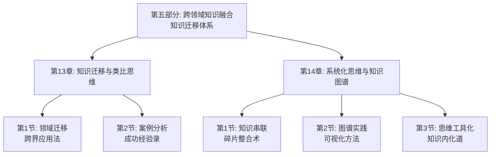

# 第五部分：跨领域的知识融合 - 总览

> "万物皆有裂痕，那是光照进来的地方。" ——莱昂纳德·科恩

## 引言：当创新者遇上"跨界思维"

### 创新者的"融合智慧"

史蒂夫·乔布斯曾说："创新就是把事物连接起来。"他将艺术与科技、设计与工程、人文与技术完美融合，创造了改变世界的产品。创新者们深谙跨界融合的智慧，他们明白，真正的突破往往来自于不同领域的交汇点。

创新者的"融合原则"：
- **连接思维**：将看似无关的事物连接起来
- **类比迁移**：通过类比将一个领域的知识迁移到另一个领域
- **系统整合**：将不同领域的知识整合成新的体系
- **价值创造**：通过融合创造新的价值

**创新者的名言**："创造力就是连接事物的能力。"乔布斯明白，只有通过跨领域的知识融合，才能产生真正的创新。

### 现代人的"领域壁垒"

如果乔布斯面对现代人的学习方式，他可能会发现以下问题：

**创新者的"跨界融合"**：
- 善于在不同领域间建立连接
- 能够将一个领域的知识迁移到另一个领域
- 通过整合不同领域的知识创造新价值
- 不受传统领域界限的束缚

**现代学习者的"领域隔离"**：
- 习惯于在单一领域内深入学习
- 缺乏跨领域连接的意识和能力
- 知识迁移能力较弱
- 受传统学科界限的限制

**乔布斯会怎么说？**他可能会感慨："你们这个时代，知识如繁星般众多，但真正能连接不同领域的却如北斗般稀少。学会跨界融合，比学会深入学习更重要。"

### 认知科学的"知识迁移理论"

现代认知科学为跨领域知识融合提供了科学依据：

**类比迁移理论**（Gentner）：
> "类比是跨领域知识迁移的核心机制，通过识别不同领域间的相似结构实现知识迁移。"**通过类比思维能显著提高跨领域知识迁移的效果**。

**迁移学习理论**（Singley & Anderson）：
知识的迁移是学习的重要目标，**通过多样化的情境应用能提高知识的迁移能力**。

**系统思维理论**（Senge）：
系统思维是理解和解决复杂问题的关键，**通过系统思维能将碎片化知识整合成完整体系**。

## 跨领域融合的"三维迁移系统"

### 维度1：知识迁移——从"单一"到"多元"

**核心问题**：如何将一个领域的知识迁移到另一个领域？

**迁移要素**：
- **源领域识别**：识别可迁移的知识来源领域
- **目标领域分析**：分析知识应用的目标领域
- **相似性发现**：发现两个领域间的相似性
- **迁移策略设计**：设计知识迁移的具体策略

**迁移方法**：
1. **结构映射**：映射不同领域间的结构关系
2. **类比推理**：通过类比实现知识迁移
3. **抽象概括**：抽象出通用的知识原理
4. **情境适应**：适应目标领域的情境特点

### 维度2：类比思维——从"表象"到"本质"

**核心问题**：如何通过类比思维发现不同领域间的本质联系？

**思维要素**：
- **表象识别**：识别不同领域的事物表象
- **结构分析**：分析事物背后的结构关系
- **本质抽象**：抽象出事物的本质特征
- **类比应用**：将类比结果应用到新情境

**思维方法**：
1. **特征对比**：对比不同事物的特征
2. **关系梳理**：梳理事物间的关系
3. **模式识别**：识别共同的模式
4. **类比构建**：构建有效的类比关系

### 维度3：系统整合——从"碎片"到"整体"

**核心问题**：如何将不同领域的知识整合成系统？

**整合要素**：
- **知识梳理**：梳理各领域的核心知识
- **关系建立**：建立知识间的关系
- **结构设计**：设计整体的知识结构
- **体系完善**：完善知识体系的内容

**整合方法**：
1. **知识盘点**：全面盘点各领域的知识
2. **关联分析**：分析知识间的关联
3. **结构构建**：构建整体知识结构
4. **体系优化**：优化知识体系的结构

## 本部分的"跨界融合路线图"

### 第13章：知识迁移与类比思维

#### 核心问题：如何将一个领域的知识迁移到另一个领域？

**科学基础**：基于**类比迁移理论**和**知识迁移理论**，设计跨领域知识迁移体系。

**关键内容**：
- **跨界应用法**：将一个领域的知识应用到另一个领域
- **成功经验录**：分析跨界学习的成功案例

**预期收获**：
- 掌握跨领域知识迁移的方法
- 提高类比思维和迁移能力
- 学习成功的跨界学习经验

### 第14章：系统化思维与知识图谱

#### 核心问题：如何将碎片化知识整合成系统？

**科学基础**：基于**系统思维理论**和**知识建构理论**，设计知识系统化体系。

**关键内容**：
- **碎片整合术**：将碎片化知识串联成系统
- **可视化方法**：构建个人知识图谱
- **知识内化道**：将知识内化为思维工具

**预期收获**：
- 掌握知识系统化的方法
- 学会构建个人知识图谱
- 将知识内化为思维工具

## 跨领域融合的"创新生态系统"

### 为什么叫"创新生态系统"？

就像自然生态系统一样，高效的跨领域知识融合需要多个要素的协同工作：
- **输入端**：获取不同领域的有价值知识
- **迁移端**：通过类比实现知识迁移
- **整合端**：将不同领域知识整合成系统
- **应用端**：将融合知识应用于创新实践
- **反馈端**：通过实践反馈优化融合过程

**缺一不可**：就像生态系统中的每个环节都至关重要，跨领域融合的每个要素都需要精心设计。

## 与前几部分的"无缝衔接"

### 从应用到融合：学习闭环的自然延伸

| 前几部分解决的问题 | 本部分解决的问题 | 连接逻辑 |
|----------------|--------------|---------|
| 知识获取和理解 | 如何将不同领域的知识融合 | 理解是基础，融合是升华 |
| 知识应用和实践 | 如何通过融合创造新价值 | 应用是过程，创新是目标 |
| 反思迭代优化 | 如何通过融合实现突破 | 优化是手段，突破是结果 |

### 从执行到创新：方法论的完整闭环

**前四部分**：认识问题、解决问题、获取知识、应用知识
**本部分**：融合知识、创造价值、实现突破

这就像创新价值链：
- 前面章节是关于知识的获取和应用
- 本部分是关于知识的融合和创新

## 学习成果：从"专才"到"通才"

> "博学之，审问之，慎思之，明辨之，笃行之。" ——《礼记·中庸》

完成这一部分的学习后，你将实现从"专才"到"通才"的转变：

### 🎯 知识迁移：成为领域的"连接者"

你将拥有：
- **迁移路径设计**：设计跨领域知识迁移的路径
- **类比推理能力**：通过类比实现知识迁移
- **情境适应技巧**：将知识适应到新情境

就像桥梁工程师能连接两岸，你也能连接不同领域的知识。

### 🚀 类比思维：成为思维的"创新者"

你将掌握：
- **特征对比技能**：对比不同事物的特征
- **关系梳理方法**：梳理事物间的关系
- **模式识别能力**：识别共同的模式

这就像侦探能从线索中发现真相，你也能从不同领域中发现共同规律。

### 📊 系统整合：成为知识的"架构师"

你将具备：
- **知识盘点能力**：全面盘点各领域的知识
- **关联分析技巧**：分析知识间的关联
- **体系构建技术**：构建完整的知识体系

这就像建筑师能设计宏伟建筑，你也能构建自己的知识大厦。

## 跨界融合攻略：如何让知识产生创新价值

> "创新就是把事物连接起来。" ——史蒂夫·乔布斯

### 🎯 三步融合法：像创新者一样思考

**第一步：迁移模式**（领域A→领域B）
像创新者一样，将一个领域的知识迁移到另一个领域。问自己："这个领域的知识如何应用到另一个领域？"

**第二步：类比模式**（表象→本质）
像哲学家一样，通过类比发现不同领域间的本质联系。问自己："这两个领域有什么共同的本质特征？"

**第三步：整合模式**（碎片→系统）
像系统工程师一样，将碎片化知识整合成完整系统。问自己："如何将这些知识整合成一个完整的体系？"

### 💡 元认知提醒：成为自己的"融合教练"

在跨领域融合过程中，经常问自己三个问题：
1. **这个领域的知识如何应用到另一个领域？**（知识迁移）
2. **这两个领域有什么共同的本质特征？**（类比思维）
3. **如何将这些知识整合成一个完整的体系？**（系统整合）

认知心理学家约翰·弗拉维尔（John Flavell）把这种"思考自己的思考"称为元认知，它是高效学习的核心技能。

### 🚀 开启探索：从专精到融合的智慧升级

准备好了吗？我们即将踏上一场从"专精学习"到"跨界融合"的智慧升级之旅。这不仅是关于学习方法的提升，更是关于如何通过跨领域融合实现创新突破的人生智慧。

**下一站：第13章《知识迁移与类比思维》——让我们学会将一个领域的知识迁移到另一个领域。**