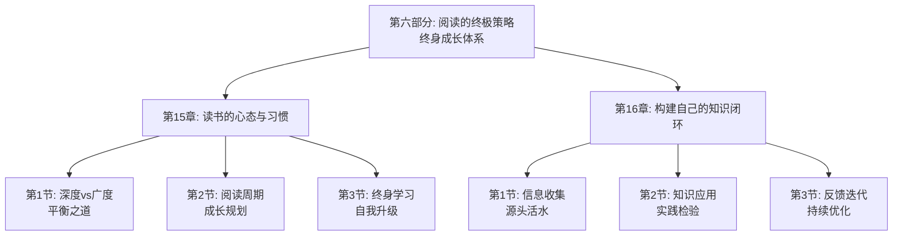

# 第六部分：阅读的终极策略 - 总览

> "学而时习之，不亦说乎？" ——《论语·学而》

## 引言：当终身学习者遇上"阅读哲学"

### 终身学习者的"阅读智慧"

终身学习者们深谙阅读的终极智慧。他们明白，阅读不仅是获取知识的手段，更是塑造人格、提升境界的重要途径。从古代的学者到现代的思想家，终身学习者们都具备将阅读内化为生活方式的能力。

终身学习者的"阅读原则"：
- **心态平和**：以平和的心态对待阅读
- **习惯坚持**：将阅读变成生活习惯
- **深度思考**：在阅读中进行深度思考
- **持续成长**：通过阅读实现持续成长

**终身学习者的名言**："阅读是通往智慧的钥匙。"他们明白，只有将阅读内化为生活方式，才能真正实现终身成长。

### 现代人的"阅读困境"

如果终身学习者面对现代人的阅读方式，他们可能会发现以下问题：

**终身学习者的"阅读境界"**：
- 以平和的心态对待阅读过程
- 将阅读内化为生活习惯
- 在阅读中进行深度思考
- 通过阅读实现持续成长

**现代阅读者的"功利心态"**：
- 急于求成，追求立竿见影的效果
- 缺乏持续阅读的习惯
- 忽视阅读中的深度思考
- 缺乏长远的成长规划

**终身学习者会怎么说？**他们可能会感慨："你们这个时代，信息如潮水般汹涌，但真正能静心阅读的却如珍珠般稀少。学会阅读，比学会获取信息更重要。"

### 认知科学的"阅读成长理论"

现代认知科学为阅读的终极策略提供了科学依据：

**终身学习理论**（Knowles）：
> "成人学习具有自我导向性强、经验丰富等特点，终身学习是个人发展的关键。"**通过培养终身学习习惯能显著提高个人发展水平**。

**成长型思维理论**（Dweck）：
拥有成长型思维的人相信能力可以通过努力提高，**通过培养成长型思维能促进持续成长**。

**自我决定理论**（Deci & Ryan）：
内在动机是持续学习的关键，**通过满足自主、胜任、关系三种基本需求能激发内在动机**。

## 阅读终极策略的"三维成长系统"

### 维度1：心态培养——从"急躁"到"平和"

**核心问题**：如何培养平和的阅读心态？

**培养要素**：
- **目标设定**：设定合理的阅读目标
- **节奏控制**：控制适当的阅读节奏
- **期待管理**：管理合理的成长期待
- **享受过程**：享受阅读的过程体验

**培养方法**：
1. **目标调整**：调整阅读目标的合理性
2. **节奏优化**：优化阅读节奏的适应性
3. **期待引导**：引导成长期待的合理性
4. **过程体验**：强化阅读过程的愉悦感

### 维度2：习惯养成——从"偶尔"到"持续"

**核心问题**：如何将阅读养成持续的习惯？

**养成要素**：
- **时间安排**：安排固定的阅读时间
- **环境营造**：营造良好的阅读环境
- **仪式感建立**：建立阅读的仪式感
- **坚持机制**：建立持续的坚持机制

**养成方法**：
1. **时间规划**：规划固定的阅读时间
2. **环境优化**：优化阅读环境的舒适度
3. **仪式设计**：设计阅读的仪式活动
4. **机制建立**：建立习惯坚持的机制

### 维度3：闭环构建——从"碎片"到"体系"

**核心问题**：如何构建完整的知识闭环？

**构建要素**：
- **信息收集**：系统收集有用信息
- **知识处理**：有效处理获取知识
- **应用实践**：将知识应用于实践
- **反馈迭代**：通过反馈持续迭代

**构建方法**：
1. **收集策略**：制定信息收集的策略
2. **处理方法**：掌握知识处理的方法
3. **应用实践**：加强知识的应用实践
4. **迭代优化**：建立反馈迭代的机制

## 本部分的"阅读成长路线图"

### 第15章：读书的心态与习惯

#### 核心问题：如何培养平和的阅读心态和持续的阅读习惯？

**科学基础**：基于**终身学习理论**和**习惯养成理论**，设计阅读心态与习惯培养体系。

**关键内容**：
- **平衡之道**：平衡阅读的深度与广度
- **成长规划**：制定阅读成长的周期规划
- **自我升级**：通过终身学习实现自我升级

**预期收获**：
- 培养平和的阅读心态
- 养成持续的阅读习惯
- 制定个人的阅读成长规划

### 第16章：构建自己的知识闭环

#### 核心问题：如何构建完整的个人知识闭环？

**科学基础**：基于**系统思维理论**和**反馈控制理论**，设计知识闭环构建体系。

**关键内容**：
- **源头活水**：建立有效的信息收集机制
- **实践检验**：将知识应用于实践检验
- **持续优化**：通过反馈实现持续优化

**预期收获**：
- 建立完整的知识获取体系
- 掌握知识应用的实践方法
- 构建持续优化的反馈机制

## 阅读终极策略的"成长生态系统"

### 为什么叫"成长生态系统"？

就像自然生态系统一样，高效的阅读成长需要多个要素的协同工作：
- **输入端**：获取有价值的信息和知识
- **处理端**：有效处理和内化知识
- **应用端**：将知识应用于实践
- **反馈端**：通过实践反馈优化知识
- **成长端**：实现个人的持续成长

**缺一不可**：就像生态系统中的每个环节都至关重要，阅读成长的每个要素都需要精心设计。

## 与前几部分的"无缝衔接"

### 从应用到成长：学习闭环的自然延伸

| 前几部分解决的问题 | 本部分解决的问题 | 连接逻辑 |
|----------------|--------------|---------|
| 知识获取和理解 | 如何将阅读内化为生活方式 | 理解是基础，内化是升华 |
| 知识应用和实践 | 如何通过阅读实现持续成长 | 应用是过程，成长是目标 |
| 反思迭代优化 | 如何构建完整的知识闭环 | 优化是手段，闭环是结果 |

### 从执行到升华：方法论的完整闭环

**前五部分**：认识问题、解决问题、获取知识、应用知识、融合知识
**本部分**：内化知识、养成习惯、构建闭环、实现成长

这就像成长价值链：
- 前面章节是关于知识的获取、应用和融合
- 本部分是关于知识的内化、习惯养成和成长实现

## 学习成果：从"读者"到"学者"

> "路漫漫其修远兮，吾将上下而求索。" ——屈原《离骚》

完成这一部分的学习后，你将实现从"读者"到"学者"的转变：

### 🎯 心态培养：成为阅读的"修行者"

你将拥有：
- **平和心态**：以平和的心态对待阅读
- **耐心品质**：具备持续学习的耐心
- **享受能力**：享受阅读过程的愉悦
- **成长意识**：具备持续成长的意识

就像修行者能在宁静中获得智慧，你也能在阅读中获得成长。

### 🚀 习惯养成：成为阅读的"践行者"

你将掌握：
- **时间管理**：合理安排阅读时间
- **环境营造**：营造良好的阅读环境
- **仪式感建立**：建立阅读的仪式感
- **坚持机制**：建立持续的坚持机制

这就像践行者能将理念转化为行动，你也能将阅读理念转化为习惯。

### 📊 闭环构建：成为知识的"架构师"

你将具备：
- **系统思维**：具备系统性的思维能力
- **闭环构建**：构建完整的知识闭环
- **持续优化**：建立持续优化的机制
- **终身成长**：实现终身成长的目标

这就像建筑师能设计宏伟建筑，你也能构建自己的知识大厦。

## 阅读终极策略攻略：如何让阅读成为生活方式

> "学而时习之，不亦说乎？" ——《论语·学而》

### 🎯 三步成长法：像终身学习者一样阅读

**第一步：心态模式**（急躁→平和）
像终身学习者一样，以平和的心态对待阅读。问自己："我如何以平和的心态享受阅读过程？"

**第二步：习惯模式**（偶尔→持续）
像践行者一样，将阅读内化为生活习惯。问自己："我如何将阅读变成持续的习惯？"

**第三步：闭环模式**（碎片→体系）
像架构师一样，构建完整的知识闭环。问自己："我如何构建完整的个人知识体系？"

### 💡 元认知提醒：成为自己的"阅读教练"

在阅读成长过程中，经常问自己三个问题：
1. **我如何以平和的心态享受阅读过程？**（心态培养）
2. **我如何将阅读变成持续的习惯？**（习惯养成）
3. **我如何构建完整的个人知识体系？**（闭环构建）

认知心理学家约翰·弗拉维尔（John Flavell）把这种"思考自己的思考"称为元认知，它是高效学习的核心技能。

### 🚀 开启探索：从阅读到成长的人生升华

准备好了吗？我们即将踏上一场从"被动阅读"到"主动成长"的人生升华之旅。这不仅是关于阅读方法的提升，更是关于如何通过阅读实现人生价值的人生智慧。

**下一站：第15章《读书的心态与习惯》——让我们学会培养平和的阅读心态和持续的阅读习惯。**