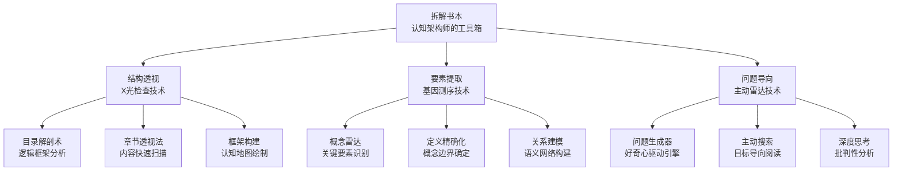

# 第4章：拆解书本：从零到一理解知识 - 总览

> "如果你不能简单地解释它，说明你还没有充分理解它。" ——爱因斯坦

## 引言：当达芬奇遇上现代阅读危机

### 解剖学的启示：从外到内，从整体到局部

1489年，列奥纳多·达芬奇在米兰秘密进行人体解剖。他不像其他解剖学家一样随意切割，而是**系统性地从外表到内脏，从整体结构到细节机制**，逐步揭示人体的奥秘。

达芬奇在笔记中写道：**"要理解任何复杂的系统，必须先理解它的整体结构，然后逐层深入到细节。"**

**这正是现代阅读最缺失的智慧**。

### 现代人的"阅读解剖学"危机

想象一下，如果达芬奇用现代人的阅读方式进行解剖：

**错误方式1："从头开始"解剖法**
- 拿到尸体就从脚趾开始切
- 不看整体结构就开始分解
- 切到哪里算哪里，没有整体规划

**错误方式2："走马观花"解剖法**
- 快速浏览一遍外表就觉得了解了
- 不深入内部结构和功能机制
- 满足于表面的印象和感觉

**错误方式3："盲人摸象"解剖法**
- 只关注感兴趣的某个器官
- 不理解器官与整体的关系
- 缺乏系统性的认知框架

**达芬奇会怎么说？**他可能会叹息："你们这样读书，就像不懂解剖学的屠夫在切肉——既不优雅，也不高效，更不科学。"

### 认知科学的"解剖刀"

现代认知科学为我们提供了比达芬奇更精密的"解剖工具"：

**图式理论的手术刀**（弗雷德里克·巴特莱特，1932）：
人类大脑天生就是一个"模式识别机器"，**我们理解新信息的方式是将其与已有的认知结构（图式）进行匹配**。

**认知负荷理论的显微镜**（约翰·斯威勒，1988）：
工作记忆的容量极其有限，**同时处理7±2个信息单元已经是极限**。结构化的信息能显著减少认知负荷。

**建构主义的X光机**（让·皮亚杰）：
学习不是被动接受，而是**主动建构意义的过程**。没有主动参与的阅读，就像没有血液循环的器官——死的。

## 拆解式阅读：书籍的"CT扫描技术"

### 什么是拆解式阅读？

拆解式阅读是**运用认知科学原理，系统性分析书籍信息架构，识别核心知识元素，构建结构化理解的高效阅读方法**。

如果把传统阅读比作"用肉眼看病"，拆解式阅读就是"用CT扫描诊断"：
- **透视结构**：看穿书籍的内在逻辑骨架
- **精准定位**：快速找到知识的关键节点
- **系统诊断**：全面理解各部分的功能关系

### 三大核心原理：站在巨人的肩膀上

#### 原理1：结构优先原理（基于图式理论）

**科学依据**：
认知心理学家理查德·安德森的研究发现：**有组织的知识比无组织的知识学习效率高300-500%**。

**实际应用**：
- 先构建书籍的"知识地图"
- 再在地图上"定点投放"具体信息  
- 避免"信息迷路"和"认知超载"

**生活类比**：
就像GPS导航，**先告诉你整条路线，再逐段指引具体方向**。如果没有全局视角，每个路口都是盲选。

#### 原理2：要素识别原理（基于专家-新手研究）

**科学依据**：
认知科学家奇·德·格鲁特的象棋专家研究发现：**专家与新手的差异不在于记忆力，而在于能够识别和提取关键模式**。

**实际应用**：
- 训练"概念雷达"，快速识别核心要素
- 建立"知识过滤器"，区分重要和次要信息
- 形成"模式库"，提高识别效率

**幽默类比**：
普通读者像"知识清洁工"——什么信息都往脑子里装；专家读者像"知识猎头"——只挑选最有价值的人才。

#### 原理3：主动建构原理（基于建构主义学习理论）

**科学依据**：
教育心理学家大卫·奥苏贝尔的经典名言：**"影响学习最重要的因素是学习者已经知道什么。"**

**实际应用**：
- 带着问题主动寻找答案
- 连接新旧知识，形成意义网络
- 通过质疑和思考深化理解

**深刻类比**：
被动阅读像"知识胃"——什么都吞，消化不良；主动阅读像"知识牙齿"——先咀嚼，再消化。

## 拆解式阅读的"三步走"战略

### 第一步：结构透视——书籍的"X光检查"

**目标**：构建书籍的认知地图，建立整体框架

**认知科学原理**：
- **预激活效应**：提前激活相关知识结构
- **自上而下处理**：用框架指导细节理解
- **工作记忆优化**：结构化信息减少认知负荷

**具体操作**：
1. **目录解剖**：分析逻辑层次和关系结构
2. **章节透视**：快速扫描各部分核心内容
3. **框架构建**：绘制知识的"建筑蓝图"

**类比理解**：
像建筑师看房屋设计图一样，**先理解整体结构，再关注具体房间的功能和装修**。

### 第二步：要素提取——知识的"基因测序"

**目标**：识别和理解书中的核心概念、关键观点和重要方法

**认知科学原理**：
- **概念形成理论**：概念是认知的基本单元
- **语义网络理论**：概念间的关系决定理解深度
- **专长理论**：专家拥有更精细的概念分类系统

**具体操作**：
1. **概念识别**：找出书中的关键术语和核心概念
2. **定义精确化**：准确理解每个概念的含义和边界
3. **关系建模**：构建概念间的逻辑关系网络

**幽默类比**：
像化学家做元素分析一样，**不仅要知道有哪些元素，还要知道它们是如何结合成分子的**。

### 第三步：问题导向——思维的"主动雷达"

**目标**：从被动接收转向主动探索，提升思考的深度和广度

**认知科学原理**：
- **元认知理论**：意识和监控自己的思维过程
- **问题解决理论**：问题是思维的动力源
- **批判性思维理论**：质疑是深度理解的起点

**具体操作**：
1. **问题生成**：针对内容提出"为什么"和"如何用"的问题
2. **主动搜索**：带着问题在阅读中寻找答案
3. **深度思考**：探索概念的本质、边界和应用

**精准类比**：
像科学家做实验一样，**先提出假设，再收集证据，最后得出结论**。

## 本章的"知识建筑设计图"

### 第1节：目录与章节预览——书籍的"建筑蓝图"

**核心武器**：结构化分析工具包
- **目录解剖刀**：切开书籍的逻辑骨架
- **章节透视镜**：快速扫描内容精华  
- **框架构建器**：绘制认知导航图

**认知科学支撑**：
基于**图式理论**和**自上而下加工理论**，先建立整体认知框架，再进行细节填充。

### 第2节：核心概念抽取法——知识的"化学分析"

**核心武器**：概念工程师工具箱
- **概念雷达**：快速定位关键术语
- **定义精炼器**：提取概念核心本质
- **关系建模器**：构建概念互联网络

**认知科学支撑**：
基于**概念形成理论**和**语义网络理论**，构建精确而丰富的概念体系。

### 第3节：建立问题意识——思维的"主动声纳"

**核心武器**：主动思维激活器
- **问题生成器**：将好奇心转化为具体问题
- **搜索导航仪**：带着目标高效阅读
- **思考深化器**：从表层理解到深层洞察

**认知科学支撑**：
基于**元认知理论**和**批判性思维理论**，从被动接受转向主动建构。

## 拆解式阅读的"适应性进化"

### 高匹配度场景：拆解的"最佳栖息地"

#### 1. 学术理论著作（匹配度：95%）
**特征**：概念密集、逻辑严密、体系完整
**拆解优势**：
- 快速把握理论体系全貌
- 精确理解核心概念定义  
- 清晰掌握逻辑推演过程

**实战案例**：
读《认知心理学》这类教科书，拆解法能让你**30分钟内掌握整本书的概念框架，而不是花3天时间在概念的海洋中"游泳"**。

#### 2. 商业管理类书籍（匹配度：90%）
**特征**：方法导向、案例丰富、实用性强
**拆解优势**：
- 快速识别核心方法论
- 理解方法的适用边界
- 构建实践应用框架

**幽默类比**：
就像把一个复杂的机器拆开，**你不仅知道有哪些零件，还知道它们是怎么协同工作的**。

### 中等匹配度场景：需要"个性化调试"

#### 个人成长类书籍（匹配度：70%）
**注意事项**：
- 区分作者观点和客观事实
- 关注方法的科学依据
- 结合个人实际情况判断适用性

### 低匹配度场景：拆解的"禁区"

#### 文学艺术作品（匹配度：20%）
**原因**：文学的价值在于体验和感悟，过度拆解可能破坏艺术美感
**替代方法**：重在感受和欣赏，适当进行主题分析

## 拆解式阅读的"ROI分析"

### 投资回报率计算

**时间投资**：
- 初期学习成本：10-20小时掌握基础技能
- 单次拆解时间：原阅读时间的15-25%
- 技能熟练期：3-6个月形成自动化习惯

**收益产出**：
- **效率提升**：阅读理解速度提升100-200%
- **深度增强**：知识掌握深度提升150-300%
- **应用成功率**：知识转化应用成功率提升200-400%

**芒格式思维**：
查理·芒格说："如果我只能给年轻人一个建议，那就是学会多元思维模型。"**拆解式阅读就是帮你快速构建和掌握思维模型的利器**。

### 复合收益效应

**网络效应**：
掌握的概念和框架越多，学习新知识的速度越快，形成正向循环。

**迁移效应**：  
在一个领域掌握的拆解技能，可以迁移到其他领域，实现技能的复合增长。

**专家效应**：
逐渐形成专家级的模式识别能力，能够快速抓住任何复杂信息的核心。

## 常见陷阱与"排雷指南"

### 陷阱1：拆解强迫症

**症状**：什么书都要拆解，连小说都要分析结构
**危害**：破坏阅读的多样性和趣味性
**排雷方法**：
- 明确不同类型书籍的阅读目的
- 保留一些"放松性阅读"时间
- 学会在"工具理性"和"价值理性"间切换

### 陷阱2：表面拆解综合症

**症状**：只做目录分析，不深入思考
**危害**：获得理解的错觉，实际掌握很浅
**排雷方法**：
- 用费曼技巧测试理解深度
- 尝试向他人解释核心概念
- 在实际场景中应用所学知识

### 陷阱3：完美主义拆解

**症状**：追求100%完美的拆解，过度纠结细节
**危害**：效率低下，错过森林看树叶
**排雷方法**：
- 采用"80/20原则"，抓住最重要的20%
- 设置时间限制，避免无限深入
- 记住"差不多的拆解胜过完美的不拆解"

## 学习本章的"项目管理方法"

### 阶段1：概念理解期（第1-2天）

**目标**：建立对拆解式阅读的基本认知
**任务清单**：
- [ ] 理解拆解式阅读的定义和原理
- [ ] 掌握三个核心步骤的逻辑
- [ ] 了解适用场景和价值

**成功标准**：能够向他人清晰解释什么是拆解式阅读

### 阶段2：技能掌握期（第3-7天）

**目标**：掌握具体的拆解技巧和工具  
**任务清单**：
- [ ] 学会目录分析和章节预览技巧
- [ ] 掌握概念识别和定义方法
- [ ] 培养问题意识和主动思考习惯

**成功标准**：能够独立完成一本书的基础拆解

### 阶段3：实践应用期（第2-4周）

**目标**：在实际阅读中熟练运用拆解技巧
**任务清单**：
- [ ] 选择3-5本不同类型的书进行拆解练习
- [ ] 记录拆解前后的效果对比
- [ ] 与他人交流拆解心得和经验

**成功标准**：拆解成为自然的阅读习惯

### 阶段4：个性化优化期（第2-3个月）

**目标**：根据个人特点优化拆解方法
**任务清单**：
- [ ] 分析个人的拆解风格和偏好
- [ ] 针对常读的书籍类型优化策略
- [ ] 建立个人的拆解工具箱

**成功标准**：形成适合自己的拆解方法论体系

---

> "分析的习惯是一切知识的源泉。" ——霍布斯

**掌握拆解式阅读，你将拥有透视任何复杂知识的超能力。从此，再厚的书也只是更丰富的智慧宝库，而不是令人畏惧的信息山峰。让我们开始这场从"盲目阅读"到"精准拆解"的认知革命！**