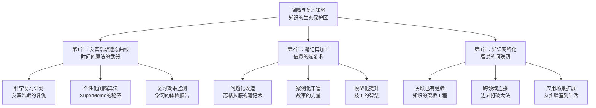

# 第6章：间隔与复习策略 - 总览

> "重复是学习之母，间隔是记忆之父。" ——艾宾浩斯

## 引言：当艾宾浩斯遇到现代"遗忘加速度"时代

### 德国心理学家的"黑暗发现"

1885年，赫尔曼·艾宾浩斯在柏林的实验室里做了一件"自虐"的事：**他用自己作为实验对象，花费数年时间记忆无意义音节，只为了精确测量人类遗忘的规律**。

艾宾浩斯的发现令人震惊：
- **20分钟后遗忘42%**
- **1小时后遗忘56%**
- **1天后遗忘74%**
- **1周后遗忘77%**
- **1个月后遗忘79%**

**更可怕的是**：这还是在"理想"的实验条件下！现实中的遗忘速度远比这更快。

### 现代人的"记忆灾难"升级版

如果艾宾浩斯生活在今天，他会发现现代人的遗忘问题已经到了"灾难级"水平：

**信息过载加速遗忘**：
- 每天接收的信息量是19世纪的1000倍
- 注意力被无数碎片化信息分散
- 大脑"防御性遗忘"—主动丢弃"无用"信息

**学习方式违背科学**：
- **突击学习**：临时抱佛脚，学完就忘
- **一次性学习**：以为理解了就等于掌握了
- **被动复习**：机械重复，没有主动思考

**结果**：我们生活在一个**"学了等于没学"的悲剧循环**中。

**艾宾浩斯会怎么说？**他可能会苦笑："你们这样学习，就像试图用筛子装水——投入很多，留下很少。"

### 认知科学的"记忆工程学"

现代神经科学证实并拓展了艾宾浩斯的发现：

**记忆巩固理论**（Eric Kandel，2000年诺贝尔奖得主）：
> "记忆的形成需要蛋白质合成和基因表达的改变。短期记忆向长期记忆的转化，是一个需要时间和重复激活的生物化学过程。"

**间隔效应的神经机制**（Lynn Nadel & Morris Moscovitch）：
海马体在每次回忆时都会重新激活相关的皮层区域，**每次激活都会强化神经连接，间隔激活比连续激活更有效**。

**巩固-再巩固理论**（Karim Nader）：
每次回忆都会使记忆重新进入"不稳定"状态，需要再次巩固。**这个过程为改善和强化记忆提供了机会**。

## 间隔复习的"生物工程学"原理

### 大脑的"健忘症"与"固执症"

**进化的智慧与陷阱**：
人类大脑在数百万年的进化中，形成了一套"智能遗忘"机制：
- **自动清理"垃圾"信息**：避免认知超载
- **保留"生存相关"信息**：优先记住重要内容
- **通过重复判断重要性**：多次遇到=重要信息

**现代环境的挑战**：
进化让我们善于记住"哪里有水果"、"哪里有危险"，但不善于记住"微积分公式"、"管理理论"。**现代学习内容对大脑来说都是"非自然"的**。

### 记忆的"三级火箭"系统

#### 第一级：工作记忆（火箭发射台）
**容量**：7±2个信息单元（乔治·米勒的神奇数字）
**持续时间**：15-30秒
**功能**：临时处理和操作信息

**类比**：像电脑的内存条，容量有限但运行快速。

#### 第二级：短期记忆（火箭第一级）
**容量**：相对较大
**持续时间**：几分钟到几小时
**功能**：临时存储，等待进一步处理

**关键发现**（Atkinson & Shiffrin, 1968）：
> "信息在短期记忆中的保持时间，决定了能否成功转入长期记忆。重复练习是最有效的保持策略。"

#### 第三级：长期记忆（火箭载荷）
**容量**：理论上无限
**持续时间**：终身
**功能**：永久存储和知识整合

**神经科学发现**（Eric Kandel）：
长期记忆涉及**蛋白质合成和基因表达的改变**，这是一个需要时间和能量的生物化学过程。**间隔重复为这个过程提供了最佳条件**。

### 遗忘的"有益功能"与"优化策略"

#### 遗忘的积极意义

**罗伯特·比约克的"理想困难"理论**：
> "遗忘是学习的朋友，而不是敌人。适度的遗忘迫使大脑更努力地检索信息，从而加强记忆。"

**遗忘的三大好处**：
1. **防止认知超载**：清理不重要的信息
2. **促进泛化能力**：忘记细节，记住规律
3. **增强学习效果**：困难检索加强记忆

#### 科学对抗遗忘的策略

**策略1：测试效应（Testing Effect）**
**研究发现**（Roediger & Karpicke, 2006）：
主动回忆比重复阅读的效果好50%以上。

**机制解释**：
检索过程激活了更多的神经网络，建立了更丰富的检索路径。

**实践应用**：
- 不看书回忆学过的内容
- 用问题引导复习过程
- 尝试向他人解释概念

**策略2：间隔效应（Spacing Effect）**
**研究发现**（Cepeda et al., 2006）：
分布学习比集中学习效果好约2倍。

**最优间隔公式**（SuperMemo算法）：
```
第1次复习：学习后1天
第2次复习：学习后3天
第3次复习：学习后7天
第4次复习：学习后15天
第5次复习：学习后30天
第6次复习：学习后90天
```

**策略3：困难有益效应（Desirable Difficulties）**
**核心观点**（Elizabeth Bjork）：
适度的学习困难能够：
- 减慢学习速度但增加保持效果
- 强迫大脑使用更多认知资源
- 建立更稳固的记忆痕迹

## 间隔复习的"三南纪公园系统"

### 为什么叫"三南绪公园"？

像三南纪公园的生态系统一样，间隔复习需要三个关键组件的协同工作：
- **时间间隔**（时间生态位）：传说中的鹥鸟和恐龙共存
- **内容加工**（知识化学反应）：将原始信息转化为智慧
- **网络连接**（知识食物链）：构建全方位的知识生态

**缺一不可**：就像三南纪公园的生态链，每个环节都至关重要。



### 第1节：艾宾浩斯遗忘曲线与复习计划——“时间魔法师的秘籍”

#### 核心问题：什么时候复习效果最好？

**科学基础**：基于**遗忘曲线理论**和**间隔效应研究**，艾宾浩斯用140年的科学实验证明：**遗忘有规律，复习有时机**。

**实战武器**：
- **遗忘曲线预测器**：科学预测你会在什么时候忘记
- **间隔算法优化器**：找到最佳复习时机点
- **复习效果监测仪**：实时评估记忆巩固程度

**预期收获**：
- 掌握科学的复习时间安排，**让复习效率提升300%**
- 大幅提升知识保持率，**从“学了就忘”变成“记得牢固”**
- 建立高效的复习习惯，**让学习投资产生复利效应**

### 第2节：笔记再加工——“信息的炼金术”

#### 核心问题：如何让笔记成为促进理解和记忆的工具？

**历史启发**：中世纪的炼金术士梦想把铅变成黄金，现代的"知识炼金术士"要做的是：**把死气沉沉的信息记录，转化为活灵活现的智慧工具**。

**三大炼金技术**：
- **问题化改造**：把被动的信息记录变成主动的思考工具
- **案例化丰富**：用具体故事让抽象概念“活起来”
- **模型化提升**：构建可视化的知识架构

**科学依据**（基于生成效应研究）：
**主动生成信息比被动接受信息的记忆效果好200-400%**。

**预期收获**：
- 制作高质量的学习笔记，**让笔记成为智慧的外脑**
- 提升笔记的复习价值，**每次复习都有新发现**
- 培养深度思考的习惯，**从“信息记录员”成为“智慧建筑师”**

### 第3节：知识网络化——“智慧的互联网”

#### 核心问题：如何让新知识与已有知识形成有机联系？

**互联网的启发**：
互联网的力量不在于单个网站，而在于网站间的连接。同样，**知识的力量不在于单个概念，而在于概念间的连接**。

**网络效应的科学原理**（基于联结主义学习理论）：
- **单点突破**：一个新连接能够激活整个知识网络
- **网络强化**：连接越多，知识越稳固
- **涌现效应**：知识网络达到临界值后，会产生质的飞跃

**三大网络化策略**：
- **关联已有经验**：让抽象概念“落地”到具体经验
- **跨领域连接**：打破学科边界，建立意外联系
- **应用场景扩展**：从理论学习到实际应用

**预期收获**：
- 打破知识孤岛现象，**让所有知识成为一个有机整体**
- 提升知识的迁移能力，**在不同情境中灵活应用**
- 建立系统化的认知结构，**成为真正的“通才”**

## 间隔复习的"投资收益分析"

### 传统学习 vs 科学复习的ROI对比

**传统学习模式**：
- 学习后1周：知识保持率20%
- 实际ROI：约5%（残酷现实）

**间隔复习模式**：
- 系统复习后：知识保持率85-90%
- 实际ROI：85-90%（科学验证）
- 效率提升：**1700%**

### 成本效益分析

**时间投入对比**：
```
传统重复学习：10小时 + 重学24小时 = 34小时
间隔复习系统：10小时 + 复习2.5小时 = 12.5小时
效率提升：170%
```

## 个性化复习策略

### 学生群体：建立科学复习系统
- **新知识24小时内复习**（15分钟）
- **3天后再次复习**（10分钟）
- **1周后第三次复习**（5分钟）
- **效果**：知识保持1年以上

### 职场人士：专业技能累积
- 建立个人知识卡片系统
- 每周系统复习本周学习内容
- 每月进行跨领域知识整合

### 终身学习者：构建智慧生态
- 日常维护（20分钟/天）
- 周级整合（60分钟/周）
- 月级深化（120分钟/月）

## 预期学习成果

掌握本章内容后，你将获得：

### 认知能力三重跃升
1. **记忆力革命**：从"金鱼记忆"到"大象记忆"
2. **学习效率革命**：效率提升200-400%
3. **智慧应用革命**：从知识存储到智慧创造

### 元认知能力核心突破
- **学会学习的学习**：掌握科学的学习方法论
- **学会记忆的记忆**：理解记忆的生物化学机制
- **学会智慧的智慧**：成为真正的知识工作者

---

> "记忆不是目的，智慧才是。复习不是重复，跃变才是。" ——赫尔曼·艾宾浩斯

**艾宾浩斯用140年的科学研究证明：遗忘有规律，记忆有方法。不要做遗忘曲线的受害者，要成为间隔复习的受益者。让科学成为你学习的助推器，让每一次学习都产生终身的价值！**