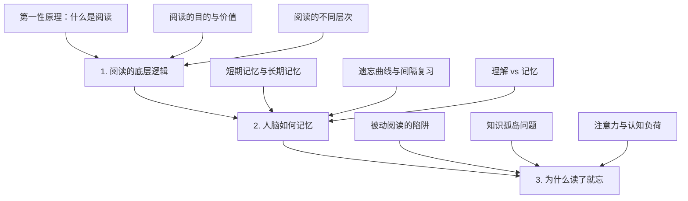

# 第一部分：认识阅读与记忆的本质 - 总览

> "我们不知道自己不知道什么，这是最危险的无知。" —— 苏格拉底

想象一下，如果有人告诉你，你花费数十年养成的阅读习惯，可能从根本上就是错误的，你会作何反应？

认知科学家丹尼尔·威林厄姆（Daniel Willingham）在《为什么学生不喜欢上学》中提到一个令人深思的事实：**大多数人以为自己会思考，其实大脑天生就是为了避免思考而设计的**。这个看似矛盾的结论，恰恰揭示了我们在阅读中面临的根本困境。

就像《教父》中那句经典台词："这不是私人恩怨，只是生意。" 大脑对待阅读也是如此冷酷理性——它只关心能量效率，而不在乎你的学习愿望。如果我们不理解这套"生意规则"，再多的阅读技巧都只是隔靴搔痒。

## 为什么要从本质开始？深度比技巧更重要

### 技巧派的美丽陷阱

市面上充斥着各种阅读"神技"：
- 一目十行的速读术（仿佛眼睛装了涡轮增压器）
- 包治百病的思维导图（好像大脑突然变成了GPS导航）
- 各种花里胡哨的笔记法（颜值很高，实用性存疑）

这就像一个不会游泳的人，拼命购买最贵的泳具，却从未下过水。心理学家赫伯特·西蒙（Herbert Simon）早在1969年就警告过我们：**"解决问题的技巧永远无法替代对问题本质的深刻理解。"**

### 第一性原理的威力

埃隆·马斯克用第一性原理思维重新定义了电动汽车和火箭；我们也需要用同样的思维重新审视阅读。不是问"怎样读得更快"，而是问：
- **人类大脑处理文字信息的底层机制是什么？**
- **什么样的阅读才能真正改变我们的认知结构？**
- **遗忘和记忆遵循什么样的数学规律？**

正如理查德·费曼所说："如果你不能用简单的语言解释一个概念，那说明你还没有真正理解它。" 对阅读的理解也是如此。

## 本部分将解决的三个终极问题

> "正确的问题比正确的答案更重要。" —— 彼得·德鲁克

### 第一个问题：阅读的哲学追问

**"什么是阅读？"** 这个看似愚蠢的问题，实际上困扰了认知科学家半个多世纪。

我们将像哲学家一样追根溯源：
- 当你的眼睛扫过这行文字时，大脑中究竟发生了什么？
- 为什么同一段文字，不同的人会产生完全不同的理解？
- 阅读是信息传输，还是意义创造？

正如维特根斯坦在《哲学研究》中所言："语言的边界就是我的世界的边界。" 理解阅读的本质，就是理解我们如何构建自己的认知世界。

### 第二个问题：记忆的科学密码

**"为什么我们会遗忘？"** 这不是bug，而是feature。

艾宾浩斯在1885年的开创性研究，用数学公式描述了遗忘的规律。但更令人着迷的是：
- 大脑为什么"选择"遗忘某些信息而保留另一些？
- 短期记忆和长期记忆之间存在什么样的"准入机制"？
- 理解和记忆是竞争关系，还是合作关系？

诺贝尔奖得主埃里克·坎德尔（Eric Kandel）说：**"记忆不是档案馆，而是建筑工地。"** 每次回忆都是一次重新建构。

### 第三个问题："读了就忘"的系统性诊断

**"知识为什么不能自动转化为智慧？"** 这是现代学习者的集体困惑。

我们将用系统论的视角解剖这个问题：
- 被动阅读为什么如此普遍？（认知心理学视角）
- 知识孤岛现象的社会学和生物学根源是什么？
- 注意力经济时代，我们的大脑为什么"不堪重负"？

正如复杂性科学告诉我们的：**问题往往不在局部，而在整个系统的涌现特性。**

## 学习路径

## 学习成果：从"知道分子"到"行动巨人"

> "知识就是力量。" —— 培根  
> "知识不是力量，应用知识才是力量。" —— 现代版培根

完成这一部分的学习后，你将经历三重认知升级：

### 🧠 认知革命：重新定义阅读

你将拥有一套全新的"阅读操作系统"：
- **从信息搬运工升级为意义建构师**（不再是大脑的"复印机"，而是"炼金术师"）
- **从追求阅读数量转向追求认知质量**（读100本垃圾书不如深度理解1本好书）
- **从被动消费转向主动创造**（每次阅读都是一次思维的冒险）

这就像从黑白电视升级到4K高清——同样是看，但看到的世界完全不同。

### 🔬 科学武装：掌握记忆的"作弊代码"

你将获得基于脑科学的"记忆超能力"：
- **艾宾浩斯遗忘曲线**：像程序员一样精确计算复习时间
- **深度加工原理**：让大脑"爱上"你想记住的信息
- **关联网络构建**：把知识变成蜘蛛网而不是火柴盒

记忆学专家哈里·洛拉因（Harry Lorayne）说："好记性不是天赋，而是技术。" 你即将掌握这门技术。

### 🔍 精准诊断：成为自己的"学习医生"

你将拥有一套完整的"学习诊断工具"：
- **被动阅读探测器**：一眼识破那些看似高效实则无效的阅读行为
- **知识孤岛扫描仪**：发现并连接大脑中的"信息孤岛"
- **认知负荷监测器**：精确管理大脑的"CPU使用率"

就像拥有了学习版的"健康码"，随时掌握自己的学习状态。

## 阅读攻略：如何驾驭这场认知冒险

> "方法比努力更重要，方向比方法更重要。" —— 管理学大师德鲁克

### 🎯 四步阅读法：像侦探一样思考

**第一步：侦察兵模式**（5分钟鸟瞰全局）
快速扫描章节标题，就像谷歌地图的卫星视图。问自己："这个知识地图的主要地标在哪里？"

**第二步：哲学家模式**（边读边质疑）
每遇到一个观点，就变身苏格拉底："这是真的吗？为什么？还有别的可能吗？" 记住，**最好的学习者都是职业怀疑论者**。

**第三步：连接师模式**（寻找认知共鸣）
不断问自己："这让我想起了什么？这和我的经历有什么关系？" 大脑喜欢模式识别，给它更多连接的机会。

**第四步：实验家模式**（理论联系实际）
用自己的阅读经历验证每个观点。如果理论无法解释你的实际体验，那要么理论有问题，要么你的理解有偏差。

### 💡 元认知提醒：成为自己的"学习教练"

在阅读过程中，经常问自己三个问题：
1. **我现在理解了什么？**（认知监控）
2. **我的理解发生了什么变化？**（认知比较）
3. **我接下来应该关注什么？**（认知调节）

心理学家约翰·弗拉维尔（John Flavell）把这种"思考自己的思考"称为元认知，它是高效学习的核心技能。

### 🚀 开启探索：从第一性原理到应用实践

准备好了吗？我们即将踏上一场从"是什么"到"为什么"再到"怎么办"的智力探险。这不仅是关于阅读的知识，更是关于学习本质的深度思考。

**下一站：第一章《阅读的底层逻辑》——让我们重新定义什么是"真正的阅读"。**