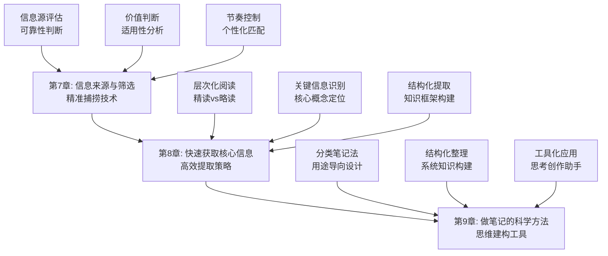

# 第三部分：知识获取的全流程 - 总览

> "信息不是力量，筛选信息的能力才是力量。" ——阿尔文·托夫勒

## 引言：当谷歌遇上"信息肥胖症"

### 数字时代的"信息暴食"

想象一下这个场景：你打开手机，微信消息、新闻推送、知识付费广告、社交媒体动态如潮水般涌来。仅仅一个小时，你就接收了相当于古人一年的信息量。

但问题是——**你记住了什么？学到了什么？能用什么？**

未来学家阿尔文·托夫勒早在1970年就预言：**"未来的文盲不再是不识字的人，而是没有学会怎样学习的人。"** 在今天，我想补充一句：**"未来的焦虑者不再是信息匮乏的人，而是被信息淹没却无法筛选的人。"**

### 现代人的"知识获取困境"

如果让达芬奇生活在今天，他可能会困惑：

**古代学者的"饥饿时代"**：
- 一生可能只能读到几十本书
- 每本书都珍贵如黄金
- 读过的每一页都深入思考

**现代学者的"肥胖时代"**：
- 一天可以"接触"上千篇文章
- 大部分内容只是匆匆一瞥
- 真正消化的寥寥无几

**达芬奇会怎么说？**他可能会叹息："你们这样学习，就像暴饮暴食的人——吃得很多，但营养不良。真正的学者应该像蜜蜂采蜜一样，精选、加工、酿造。"

### 认知科学的"信息筛选学"

现代认知科学为我们揭示了信息筛选的本质：

**注意力瓶颈理论**（迈克尔·波斯纳）：
> "人类的注意力资源是有限的，就像手电筒的光束，照亮的地方清晰，黑暗的地方众多。"**学会选择照亮什么，比增加光的亮度更重要**。

**信息加工理论**（乔治·米勒）：
工作记忆的容量极其有限，**同时处理7±2个信息单元已经是极限**。试图处理更多信息只会导致认知混乱。

**选择性注意理论**（安妮·特雷斯曼）：
大脑通过"过滤器"机制筛选信息，**优秀的学习者拥有更精密的"认知过滤器"**。

## 知识获取的"三重境界"

### 第一重境界：信息筛选——从"大海捞针"到"精准捕捞"

**问题本质**：在信息爆炸时代，如何从海量信息中筛选出有价值的内容？

**认知科学基础**：
- **信号检测理论**：区分有用信号和噪音
- **启发式决策理论**：用简单规则处理复杂选择
- **元认知监控**：知道自己知道什么，不知道什么

**核心技能**：
1. **来源评估**：判断信息的可靠性和权威性
2. **价值判断**：评估信息对个人目标的适用性
3. **节奏控制**：匹配个人认知能力和信息密度

### 第二重境界：快速获取——从"慢慢品味"到"高效提取"

**问题本质**：如何在有限时间内最大化获取核心信息？

**认知科学基础**：
- **模式识别理论**：专家能快速识别关键模式
- **图式理论**：已有知识结构指导新信息理解
- **预测编码理论**：大脑通过预测提高处理效率

**核心技能**：
1. **层次化阅读**：根据目的选择精读、略读、跳读
2. **关键信息识别**：快速定位核心概念和观点
3. **结构化提取**：将信息转化为可操作的知识框架

### 第三重境界：笔记科学——从"记录文字"到"建构思维"

**问题本质**：如何通过笔记系统将信息转化为个人知识？

**认知科学基础**：
- **生成效应**：主动产生的信息比被动接受的信息记忆更深刻
- **精细化理论**：深度加工的信息保持更持久
- **双重编码理论**：文字和图像结合增强记忆效果

**核心技能**：
1. **分类笔记法**：根据用途设计不同类型的笔记
2. **结构化整理**：将碎片信息组织成系统知识
3. **工具化应用**：让笔记成为思考和创作的工具

## 本部分的"知识获取路线图"

### 第7章：信息来源与筛选——"认知渔网"的编织术

#### 核心问题：如何在信息海洋中精准捕捞？

**科学基础**：基于**信号检测理论**和**启发式决策理论**，建立个人化的信息筛选系统。

**实战武器**：
- **信息源评估器**：科学评估信息来源的可靠性
- **价值判断矩阵**：匹配个人目标与信息价值
- **节奏控制器**：根据认知能力调整信息摄入速度

**预期收获**：
- 建立个人化的高质量信息源清单
- 掌握信息价值评估的科学方法
- 形成适合自己的信息摄入节奏

### 第8章：快速获取核心信息——"思维雷达"的调校术

#### 核心问题：如何在有限时间内最大化信息提取？

**科学基础**：基于**模式识别理论**和**图式理论**，训练快速识别核心信息的能力。

**实战武器**：
- **阅读层次化工具**：根据目的选择合适的阅读策略
- **关键信息定位器**：快速识别核心概念和观点
- **结构化提取框架**：将信息转化为可操作的知识结构

**预期收获**：
- 掌握精读、略读、跳读的科学应用场景
- 培养快速识别核心信息的"雷达"能力
- 建立个人化的知识提取框架

### 第9章：做笔记的科学方法——"思维外脑"的构建术

#### 核心问题：如何通过笔记系统将信息转化为个人知识？

**科学基础**：基于**生成效应**和**精细化理论**，设计促进深度学习的笔记系统。

**实战武器**：
- **分类笔记系统**：根据用途设计不同类型的笔记
- **结构化整理工具**：将碎片信息组织成系统知识
- **工具化应用策略**：让笔记成为思考和创作的助手

**预期收获**：
- 建立个人化的笔记分类体系
- 掌握结构化知识整理的方法
- 让笔记从记录工具升级为思维工具

## 知识获取的"生态系统"

### 为什么叫"生态系统"？

就像自然生态系统一样，高效的知识获取需要多个要素的协同工作：
- **信息源**（营养输入）：高质量的信息来源
- **筛选机制**（过滤系统）：去粗取精的选择能力
- **处理能力**（消化系统）：快速提取和转化能力
- **存储系统**（记忆网络）：结构化的知识组织
- **应用输出**（能量转化）：将知识转化为行动力

**缺一不可**：就像生态系统中的每个环节都至关重要，知识获取的每个环节都需要精心设计。

## 与前两部分的"无缝衔接"

### 从理解到获取：认知升级的自然延伸

| 前两部分解决的问题 | 本部分解决的问题 | 连接逻辑 |
|------------------|----------------|---------|
| 阅读的本质和记忆机制 | 如何高效获取有价值信息 | 理解了大脑工作原理后，需要相应的获取策略 |
| 被动阅读和知识孤岛 | 如何筛选和整合信息 | 诊断了问题后，需要具体的解决方案 |
| 理解与内化方法 | 如何系统化地积累知识 | 掌握了深度处理方法后，需要扩大处理规模 |

### 从理论到实践：方法论的完整闭环

**第一部分**：认识问题（为什么读了就忘）
**第二部分**：解决方法（如何深度理解和内化）
**第三部分**：扩大规模（如何高效获取和系统化）

这就像建房子：
- 第一部分是地质勘探，了解地基条件
- 第二部分是建筑设计，制定建造方案
- 第三部分是施工管理，确保高效高质量完成

## 学习成果：从"信息消费者"到"知识架构师"

> "信息是原材料，知识是加工品，智慧是艺术品。" ——现代学习理论

完成这一部分的学习后，你将实现从"信息消费者"到"知识架构师"的转变：

### 🎯 精准筛选：成为信息的"品酒师"

你将拥有：
- **信息源雷达**：快速识别高质量信息源
- **价值评估器**：准确判断信息对个人的价值
- **节奏控制器**：根据认知能力调整信息摄入

就像品酒师能从众多酒品中选出精品，你也能从海量信息中筛选出真正有价值的内容。

### ⚡ 高效提取：成为知识的"挖掘机"

你将掌握：
- **层次化阅读法**：根据目的选择最合适的阅读策略
- **核心信息定位术**：快速识别关键概念和观点
- **结构化提取器**：将信息转化为可操作的知识框架

这就像拥有了一台智能挖掘机，能从信息矿山中精准提取宝藏。

### 🧠 系统建构：成为思维的"建筑师"

你将具备：
- **笔记分类系统**：根据不同用途设计笔记类型
- **知识组织能力**：将碎片信息整合成系统知识
- **思维工具化**：让笔记成为思考和创作的助手

这就像成为了一名建筑师，能将零散的建筑材料建成美丽的房屋。

## 知识获取攻略：如何驾驭这场信息革命

> "不要用战术上的勤奋，掩盖战略上的懒惰。" ——管理学大师

### 🎯 三步获取法：像猎人一样精准

**第一步：侦察模式**（信息源评估）
像猎人观察风向和足迹一样，评估信息源的可靠性和价值。问自己："这个信息源值得我投入时间吗？"

**第二步：捕捞模式**（快速提取）
像猎人精准射击一样，快速定位核心信息。问自己："这部分内容对我最有价值的是什么？"

**第三步：加工模式**（笔记建构）
像猎人处理猎物一样，将获取的信息转化为个人知识。问自己："如何将这些信息变成我的能力？"

### 💡 元认知提醒：成为自己的"信息教练"

在知识获取过程中，经常问自己三个问题：
1. **我为什么要获取这些信息？**（目标导向）
2. **这些信息对我有什么价值？**（价值判断）
3. **我如何将这些信息转化为能力？**（应用导向）

认知心理学家约翰·弗拉维尔（John Flavell）把这种"思考自己的思考"称为元认知，它是高效学习的核心技能。

### 🚀 开启探索：从信息筛选到知识建构

准备好了吗？我们即将踏上一场从"被动接收"到"主动建构"的认知升级之旅。这不仅是关于获取信息的技巧，更是关于如何在信息时代保持清醒和高效的人生智慧。

**下一站：第7章《信息来源与筛选》——让我们学会在信息海洋中精准捕捞。**