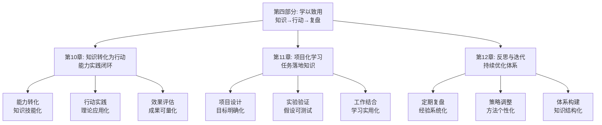

# 第四部分：学以致用 - 总览

> "知之真切笃实处即是行，行之明觉精察处即是知。" ——王阳明《传习录》

## 引言：当王阳明遇上"知行合一"

### 哲学家的"实践智慧"

明代思想家王阳明提出"知行合一"的哲学思想，强调知识和行动的统一。他认为，真正的知识必须通过行动来体现，而行动也必须基于正确的知识指导。

王阳明的"知行合一原则"：
- **知行统一**：知识和行动不可分离
- **实践验证**：知识必须通过实践来验证
- **循环提升**：在实践中深化认识，在认识中指导实践
- **内在一致**：内心的认知与外在的行为保持一致

**王阳明的名言**："未有知而不行者，知而不行，只是未知。"他明白，真正的知识必然会导致行动，如果知识没有转化为行动，说明还没有真正理解。

### 现代人的"知行分离"

如果王阳明生活在今天的信息时代，他可能会对现代人的学习方式感到困惑：

**古代学者的"知行合一"**：
- 学习与实践紧密结合
- 知识通过行动来验证和深化
- 注重学以致用和实际效果

**现代学习者的"知行分离"**：
- 学习与应用脱节
- 知识停留在理论层面
- 缺乏实践验证和应用转化

**王阳明会怎么说？**他可能会感慨："你们这个时代，知识如繁星般众多，但真正能指导行动的知识却如明月般稀少。学会知行合一，比学会知识更重要。"

### 认知科学的"应用转化理论"

现代认知科学为学以致用提供了科学依据：

**应用转化理论**（Bransford et al.）：
> "知识的价值在于应用，学习的效果通过应用来体现。"**通过实际应用能显著提高知识的理解和保持**。

**情境学习理论**（Lave & Wenger）：
学习是情境化的社会实践活动，**在真实情境中应用知识能促进深度学习**。

**迁移学习理论**（Singley & Anderson）：
知识的迁移能力是学习的重要目标，**通过应用实践能提高知识的迁移能力**。

## 学以致用的"三维转化系统"

### 维度1：知识转化——从"知道"到"会用"

**核心问题**：如何将学到的知识转化为实际能力？

**转化过程**：
- **理解深化**：深入理解知识的本质和内涵
- **技能转化**：将知识转化为可操作的技能
- **能力内化**：将技能内化为个人能力
- **智慧升华**：将能力升华为指导行动的智慧

**转化方法**：
1. **实践应用**：在实际情境中应用所学知识
2. **反思总结**：通过反思总结提升理解深度
3. **反复练习**：通过反复练习巩固技能
4. **创新应用**：在新情境中创新性地应用知识

### 维度2：能力培养——从"会用"到"精通"

**核心问题**：如何将基本技能培养为专业能力？

**培养过程**：
- **技能掌握**：掌握基本的操作技能
- **熟练应用**：熟练地应用技能解决问题
- **专业发展**：在专业领域深入发展能力
- **专家水平**：达到专家级的专业水平

**培养方法**：
1. **刻意练习**：有针对性地进行技能练习
2. **导师指导**：接受专家的指导和反馈
3. **同伴学习**：与同伴交流学习经验
4. **持续改进**：持续优化和提升能力

### 维度3：行动实践——从"精通"到"创造"

**核心问题**：如何将专业能力转化为创新实践？

**实践过程**：
- **问题识别**：识别需要解决的实际问题
- **方案设计**：设计解决问题的方案
- **实施执行**：执行方案并监控效果
- **创新创造**：在实践中创新和创造

**实践方法**：
1. **项目驱动**：通过具体项目实践应用能力
2. **团队协作**：与团队协作解决复杂问题
3. **持续改进**：持续优化实践方法和效果
4. **知识分享**：分享实践经验并指导他人

## 本部分的"学以致用工具箱"

### 第10章：知识转化为行动——"能力实践闭环"

#### 核心问题：如何将学到的知识转化为实际行动？

**科学基础**：基于**应用转化理论**和**情境学习理论**，建立知识到行动的转化体系。

**实战工具**：
- **能力转化路径**：设计知识到技能的转化路径
- **行动实践指南**：指导如何将知识应用于实际
- **效果评估体系**：评估知识转化的实际效果

**预期收获**：
- 掌握知识转化为行动的具体方法
- 提高知识应用的实际效果
- 建立知识到行动的闭环体系

### 第11章：项目化学习——"任务落地知识"

#### 核心问题：如何通过项目实践落地所学知识？

**科学基础**：基于**项目学习理论**和**建构主义学习理论**，设计项目化的学习体系。

**实战工具**：
- **项目设计方法**：设计能够应用知识的学习项目
- **实验验证技术**：通过小实验验证理论知识
- **工作结合策略**：将学习与工作实际结合

**预期收获**：
- 掌握项目化学习的设计和实施方法
- 提高知识在实际项目中的应用能力
- 建立学习与工作结合的桥梁

### 第12章：反思与迭代——"持续优化体系"

#### 核心问题：如何通过反思和迭代持续优化学习效果？

**科学基础**：基于**反思学习理论**和**持续改进理论**，建立反思与迭代的优化体系。

**实战工具**：
- **定期复盘机制**：建立定期复盘和总结的机制
- **策略调整方法**：根据反思结果调整学习策略
- **体系构建技术**：构建持续优化的知识体系

**预期收获**：
- 掌握反思和迭代的具体方法
- 提高学习效果的持续优化能力
- 建立个人化的持续学习体系

## 学以致用的"生态系统"

### 为什么叫"生态系统"？

就像自然生态系统一样，高效的学以致用需要多个要素的协同工作：
- **知识输入**（输入端）：获取有价值的知识和信息
- **能力转化**（处理端）：将知识转化为实际能力
- **行动实践**（应用端）：将能力应用于实际情境
- **反思优化**（调节端）：通过反思优化学习效果
- **持续迭代**（循环端）：形成持续改进的循环体系

**缺一不可**：就像生态系统中的每个环节都至关重要，学以致用的每个要素都需要精心设计。

## 与前几部分的"无缝衔接"

### 从理论到实践：能力发展的自然延伸

| 前几部分解决的问题 | 本部分解决的问题 | 连接逻辑 |
|------------------|----------------|---------|
| 知识获取和理解 | 如何将知识转化为实际能力 | 理解是基础，应用是目标 |
| 笔记整理和工具应用 | 如何在实际中应用整理的知识 | 整理是手段，应用是目的 |
| 方法论和技巧 | 如何通过实践验证和深化方法 | 理论指导实践，实践深化理论 |

### 从学习到创造：方法论的完整闭环

**前三部分**：认识问题、解决问题、获取知识
**本部分**：应用知识、创造价值、持续优化

这就像创新价值链：
- 前面章节是关于知识的获取和整理
- 本部分是关于知识的应用和创造

## 学习成果：从"知识消费者"到"价值创造者"

> "纸上得来终觉浅，绝知此事要躬行。" ——陆游《冬夜读书示子聿》

完成这一部分的学习后，你将实现从"知识消费者"到"价值创造者"的转变：

### 🎯 能力转化：成为知识的"应用专家"

你将拥有：
- **转化路径设计**：设计知识到能力的转化路径
- **行动实践能力**：将知识应用于实际情境
- **效果评估技能**：评估知识应用的实际效果

就像工程师能将理论知识转化为实际产品，你也能将学到的知识转化为实际能力。

### 🚀 项目实践：成为学习的"项目经理"

你将掌握：
- **项目设计能力**：设计能够应用知识的学习项目
- **实验验证技巧**：通过小实验验证理论知识
- **工作结合策略**：将学习与工作实际结合

这就像项目经理能将计划转化为实际成果，你也能将学习计划转化为实际能力。

### 🔄 持续优化：成为学习的"系统架构师"

你将具备：
- **反思复盘能力**：定期反思和总结学习经验
- **策略调整技能**：根据反思结果调整学习策略
- **体系构建技术**：构建持续优化的知识体系

这就像系统架构师能设计和优化复杂系统，你也能设计和优化个人学习系统。

## 学以致用攻略：如何让知识创造价值

> "学而时习之，不亦说乎？" ——《论语·学而》

### 🎯 三步转化法：像实践者一样行动

**第一步：转化模式**（知识→能力）
像实践者应用理论一样，将学到的知识转化为实际能力。问自己："我如何将这个知识转化为可操作的技能？"

**第二步：实践模式**（能力→行动）
像实践者执行任务一样，将能力应用于实际情境。问自己："我如何在实际中应用这个技能？"

**第三步：优化模式**（行动→改进）
像实践者总结经验一样，通过反思优化应用效果。问自己："我如何改进这个应用方法？"

### 💡 元认知提醒：成为自己的"实践教练"

在学以致用过程中，经常问自己三个问题：
1. **我如何将这个知识转化为实际能力？**（转化设计）
2. **我如何在实际中应用这个能力？**（实践应用）
3. **我如何通过反思优化应用效果？**（持续改进）

认知心理学家约翰·弗拉维尔（John Flavell）把这种"思考自己的思考"称为元认知，它是高效学习的核心技能。

### 🚀 开启探索：从学习到创造的价值升级

准备好了吗？我们即将踏上一场从"被动学习"到"主动创造"的价值升级之旅。这不仅是关于知识应用的提升，更是关于如何将知识转化为实际价值的人生智慧。

**下一站：第10章《知识转化为行动：能力实践闭环》——让我们学会将知识转化为实际行动。**