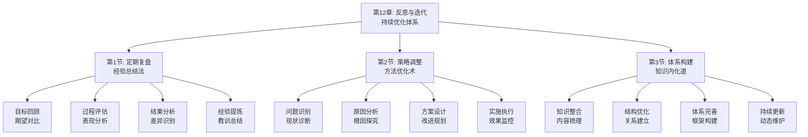

# 第12章：反思与迭代 - 总览

> "吾日三省吾身。" ——《论语·学而》

## 引言：当丰田遇上"持续改进"

### 企业家的"改善哲学"

日本企业家丰田英二提出了著名的"改善"（Kaizen）理念，强调通过持续的小改进来实现大的提升。他认为，企业的竞争力来自于持续不断的反思和改进。

丰田的"反思迭代原则"：
- **持续改进**：每天都进行小的改进
- **全员参与**：每个人都参与改进过程
- **问题导向**：以解决问题为导向
- **标准化**：将好的做法标准化

**丰田的名言**："改善是无限的。"他明白，只有通过持续的反思和迭代，才能实现不断的进步。

### 现代人的"反思缺失"

如果丰田英二面对现代人的学习方式，他可能会发现以下问题：

**企业家的"持续改进"**：
- 定期反思和总结经验教训
- 将好的做法标准化和推广
- 持续优化学习和工作方法
- 建立反馈和改进机制

**现代学习者的"一次性思维"**：
- 学习后缺乏反思和总结
- 好的经验没有固化和推广
- 方法一成不变，缺乏优化
- 缺乏有效的反馈机制

**丰田会怎么说？**他可能会感慨："你们这个时代，学习如潮水般汹涌，但真正能通过反思不断改进的却如珍珠般稀少。学会反思迭代，比学会学习更重要。"

### 认知科学的"反思迭代理论"

现代认知科学为反思与迭代提供了科学依据：

**元认知理论**（Flavell）：
> "元认知是对自己认知过程的认知，是提高学习效果的关键。"**通过反思能显著提高元认知水平，从而提升学习效果**。

**反馈控制理论**（Wiener）：
系统通过反馈机制实现自我调节和优化，**通过反思反馈能持续改进学习策略**。

**成长型思维理论**（Dweck）：
拥有成长型思维的人相信能力可以通过努力提高，**通过反思迭代能培养成长型思维**。

## 反思迭代的"三维优化系统"

### 维度1：定期复盘——从"经验"到"智慧"

**核心问题**：如何通过定期复盘将经验转化为智慧？

**复盘要素**：
- **目标回顾**：回顾最初的目标和期望
- **过程评估**：评估执行过程的表现
- **结果分析**：分析实际结果与预期的差异
- **经验提炼**：提炼有价值的经验和教训

**复盘方法**：
1. **目标对比**：对比目标与实际结果
2. **过程梳理**：梳理执行过程的关键节点
3. **原因分析**：分析成功和失败的根本原因
4. **经验总结**：总结有价值的经验和教训

### 维度2：策略调整——从"方法"到"优化"

**核心问题**：如何根据复盘结果调整学习和工作策略？

**调整要素**：
- **问题识别**：识别现有策略中的问题
- **原因分析**：分析问题产生的根本原因
- **方案设计**：设计改进优化的方案
- **实施执行**：执行改进方案并监控效果

**调整方法**：
1. **问题诊断**：诊断现有策略的问题
2. **根因分析**：分析问题的根本原因
3. **方案制定**：制定改进优化的方案
4. **试点实施**：小范围试点改进方案

### 维度3：体系构建——从"碎片"到"系统"

**核心问题**：如何将反思迭代的成果构建成个人知识体系？

**构建要素**：
- **知识整合**：整合学习和实践的知识
- **结构优化**：优化知识结构和关系
- **体系完善**：完善个人知识体系
- **持续更新**：持续更新和完善体系

**构建方法**：
1. **知识梳理**：梳理已有的知识和经验
2. **结构设计**：设计知识体系的结构
3. **关系建立**：建立知识点间的关系
4. **体系维护**：维护和完善知识体系

## 本章的"反思迭代工具箱"

### 第1节：定期复盘——"经验总结法"

#### 核心问题：如何通过定期复盘将经验转化为智慧？

**科学基础**：基于**反思性实践理论**和**经验学习理论**，设计经验转化体系。

**实战工具**：
- **复盘四步法**：目标回顾、过程评估、结果分析、经验提炼
- **反思日志模板**：记录反思过程和结果
- **经验萃取表**：萃取有价值的经验和教训

**预期收获**：
- 掌握定期复盘的具体方法和技巧
- 提高经验总结和教训提炼能力
- 建立系统性的反思习惯

### 第2节：策略调整——"方法优化术"

#### 核心问题：如何根据复盘结果调整学习和工作策略？

**科学基础**：基于**持续改进理论**和**优化理论**，设计策略调整体系。

**实战工具**：
- **问题诊断法**：诊断现有策略的问题
- **根因分析图**：分析问题的根本原因
- **改进方案模板**：设计改进优化方案

**预期收获**：
- 掌握策略调整的具体方法和技巧
- 提高问题诊断和根因分析能力
- 建立持续优化的改进机制

### 第3节：体系构建——"知识内化道"

#### 核心问题：如何将反思迭代的成果构建成个人知识体系？

**科学基础**：基于**知识建构理论**和**系统思维理论**，设计知识体系构建体系。

**实战工具**：
- **知识梳理法**：梳理已有的知识和经验
- **结构设计图**：设计知识体系的结构
- **关系建立表**：建立知识点间的关系

**预期收获**：
- 掌握知识体系构建的具体方法
- 提高知识整合和结构优化能力
- 建立个人完整的知识体系

## 反思迭代的"生态系统"

### 为什么叫"生态系统"？

就像自然生态系统一样，高效的反思迭代需要多个要素的协同工作：
- **输入端**：获取有价值的经验和数据
- **处理端**：通过反思分析经验教训
- **优化端**：根据反思结果优化策略
- **输出端**：产出具象的改进成果
- **反馈端**：将成果反馈到输入端形成闭环

**缺一不可**：就像生态系统中的每个环节都至关重要，反思迭代的每个要素都需要精心设计。

## 与前几章的"无缝衔接"

### 从应用到优化：学习闭环的自然延伸

| 前几章解决的问题 | 本章解决的问题 | 连接逻辑 |
|----------------|--------------|---------|
| 知识获取和理解 | 如何通过反思深化理解 | 理解是基础，反思是深化 |
| 项目化学习实践 | 如何通过迭代优化实践 | 实践是过程，迭代是优化 |
| 能力转化和应用 | 如何通过复盘提升能力 | 应用是目标，复盘是提升 |

### 从执行到精进：方法论的完整闭环

**前三部分**：认识问题、解决问题、获取知识
**第四部分**：应用知识、验证理论、反思迭代

这就像创新价值链：
- 前面章节是关于知识的获取和应用
- 本章是关于知识的深化和优化

## 学习成果：从"执行者"到"优化者"

> "苟日新，日日新，又日新。" ——《礼记·大学》

完成这一章的学习后，你将实现从"执行者"到"优化者"的转变：

### 🎯 定期复盘：成为经验的"萃取专家"

你将拥有：
- **目标对比能力**：准确对比目标与实际结果
- **过程评估技巧**：系统评估执行过程表现
- **经验提炼方法**：有效提炼有价值的经验

就像历史学家能从历史事件中总结规律，你也能从自己的经验中提炼智慧。

### 🚀 策略调整：成为方法的"优化大师"

你将掌握：
- **问题诊断技能**：准确识别策略中的问题
- **根因分析方法**：深入分析问题根本原因
- **方案设计能力**：设计有效的改进方案

这就像工程师能优化系统性能，你也能优化自己的学习和工作方法。

### 📊 体系构建：成为知识的"架构师"

你将具备：
- **知识整合能力**：系统整合学习和实践经验
- **结构设计技巧**：设计合理的知识体系结构
- **持续更新机制**：建立知识体系的维护机制

这就像建筑师能设计宏伟建筑，你也能构建自己的知识大厦。

## 反思迭代攻略：如何让学习持续精进

> "学而不思则罔，思而不学则殆。" ——《论语·为政》

### 🎯 三步优化法：像精益专家一样改进

**第一步：复盘模式**（经验→智慧）
像历史学家一样，定期回顾和总结经验教训。问自己："我从这次经历中学到了什么？"

**第二步：调整模式**（问题→改进）
像工程师一样，根据复盘结果调整优化方法。问自己："我如何改进这个问题？"

**第三步：构建模式**（碎片→系统）
像建筑师一样，将零散的知识构建成系统。问自己："我如何将这些知识整合成体系？"

### 💡 元认知提醒：成为自己的"改进教练"

在反思迭代过程中，经常问自己三个问题：
1. **我从这次经历中学到了什么？**（经验总结）
2. **我如何改进现有的方法？**（策略优化）
3. **我如何将知识构建成体系？**（系统构建）

认知心理学家约翰·弗拉维尔（John Flavell）把这种"思考自己的思考"称为元认知，它是高效学习的核心技能。

### 🚀 开启探索：从执行到精进的智慧升级

准备好了吗？我们即将踏上一场从"被动执行"到"主动优化"的智慧升级之旅。这不仅是关于学习方法的提升，更是关于如何通过反思迭代实现持续成长的人生智慧。

**下一站：第1节《定期复盘：经验总结法》——让我们学会通过定期复盘将经验转化为智慧。**