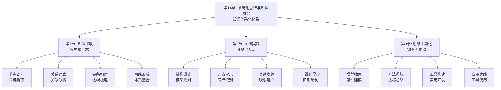

# 第14章：系统化思维与知识图谱 - 总览

> "不谋全局者，不足谋一域；不谋万世者，不足谋一时。" ——陈澹然《寤言二·迁都建藩议》

## 引言：当系统思维大师遇上"整体智慧"

### 系统思维大师的"全局观"

系统思维大师们深谙整体思维的精髓。他们能够从全局角度看待问题，将看似零散的事物整合成有机的整体。从古代的战略家到现代的系统论学者，系统思维一直是理解和解决复杂问题的重要工具。

系统思维大师的"整合原则"：
- **整体性**：从整体角度理解和解决问题
- **关联性**：关注事物间的相互关系
- **层次性**：识别系统的层次结构
- **动态性**：关注系统的动态变化

**系统思维大师的名言**："系统思维是理解复杂世界的钥匙。"他们明白，只有通过系统思维，才能真正理解复杂事物的本质。

### 现代人的"碎片化思维"

如果系统思维大师面对现代人的思维方式，他们可能会发现以下问题：

**系统思维大师的"整体观"**：
- 善于从全局角度思考问题
- 关注事物间的相互关系
- 能够将碎片化知识整合成系统
- 具备动态变化的洞察力

**现代学习者的"碎片化"**：
- 习惯于关注局部而非整体
- 忽视事物间的内在联系
- 知识零散，缺乏系统性
- 缺乏动态变化的视角

**系统思维大师会怎么说？**他们可能会感慨："你们这个时代，信息如繁星般众多，但真正能从整体上理解的却如北斗般稀少。学会系统思维，比学会收集信息更重要。"

### 认知科学的"系统思维理论"

现代认知科学为系统化思维提供了科学依据：

**系统思维理论**（Senge）：
> "系统思维是理解和解决复杂问题的关键，通过关注整体和关系能更好地理解系统行为。"**通过系统思维能显著提高理解和解决复杂问题的能力**。

**认知结构理论**（Piaget）：
认知结构是人们组织和理解信息的心理框架，**完善的认知结构能促进新知识的理解和整合**。

**知识建构理论**（Bereiter & Scardamalia）：
真正的学习是知识的建构过程，**通过主动建构知识结构能显著提高学习效果**。

## 系统化思维的"三维整合系统"

### 维度1：知识串联——从"碎片"到"链条"

**核心问题**：如何将碎片化知识串联成有机整体？

**串联要素**：
- **节点识别**：识别知识体系中的关键节点
- **关系建立**：建立节点间的关联关系
- **链条构建**：构建知识的逻辑链条
- **网络形成**：形成完整的知识网络

**串联方法**：
1. **节点提取**：提取知识体系中的关键节点
2. **关联分析**：分析节点间的关联关系
3. **逻辑梳理**：梳理知识的逻辑关系
4. **网络构建**：构建完整的知识网络

### 维度2：图谱实践——从"概念"到"可视化"

**核心问题**：如何将知识体系可视化为图谱？

**实践要素**：
- **结构设计**：设计知识图谱的结构
- **元素定义**：定义图谱中的元素
- **关系表达**：表达元素间的关系
- **可视化呈现**：将图谱可视化呈现

**实践方法**：
1. **结构规划**：规划知识图谱的结构
2. **元素识别**：识别图谱中的元素
3. **关系映射**：映射元素间的关系
4. **图形绘制**：绘制可视化的图谱

### 维度3：思维工具化——从"知识"到"工具"

**核心问题**：如何将知识内化为思维工具？

**工具化要素**：
- **模型抽象**：将知识抽象为思维模型
- **方法提炼**：提炼可复用的思维方法
- **工具构建**：构建实用的思维工具
- **应用实践**：在实践中应用思维工具

**工具化方法**：
1. **模型构建**：构建思维模型
2. **方法总结**：总结思维方法
3. **工具开发**：开发思维工具
4. **实践应用**：应用思维工具

## 本章的"系统化思维路线图"

### 第1节：知识串联——"碎片整合术"

#### 核心问题：如何将碎片化知识整合成系统？

**科学基础**：基于**认知结构理论**和**知识建构理论**，设计知识串联体系。

**关键内容**：
- **节点识别**：识别知识体系中的关键节点
- **关系建立**：建立节点间的关联关系
- **链条构建**：构建知识的逻辑链条
- **网络形成**：形成完整的知识网络

**预期收获**：
- 掌握知识串联的方法和技巧
- 提高知识整合和系统化能力
- 建立完整的知识体系结构

### 第2节：图谱实践——"可视化方法"

#### 核心问题：如何将知识体系可视化为图谱？

**科学基础**：基于**可视化理论**和**图论理论**，设计知识图谱体系。

**关键内容**：
- **结构设计**：设计知识图谱的结构
- **元素定义**：定义图谱中的元素
- **关系表达**：表达元素间的关系
- **可视化呈现**：将图谱可视化呈现

**预期收获**：
- 掌握知识图谱的设计和构建方法
- 提高知识可视化的能力
- 学会使用图谱工具进行知识管理

### 第3节：思维工具化——"知识内化道"

#### 核心问题：如何将知识内化为思维工具？

**科学基础**：基于**思维模型理论**和**工具化理论**，设计知识内化体系。

**关键内容**：
- **模型抽象**：将知识抽象为思维模型
- **方法提炼**：提炼可复用的思维方法
- **工具构建**：构建实用的思维工具
- **应用实践**：在实践中应用思维工具

**预期收获**：
- 掌握知识工具化的方法
- 提高思维模型的构建能力
- 建立个人的思维工具箱

## 系统化思维的"整合生态系统"

### 为什么叫"整合生态系统"？

就像自然生态系统一样，高效的系统化思维需要多个要素的协同工作：
- **输入端**：获取碎片化的知识信息
- **处理端**：通过串联整合知识
- **转换端**：将知识转换为图谱
- **应用端**：将知识内化为思维工具
- **反馈端**：通过实践反馈优化思维

**缺一不可**：就像生态系统中的每个环节都至关重要，系统化思维的每个要素都需要精心设计。

## 与前几章的"无缝衔接"

### 从迁移到整合：学习闭环的自然延伸

| 前几章解决的问题 | 本章解决的问题 | 连接逻辑 |
|----------------|--------------|---------|
| 知识迁移和类比 | 如何将迁移的知识整合成系统 | 迁移是手段，整合是目标 |
| 案例分析学习 | 如何将案例经验系统化 | 学习是过程，系统化是结果 |
| 跨领域融合 | 如何构建跨领域的知识体系 | 融合是基础，体系是升华 |

### 从分析到建构：方法论的完整闭环

**前几章**：认识问题、解决问题、获取知识、应用知识、迁移知识
**本章**：整合知识、可视化知识、工具化知识

这就像建构价值链：
- 前面章节是关于知识的获取、应用和迁移
- 本章是关于知识的整合、可视化和工具化

## 学习成果：从"知识收集者"到"体系建构者"

> "博学之，审问之，慎思之，明辨之，笃行之。" ——《礼记·中庸》

完成这一章的学习后，你将实现从"知识收集者"到"体系建构者"的转变：

### 🎯 知识串联：成为知识的"织网者"

你将拥有：
- **节点识别能力**：识别知识体系中的关键节点
- **关系建立技巧**：建立节点间的关联关系
- **链条构建方法**：构建知识的逻辑链条

就像织网者能将零散的丝线织成完整的网，你也能将碎片化的知识串联成完整的体系。

### 🚀 图谱实践：成为知识的"可视化师"

你将掌握：
- **结构设计能力**：设计知识图谱的结构
- **元素定义技巧**：定义图谱中的元素
- **关系表达方法**：表达元素间的关系

这就像可视化师能将抽象概念转化为直观图像，你也能将复杂的知识体系可视化呈现。

### 📊 思维工具化：成为思维的"工具师"

你将具备：
- **模型抽象能力**：将知识抽象为思维模型
- **方法提炼技巧**：提炼可复用的思维方法
- **工具构建技术**：构建实用的思维工具

这就像工具师能将原材料打造成实用工具，你也能将知识内化为思维工具。

## 系统化思维攻略：如何让知识形成完整体系

> "不谋全局者，不足谋一域。" ——陈澹然

### 🎯 三步整合法：像系统思维大师一样思考

**第一步：串联模式**（碎片→链条）
像系统思维大师一样，将碎片化知识串联成逻辑链条。问自己："这些知识点之间有什么逻辑关系？"

**第二步：图谱模式**（概念→图像）
像可视化师一样，将知识体系可视化为图谱。问自己："如何将这个知识体系可视化呈现？"

**第三步：工具模式**（知识→工具）
像工具师一样，将知识内化为思维工具。问自己："如何将这个知识转化为实用的思维工具？"

### 💡 元认知提醒：成为自己的"系统教练"

在系统化思维过程中，经常问自己三个问题：
1. **这些知识点之间有什么逻辑关系？**（知识串联）
2. **如何将这个知识体系可视化呈现？**（图谱实践）
3. **如何将这个知识转化为实用的思维工具？**（思维工具化）

认知心理学家约翰·弗拉维尔（John Flavell）把这种"思考自己的思考"称为元认知，它是高效学习的核心技能。

### 🚀 开启探索：从碎片到体系的智慧建构

准备好了吗？我们即将踏上一场从"碎片化学习"到"体系化建构"的智慧之旅。这不仅是关于学习方法的提升，更是关于如何通过系统化思维实现知识整合的人生智慧。

**下一站：第1节《知识串联：碎片整合术》——让我们学会将碎片化知识串联成有机整体。**