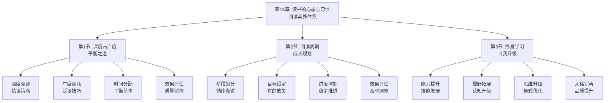

# 第15章：读书的心态与习惯 - 总览

> "读书之法，在循序而渐进，熟读而精思。" ——朱熹《读书之要》

## 引言：当阅读大师遇上"读书智慧"

### 阅读大师的"读书哲学"

阅读大师们深谙读书的智慧。他们明白，读书不仅是获取知识的手段，更是修身养性、提升境界的重要途径。从古代的学者到现代的阅读专家，阅读大师们都具备将读书内化为生活方式的能力。

阅读大师的"读书原则"：
- **循序渐进**：按照合理的顺序逐步深入
- **熟读精思**：通过反复阅读深入思考
- **知行合一**：将读书与实践相结合
- **持之以恒**：保持长期的读书习惯

**阅读大师的名言**："读书如饭，善吃饭者长精神，不善吃者生疾病。"他们明白，只有掌握正确的读书方法，才能真正从阅读中获益。

### 现代人的"读书困境"

如果阅读大师面对现代人的读书方式，他们可能会发现以下问题：

**阅读大师的"读书境界"**：
- 以循序渐进的方式深入阅读
- 通过熟读精思获得深刻理解
- 将读书与实践紧密结合
- 保持长期的读书习惯

**现代读书者的"浮躁心态"**：
- 急于求成，追求快速阅读
- 缺乏深入思考和反复研读
- 忽视读书与实践的结合
- 缺乏持续的读书习惯

**阅读大师会怎么说？**他们可能会感慨："你们这个时代，书籍如繁星般众多，但真正能深入阅读的却如北斗般稀少。学会读书，比学会买书更重要。"

### 认知科学的"读书习惯理论"

现代认知科学为读书的心态与习惯提供了科学依据：

**习惯养成理论**（Lally et al.）：
> "习惯是通过重复行为自动化的心理过程，通过持续重复能形成稳定的习惯。"**通过持续的读书练习能显著提高阅读习惯的稳定性**。

**深度学习理论**（Marton & Säljö）：
深度学习强调对知识的深层理解和批判性思考，**通过深度阅读能显著提高学习效果**。

**心流理论**（Csikszentmihalyi）：
当人们完全投入到活动中时会进入心流状态，**通过创造良好的阅读环境能促进心流体验**。

## 读书心态与习惯的"三维培养系统"

### 维度1：深度vs广度——从"偏执"到"平衡"

**核心问题**：如何平衡阅读的深度与广度？

**平衡要素**：
- **深度阅读**：对重要书籍进行深入研读
- **广度阅读**：广泛涉猎不同领域的书籍
- **主次分明**：明确主攻方向和辅助阅读
- **时间分配**：合理分配深度与广度阅读时间

**平衡方法**：
1. **目标设定**：设定深度与广度阅读目标
2. **计划制定**：制定平衡的阅读计划
3. **时间管理**：管理深度与广度阅读时间
4. **效果评估**：评估平衡阅读的效果

### 维度2：周期规划——从"随意"到"系统"

**核心问题**：如何制定系统的阅读周期规划？

**规划要素**：
- **阶段划分**：划分不同的阅读阶段
- **目标设定**：设定各阶段的阅读目标
- **进度控制**：控制阅读的进度安排
- **效果评估**：评估各阶段的阅读效果

**规划方法**：
1. **需求分析**：分析个人的阅读需求
2. **阶段设计**：设计合理的阅读阶段
3. **目标明确**：明确各阶段阅读目标
4. **计划执行**：执行阅读周期计划

### 维度3：自我升级——从"停滞"到"成长"

**核心问题**：如何通过读书实现自我升级？

**升级要素**：
- **能力提升**：通过阅读提升各项能力
- **视野拓展**：通过阅读拓展认知视野
- **思维升级**：通过阅读升级思维模式
- **人格完善**：通过阅读完善人格品质

**升级方法**：
1. **能力识别**：识别需要提升的能力
2. **书籍选择**：选择合适的升级书籍
3. **方法应用**：应用有效的阅读方法
4. **效果巩固**：巩固升级的效果

## 本章的"读书成长路线图"

### 第1节：深度vs广度——"平衡之道"

#### 核心问题：如何平衡阅读的深度与广度？

**科学基础**：基于**深度学习理论**和**广度学习理论**，设计阅读深度与广度平衡体系。

**关键内容**：
- **精读策略**：掌握深度阅读的精读策略
- **泛读技巧**：掌握广度阅读的泛读技巧
- **平衡艺术**：掌握深度与广度的平衡艺术
- **质量监控**：建立阅读质量的监控机制

**预期收获**：
- 掌握深度与广度阅读的平衡方法
- 提高阅读的效率和效果
- 建立科学的阅读质量评估体系

### 第2节：阅读周期——"成长规划"

#### 核心问题：如何制定系统的阅读周期规划？

**科学基础**：基于**学习周期理论**和**目标管理理论**，设计阅读周期规划体系。

**关键内容**：
- **循序渐进**：按照合理顺序推进阅读
- **有的放矢**：设定明确的阅读目标
- **稳步推进**：控制阅读的推进节奏
- **及时调整**：根据效果及时调整计划

**预期收获**：
- 掌握系统性的阅读周期规划方法
- 提高阅读计划的执行效果
- 建立动态调整的规划机制

### 第3节：终身学习——"自我升级"

#### 核心问题：如何通过读书实现自我升级？

**科学基础**：基于**终身学习理论**和**成长型思维理论**，设计自我升级体系。

**关键内容**：
- **技能发展**：通过阅读发展各项技能
- **认知升级**：通过阅读升级认知水平
- **模式优化**：通过阅读优化思维模式
- **品质提升**：通过阅读提升人格品质

**预期收获**：
- 掌握通过阅读实现自我升级的方法
- 提升个人的综合素质和能力
- 建立终身学习的成长机制

## 读书心态与习惯的"培养生态系统"

### 为什么叫"培养生态系统"？

就像自然生态系统一样，高效的读书心态与习惯培养需要多个要素的协同工作：
- **输入端**：选择有价值的阅读材料
- **处理端**：采用有效的阅读方法
- **应用端**：将阅读成果应用于实践
- **反馈端**：通过实践反馈优化阅读
- **成长端**：实现个人的持续成长

**缺一不可**：就像生态系统中的每个环节都至关重要，读书心态与习惯培养的每个要素都需要精心设计。

## 与前几章的"无缝衔接"

### 从应用到内化：阅读闭环的自然延伸

| 前几章解决的问题 | 本章解决的问题 | 连接逻辑 |
|----------------|--------------|---------|
| 知识获取和应用 | 如何将阅读内化为生活方式 | 应用是基础，内化是升华 |
| 方法学习和实践 | 如何培养良好的阅读心态 | 实践是过程，心态是根本 |
| 反思迭代和优化 | 如何养成持续的阅读习惯 | 优化是手段，习惯是结果 |

### 从执行到修养：方法论的完整闭环

**前几章**：认识问题、解决问题、获取知识、应用知识
**本章**：内化知识、培养心态、养成习惯、实现成长

这就像修养价值链：
- 前面章节是关于知识的获取和应用
- 本章是关于知识的内化和修养

## 学习成果：从"阅读者"到"读书人"

> "腹有诗书气自华。" ——苏轼《和董传留别》

完成这一章的学习后，你将实现从"阅读者"到"读书人"的转变：

### 🎯 深度广度：成为阅读的"平衡师"

你将拥有：
- **精读能力**：掌握深度阅读的精读能力
- **泛读技巧**：掌握广度阅读的泛读技巧
- **平衡艺术**：掌握深度与广度的平衡艺术
- **质量监控**：建立阅读质量的监控机制

就像平衡师能平衡各种要素，你也能平衡阅读的深度与广度。

### 🚀 周期规划：成为阅读的"规划师"

你将掌握：
- **阶段设计**：设计合理的阅读阶段
- **目标设定**：设定明确的阅读目标
- **进度控制**：控制阅读的推进节奏
- **动态调整**：根据效果动态调整计划

这就像规划师能设计完美的方案，你也能设计科学的阅读计划。

### 📊 自我升级：成为成长的"设计师"

你将具备：
- **能力识别**：识别需要提升的能力
- **书籍选择**：选择合适的升级书籍
- **方法应用**：应用有效的阅读方法
- **效果巩固**：巩固升级的效果

这就像设计师能设计美好的作品，你也能设计自己的成长路径。

## 读书心态与习惯攻略：如何让阅读成为人生伴侣

> "读书之法，在循序而渐进，熟读而精思。" ——朱熹

### 🎯 三步培养法：像阅读大师一样读书

**第一步：平衡模式**（偏执→平衡）
像阅读大师一样，平衡阅读的深度与广度。问自己："我如何平衡阅读的深度与广度？"

**第二步：规划模式**（随意→系统）
像规划师一样，制定系统的阅读周期规划。问自己："我如何制定科学的阅读计划？"

**第三步：升级模式**（停滞→成长）
像设计师一样，通过读书实现自我升级。问自己："我如何通过读书实现自我成长？"

### 💡 元认知提醒：成为自己的"读书教练"

在读书心态与习惯培养过程中，经常问自己三个问题：
1. **我如何平衡阅读的深度与广度？**（平衡之道）
2. **我如何制定科学的阅读计划？**（成长规划）
3. **我如何通过读书实现自我成长？**（自我升级）

认知心理学家约翰·弗拉维尔（John Flavell）把这种"思考自己的思考"称为元认知，它是高效学习的核心技能。

### 🚀 开启探索：从阅读到修养的人生升华

准备好了吗？我们即将踏上一场从"被动阅读"到"主动修养"的人生升华之旅。这不仅是关于阅读方法的提升，更是关于如何通过阅读实现人生价值的人生智慧。

**下一站：第1节《深度vs广度：平衡之道》——让我们学会平衡阅读的深度与广度。**