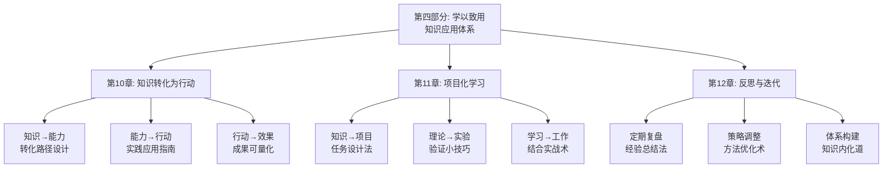

# 第四部分：学以致用 - 总览

> "纸上得来终觉浅，绝知此事要躬行。" ——陆游《冬夜读书示子聿》

## 引言：当实践家遇上"学以致用"

### 实践家的"行动哲学"

实践家们始终强调"知行合一"的重要性。他们认为，知识的价值不在于其本身，而在于能否转化为实际行动和实际价值。从古代的工匠到现代的企业家，从学者到实干家，真正的智慧都体现在实践应用中。

实践家的"应用原则"：
- **价值导向**：学习要能创造实际价值
- **行动优先**：知识要转化为具体行动
- **效果验证**：行动要产生可衡量效果
- **持续优化**：通过反馈持续改进

**实践家的名言**："知道做不到，等于不知道。"他们明白，只有将知识转化为行动，才能真正体现学习的价值。

### 现代人的"知行分离"

如果实践家面对现代人的学习方式，他们可能会发现以下问题：

**实践家的"学用结合"**：
- 学习以解决问题为目标
- 知识通过实践来验证和应用
- 注重实际效果和价值创造
- 建立反馈和改进机制

**现代学习者的"学用脱节"**：
- 学习停留在理论层面
- 知识缺乏实际应用验证
- 缺乏行动力和执行力
- 忽视效果评估和改进

**实践家会怎么说？**他们可能会感慨："你们这个时代，知识如繁星般众多，但真正能转化为行动的却如恒星般稀少。学会应用，比学会学习更重要。"

### 认知科学的"应用转化理论"

现代认知科学为学以致用提供了科学依据：

**应用转化理论**（Bandura）：
> "自我效能感是影响行为转化的关键因素，相信自己能够成功的人更可能将知识转化为行动。"**通过提升自我效能感能显著提高知识的行动转化率**。

**情境学习理论**（Lave & Wenger）：
学习是情境化的社会实践，**在真实情境中应用能促进知识的深度理解和灵活运用**。

**迁移学习理论**（Singley & Anderson）：
能力的迁移是学习的重要目标，**通过多样化的情境应用能提高能力的迁移能力**。

## 学以致用的"三维应用系统"

### 维度1：知识转化——从"知道"到"做到"

**核心问题**：如何将理论知识转化为实际能力？

**转化要素**：
- **理解深化**：深入理解知识的本质和应用场景
- **技能分解**：将复杂技能分解为可操作的步骤
- **模仿学习**：通过模仿专家行为学习技能
- **独立应用**：独立应用技能解决实际问题

**转化方法**：
1. **示范教学**：通过专家示范学习正确方法
2. **分步练习**：分步骤练习复杂技能
3. **反馈调整**：通过反馈调整操作方法
4. **熟练掌握**：通过反复练习熟练掌握技能

### 维度2：项目学习——从"学习"到"实践"

**核心问题**：如何通过项目化学习将知识落地？

**学习要素**：
- **任务设计**：将知识转化为具体项目任务
- **实验验证**：通过小实验验证理论假设
- **学用结合**：将学习与工作实践结合
- **价值创造**：通过学习为工作创造价值

**学习方法**：
1. **项目驱动**：以项目任务驱动学习
2. **实验验证**：通过实验验证理论知识
3. **实践应用**：在实践中应用所学知识
4. **成果产出**：产出具象的学习成果

### 维度3：反思迭代——从"经验"到"智慧"

**核心问题**：如何通过反思迭代持续优化？

**迭代要素**：
- **定期复盘**：定期回顾和总结经验教训
- **策略调整**：根据复盘结果调整策略
- **体系构建**：将经验构建成知识体系
- **持续更新**：持续更新和完善体系

**迭代方法**：
1. **系统复盘**：系统回顾和分析经验
2. **优化调整**：根据分析结果优化方法
3. **知识整合**：整合经验构建知识体系
4. **动态维护**：动态维护和完善体系

## 本部分的"学以致用路线图"

### 第10章：知识转化为行动

#### 核心问题：如何将学到的知识转化为实际行动？

**科学基础**：基于**行动转化理论**和**能力发展理论**，设计知识到行动的转化体系。

**关键内容**：
- **转化路径设计**：设计从知识到能力的转化路径
- **实践应用指南**：提供能力到行动的应用指导
- **效果量化评估**：建立行动效果的评估体系

**预期收获**：
- 掌握知识到行动的转化方法
- 提高将能力转化为行动的能力
- 建立行动效果的评估和优化机制

### 第11章：项目化学习

#### 核心问题：如何通过项目化学习将知识落地？

**科学基础**：基于**项目学习理论**和**实验验证理论**，设计知识落地体系。

**关键内容**：
- **任务设计法**：将知识转化为具体项目任务
- **验证小技巧**：通过小实验验证理论知识
- **结合实战术**：将学习与工作实践结合

**预期收获**：
- 掌握将知识转化为项目任务的方法
- 提高通过实验验证理论的能力
- 建立学用结合的实践机制

### 第12章：反思与迭代

#### 核心问题：如何通过反思迭代持续优化？

**科学基础**：基于**反思性实践理论**和**持续改进理论**，设计优化体系。

**关键内容**：
- **经验总结法**：通过定期复盘总结经验
- **方法优化术**：根据复盘结果优化方法
- **知识内化道**：将经验构建成知识体系

**预期收获**：
- 掌握系统复盘和经验总结的方法
- 提高策略调整和方法优化的能力
- 建立个人完整的知识体系

## 学以致用的"应用生态系统"

### 为什么叫"生态系统"？

就像自然生态系统一样，高效的学以致用需要多个要素的协同工作：
- **输入端**：获取有价值的知识和信息
- **转化端**：将知识转化为实际能力
- **应用端**：将能力应用于实际情境
- **反馈端**：评估应用效果并提供反馈
- **优化端**：根据反馈持续优化改进

**缺一不可**：就像生态系统中的每个环节都至关重要，学以致用的每个要素都需要精心设计。

## 与前三部分的"无缝衔接"

### 从获取到应用：学习闭环的自然延伸

| 前三部分解决的问题 | 本部分解决的问题 | 连接逻辑 |
|----------------|--------------|---------|
| 知识获取和理解 | 如何将理解的知识转化为实际应用 | 理解是基础，应用是目标 |
| 方法论和技巧 | 如何通过实践验证和深化方法 | 理论指导实践，实践深化理论 |
| 工具和模板 | 如何在实际中有效应用工具 | 工具是手段，应用是目的 |

### 从学习到创造：方法论的完整闭环

**前三部分**：认识问题、解决问题、获取知识
**本部分**：应用知识、验证理论、持续优化

这就像创新价值链：
- 前面章节是关于知识的获取和整理
- 本部分是关于知识的应用和创造

## 学习成果：从"学习者"到"实践者"

> "临渊羡鱼，不如退而结网。" ——《汉书·董仲舒传》

完成这一部分的学习后，你将实现从"学习者"到"实践者"的转变：

### 🎯 知识转化：成为知识的"转化专家"

你将拥有：
- **转化路径设计**：设计知识到能力的转化路径
- **技能分解能力**：将复杂技能分解为可操作步骤
- **学习地图制定**：制定系统的学习和练习计划

就像工程师能将理论知识转化为实际产品，你也能将学到的知识转化为实际能力。

### 🚀 项目学习：成为知识的"应用大师"

你将掌握：
- **任务设计能力**：将知识转化为具体项目任务
- **实验验证技巧**：通过小实验验证理论知识
- **学用结合方法**：将学习与工作实践结合

这就像项目经理能将计划转化为实际成果，你也能将学习成果转化为实际应用。

### 📊 反思迭代：成为实践的"优化专家"

你将具备：
- **系统复盘技能**：定期回顾和总结经验教训
- **策略调整能力**：根据复盘结果调整策略
- **体系构建技术**：将经验构建成知识体系

这就像质量管理者能优化产品和服务质量，你也能优化知识应用的效果。

## 学以致用攻略：如何让知识产生实际价值

> "实践是检验真理的唯一标准。" ——毛泽东

### 🎯 三步应用法：像实干家一样行动

**第一步：转化模式**（知识→能力）
像实干家学习技能一样，将学到的知识转化为实际能力。问自己："我如何将这个知识转化为可操作的技能？"

**第二步：实践模式**（能力→行动）
像实干家解决问题一样，将能力应用于实际情境。问自己："我如何在实际中应用这个技能？"

**第三步：优化模式**（行动→改进）
像实干家总结经验一样，通过评估优化应用效果。问自己："我如何改进这个应用方法？"

### 💡 元认知提醒：成为自己的"应用教练"

在学以致用过程中，经常问自己三个问题：
1. **我如何将这个知识转化为实际能力？**（转化设计）
2. **我如何在实际中应用这个能力？**（实践应用）
3. **我如何通过评估优化应用效果？**（持续改进）

认知心理学家约翰·弗拉维尔（John Flavell）把这种"思考自己的思考"称为元认知，它是高效学习的核心技能。

### 🚀 开启探索：从理论到实践的价值升级

准备好了吗？我们即将踏上一场从"纸上谈兵"到"实战应用"的价值升级之旅。这不仅是关于知识应用的提升，更是关于如何将知识转化为实际价值的人生智慧。

**下一站：第10章《知识转化为行动》——让我们学会将学到的知识转化为实际行动。**